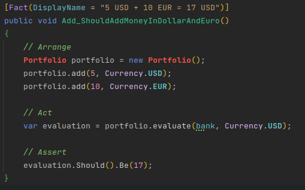
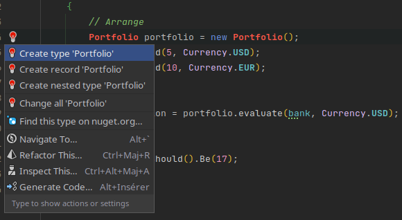
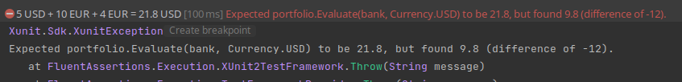
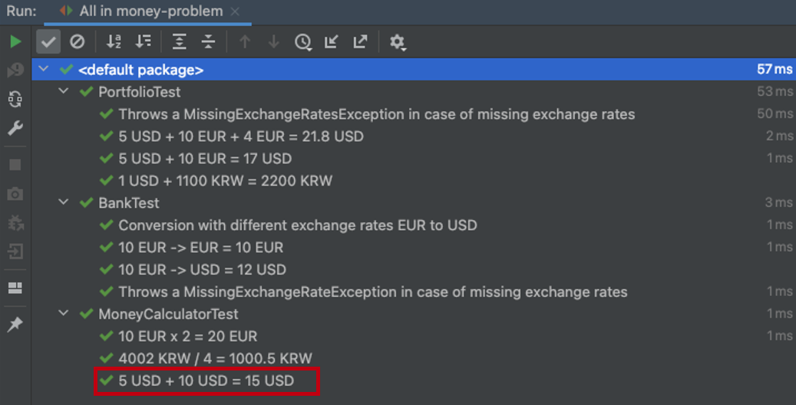

# Implement Portfolio
We have to implement two new features :

```text
5 USD + 10 EUR = 17 USD
1 USD + 1100 KRW = 2200 KRW
```

## Write our first test

:red_circle: 
Let's write a failing test.

```c#
public class PortfolioTest
{
    private readonly Bank bank = Bank.WithExchangeRate(Currency.EUR, Currency.USD, 1.2);

    [Fact(DisplayName = "5 USD + 10 EUR = 17 USD")]
    public void Add_ShouldAddMoneyInDollarAndEuro()
    {
        // Arrange
        Portfolio portfolio = new Portfolio();
        portfolio.Add(5, Currency.USD);
        portfolio.Add(10, Currency.EUR);

        // Act
        var evaluation = portfolio.Evaluate(bank, Currency.USD);

        // Assert
        evaluation.Should().Be(17);
    }
}
```

From your IDE, you should see your code like this:



Congratulations you have a first failing test (compilation errors are failures).
Now we have a failing test : 

:green_circle: Make it pass `as fast as possible`

We can use the power of our IDE and `generate code from usage`:



Here's what the generated code looks like:

```c#
public class Portfolio
{
    public void Add(double amount, Currency currency)
    {
        throw new System.NotImplementedException();
    }

    public double Evaluate(Bank bank, Currency currency)
    {
        throw new System.NotImplementedException();
    }
}
```

Then, we can apply the strategy `Fake It 'Til You Make It` (more about it [here](https://dzone.com/articles/three-modes-of-tdd))

It's basically the fastest way to make the test pass. It is okay to write dirty code (hardcode, copy/paste, duplicate, etc.) to reach the green phase because `it will be refactored`. It's also a good way to verify you don't break any existing test.


```c#
public double evaluate(Bank bank, Currency currency) {
	// Fake It 'Til You Make It
    return 17;
}
```

Let's look at where we are at the moment:

```text
✅ 5 USD + 10 EUR = 17 USD
1 USD + 1100 KRW = 2200 KRW
```

## Handle currencies in KoreanWons
:red_circle:
Let's write a new failing test:

```c#
[Fact(DisplayName = "1 USD + 1100 KRW = 2200 KRW")]
public void Add_ShouldAddMoneyInDollarAndKoreanWons()
{
	var portfolio = new Portfolio();
	portfolio.Add(1, Currency.USD);
	portfolio.Add(1100, Currency.KRW);
	portfolio.Evaluate(bank, Currency.KRW).Should().Be(2200);
}
```

The test is failing because we have faked the result of the `Evaluate` method

:green_circle: We have to make it pass.
 
Here, we use what we call `triangulation`:
  - We start by hard-coding the result
  - We provide another test to add more behaviors
  - Each new test leads us closer to the final solution

```c#
public class Portfolio
{
    private readonly Dictionary<Currency, ICollection<double>> moneys = new Dictionary<Currency, ICollection<double>>();
    public void Add(double amount, Currency currency)
    {
        if (!this.moneys.ContainsKey(currency))
        {
            this.moneys.Add(currency, new List<double> { amount });
        }
        else
        {
            this.moneys[currency] = new List<double> { amount };
        }
    }

    public double Evaluate(Bank bank, Currency currency)
    {
        double convertedResult = 0;
        foreach (KeyValuePair<Currency, ICollection<double>> entry in this.moneys)
        {
            foreach (double amount in entry.Value)
            {
                double convertedAmount = bank.Convert(amount, entry.Key, currency);
                convertedResult += convertedAmount;
            }
        }
        
        return convertedResult;
    }
}
```

:large_blue_circle: Do you think any refactoring could be done ?

In the tests, we could centralize the exchange rates setup

```c#
private readonly Bank bank;

public PortfolioTest()
{
	this.bank = Bank.WithExchangeRate(Currency.EUR, Currency.USD, 1.2);
	bank.AddExchangeRate(Currency.USD, Currency.KRW, 1100);
}
```

Refactoring ideas are emerging from the current implementation :
- If we have the same currency twice, we have a problem in the `Add` method
  - We need to increase our confidence by adding a new test on it
- Missing Exchange rate -> how to improve error handling?

We're halfway there. Let's add new test cases for our portfolio :

```text
✅ 5 USD + 10 EUR = 17 USD
✅ 1 USD + 1100 KRW = 2200 KRW
5 USD + 10 EUR + 4 EUR = 21.8 USD
Improve error handling
```

## Portfolio containing amounts in same currencies
:red_circle:
As usual, the first step is always to write a failing test.

```c#
[Fact(DisplayName = "5 USD + 10 EUR + 4 EUR = 21.8 USD")]
public void Add_ShouldAddMoneyInDollarsAndMultipleAmountInEuros()
{
	var portfolio = new Portfolio();
	portfolio.Add(5, Currency.USD);
	portfolio.Add(10, Currency.EUR);
	portfolio.Add(4, Currency.EUR);
	portfolio.Evaluate(bank, Currency.USD).Should().Be(21.8);
}
```



:green_circle:
Make it pass by refactoring the `Add` method:

```c#
public void Add(double amount, Currency currency)
{
	if (!this.moneys.ContainsKey(currency))
	{
		this.moneys.Add(currency, new List<double>());
	}
	
	this.moneys[currency].Add(amount);
}
```

One more step to go!

```text
✅ 5 USD + 10 EUR = 17 USD
✅ 1 USD + 1100 KRW = 2200 KRW
✅ 5 USD + 10 EUR + 4 EUR = 21.8 USD
Improve error handling
```

## Improve error handling
Here, we need to improve error handling.

If we have multiple missing exchange rates, we only return the information for the first missing one... 

:red_circle:
You know the drill: let's write a new test!

```c#
[Fact(DisplayName = "Throws a MissingExchangeRatesException in case of missing exchange rates")]
public void Add_ShouldThrowAMissingExchangeRatesException()
{
	var portfolio = new Portfolio();
	portfolio.Add(1, Currency.EUR);
	portfolio.Add(1, Currency.USD);
	portfolio.Add(1, Currency.KRW);
	Action act = () => portfolio.Evaluate(this.bank, Currency.EUR));
	act.Should().Throw<MissingExchangeRatesException>()
		.WithMessage("Missing exchange rate(s): [USD->EUR],[KRW->EUR]");        
}
```

Generate the new Exception class from the test:

```c#
public class MissingExchangeRatesException : Exception
{
    public MissingExchangeRatesException(List<MissingExchangeRateException> missingExchangeRates)
        : base("Missing exchange rate(s): [USD->EUR],[KRW->EUR]")
    {
        
    }
}
```

:green_circle:
Adapt our evaluation to pass the test:

```c#
public double Evaluate(Bank bank, Currency currency)
{
	double convertedResult = 0;
	var missingExchangeRates = new List<MissingExchangeRateException>();
	foreach (KeyValuePair<Currency, ICollection<double>> entry in this.moneys)
	{
		foreach (double amount in entry.Value)
		{
			try
			{
				double convertedAmount = bank.Convert(amount, entry.Key, currency);
				convertedResult += convertedAmount;
			}
			catch (MissingExchangeRateException exception)
			{
				missingExchangeRates.Add(exception);
			}
		}
	}
	
	if (missingExchangeRates.Any()) {
		throw new MissingExchangeRatesException(missingExchangeRates);
	}
	
	return convertedResult;
}
```

- Let's adapt our tests accordingly
	- The `Evaluate` method is now throwing only `MissingExchangeRatesException`

```c#
[Fact(DisplayName = "5 USD + 10 EUR + 4 EUR = 21.8 USD")]
public void Add_ShouldAddMoneyInDollarsAndMultipleAmountInEuros()
{
	var portfolio = new Portfolio();
	portfolio.Add(5, Currency.USD);
	portfolio.Add(10, Currency.EUR);
	portfolio.Add(4, Currency.EUR);
	portfolio.Evaluate(bank, Currency.USD).Should().Be(21.8);
}

[Fact(DisplayName = "Throws a MissingExchangeRatesException in case of missing exchange rates")]
public void Add_ShouldThrowAMissingExchangeRatesException()
{
	var portfolio = new Portfolio();
	portfolio.Add(1, Currency.EUR);
	portfolio.Add(1, Currency.USD);
	portfolio.Add(1, Currency.KRW);
	Action act = () => portfolio.Evaluate(this.bank, Currency.EUR);
	act.Should().Throw<MissingExchangeRatesException>()
		.WithMessage("Missing exchange rate(s): [USD->EUR],[KRW->EUR]");
}
```

Congratulations! All tests are now green!

:large_blue_circle:
But we don't stop when it works, we have to refactor now:

- We have some hardcoded values in the new `MissingExchangeRatesException` class

```c#
public class MissingExchangeRatesException : Exception
{
    public MissingExchangeRatesException(List<MissingExchangeRateException> missingExchangeRates)
        : base($"Missing exchange rate(s): {GetMissingRates(missingExchangeRates)}")
    {
    }

    private static string GetMissingRates(List<MissingExchangeRateException> missingRates) => missingRates
        .Select(exception => $"[{exception.Message}]")
        .Aggregate((r1, r2) => $"{r1},{r2}");
}
```

```text
✅ 5 USD + 10 EUR = 17 USD
✅ 1 USD + 1100 KRW = 2200 KRW
✅ 5 USD + 10 EUR + 4 EUR = 21.8 USD
✅ Improve error handling
```

Our `Portfolio` is growing step-by-step.
Let's keep it for the coming constraints 😊

## Reflect
During this iteration we have implemented a `Portfolio` that allows to add different amounts in different currencies. Let's take a look at our test cases :



With what we implemented during this iteration, it would make sense to use only the `Portfolio` to add moneys together.

So let's move this test in our `PortfolioTest` suite

```c#
[Fact(DisplayName = "5 USD + 10 USD = 15 USD")]
public void Add_ShouldAddMoneyInTheSameCurrency()
{
	var portfolio = new Portfolio();
	portfolio.Add(5, Currency.USD);
	portfolio.Add(10, Currency.USD);
	portfolio.Evaluate(bank, Currency.USD).Should().Be(15);
}
```

Now that we removed the test from MoneyCalculator, we can also remove the `Add` method as it's not being used anymore.


`Always put the same attention on your test code than on your production code`
