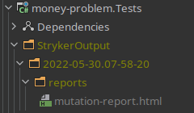
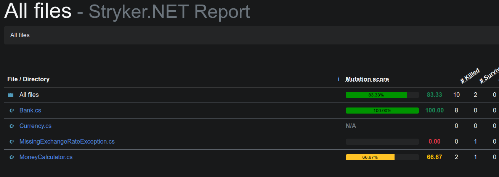
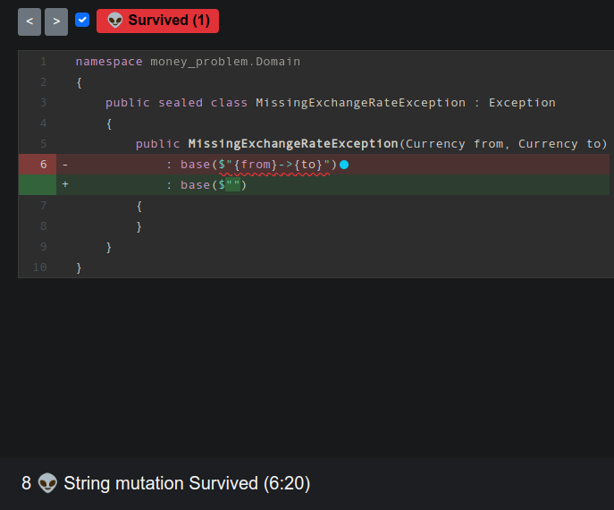
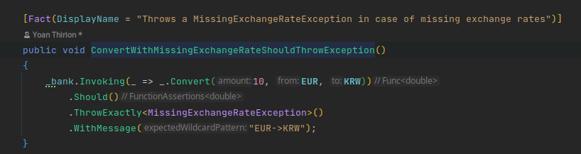
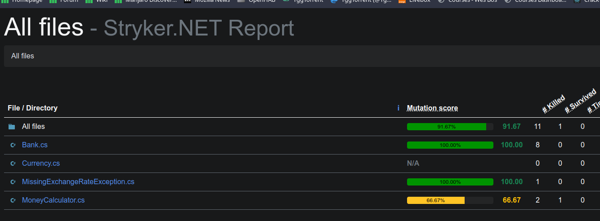
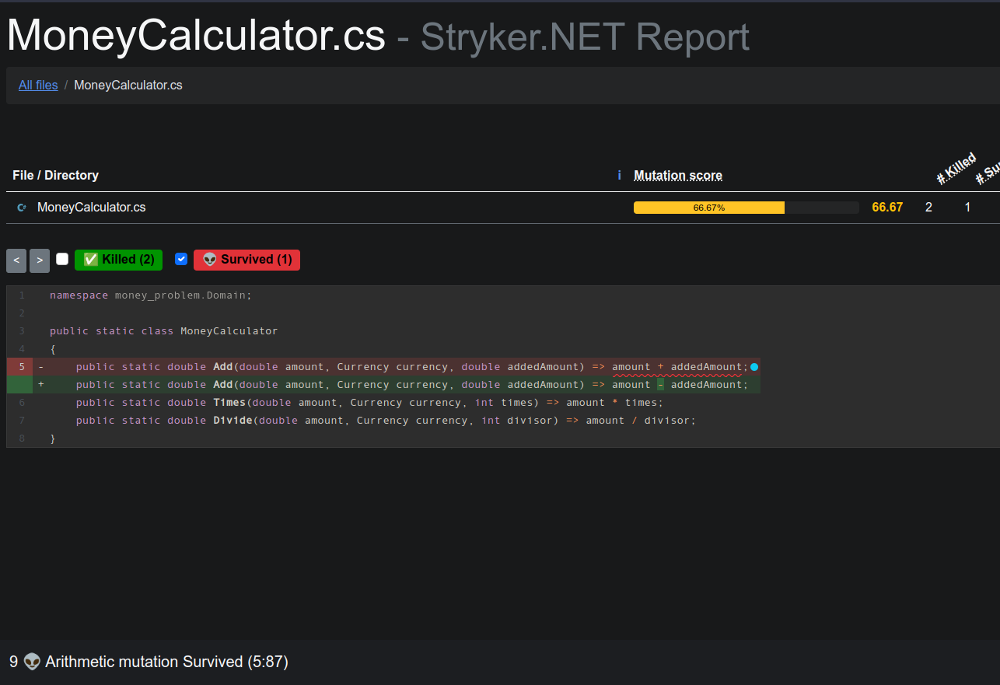
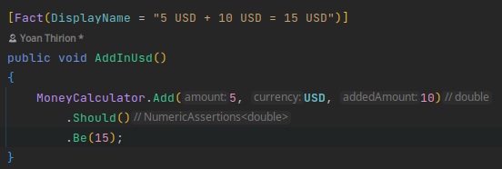
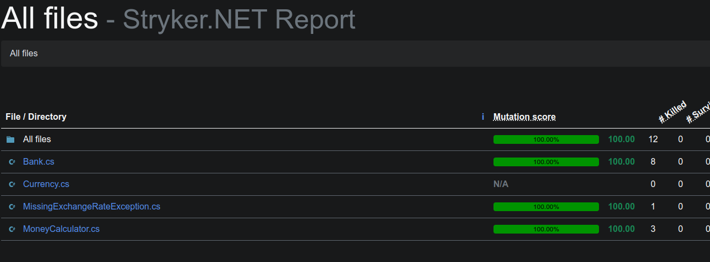

# Mutation Testing

- Use dotnet command to install stryker
`dotnet tool install -g dotnet-stryker`

- Go inside Tests folder
`cd money-problem/Tests`

- Run stryker command
`dotnet stryker`

- Check the report inside StrykerOutput folder

- Check remaining mutants

## MissingExchangeRateException

- Stryker was able to create a mutant as we don't verify the exception message. 
- Expecting an empty string makes our test pass too which proves our test isn't reliable.
- Testing the message does provide value as it contain business information.

- When implemented, verify your test pass and run the stryker command again.

## MoneyCalculator

- Stryker was able to create a mutant as we don't have any assertion in our test.

- When implemented, verify your test pass and run the stryker command again.

- Why you should focus on good assertion?
	- Take a look at the [Test Desiderata](https://kentbeck.github.io/TestDesiderata/)
