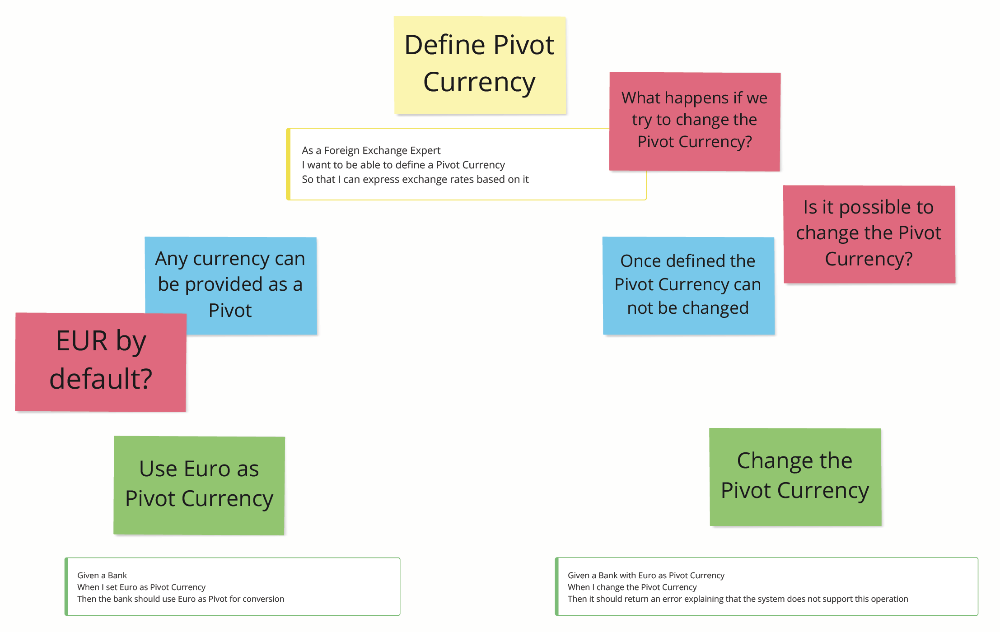
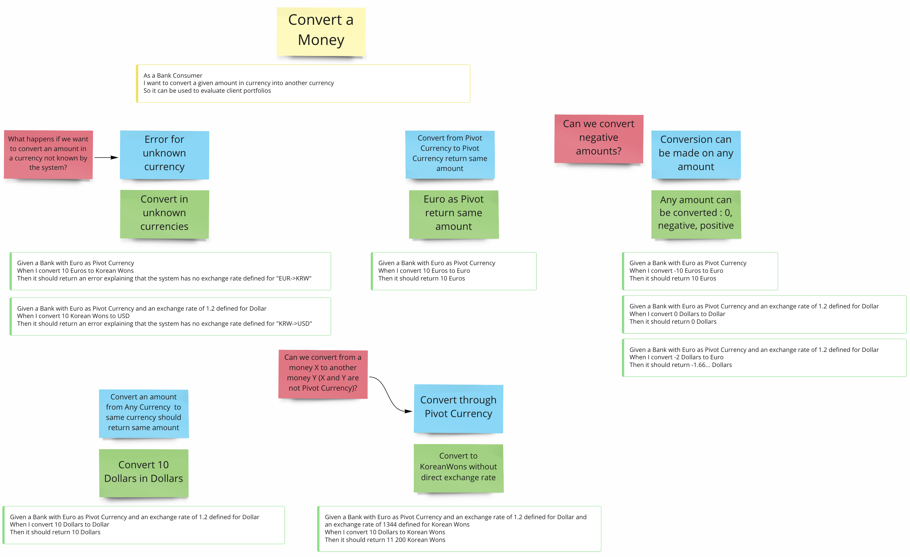
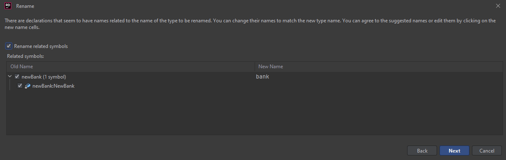

## Redesign the Bank
Based on our discoveries from the `example mapping` workshop, we can work on redesigning our `Bank`.
Again, our examples will drive the implementation.

One significant impact is modifying the `Bank`at this stage will have a massive impact on the codebase.

### Sprout Technique
One way to avoid it is to use a technique called [Sprout Technique](https://understandlegacycode.com/blog/key-points-of-working-effectively-with-legacy-code/#1-the-sprout-technique) from [Michael Feathers](https://wiki.c2.com/?MichaelFeathers) in his book [Working Effectively with Legacy Code](https://www.oreilly.com/library/view/working-effectively-with/0131177052/):
- Create your code somewhere else.
  - Keep applying Test-Driven Development based on our new use cases.
- Identify where to call that code from the existing one: the `insertion point`.
- Call your code from the existing code.

> Let's try!

### Implement the New Bank
We're going to iterate upon the example mapping outcome.

#### Define pivot currency



From the business point of view, those rules are fundamental and should be at the heart of our system.
To implement those, we can encapsulate our class by making it impossible `by design` to change the pivot currency of an
existing `Bank` instance.

We don't have test cases here, but it gives us ideas for preserving the integrity of our system.

`Property-Based Testing` is a good candidate to verify these rules.
We will follow the main rules as shown below.

#### Add an exchange rate


> Add an exchange rate for the Pivot Currency

```text
for all (currency, rate)
CreateBankWithPivotCurrency(currency)
    .Add(new ExchangeRate(rate, currency)) should return an error("Can not add an exchange rate for the pivot currency")
```

Let's start to work on this property first.

:red_circle: As usual, we start with a failing test/property on a new bank implementation.

```csharp
[Property]
private Property CannotAddExchangeRateForThePivotCurrencyOfTheBank() =>
    Prop.ForAll(
        Arb.From<Currency>(),
        Arb.From<double>().MapFilter(_ => _, rate => rate > 0),
        (currency, rate) =>
            NewBank
            .WithPivotCurrency(currency)
            .Add(new NewExchangeRate(currency, rate)) == Either<Error, NewBank>.Left(new Error("Cannot add an exchange rate for the pivot currency.")));
```

We have quite some code to generate here.
As usual, we are going to use our IDE to do so.

Also, we will have to adapt our existing record `ExchangeRate`.
Indeed, we won't have to provide the source currency anymore because it will always be our pivot currency.

```csharp
public class NewBank
{
    public static NewBank WithPivotCurrency(Currency currency)
    {
        throw new NotImplementedException();
    }

    public Either<Error,NewBank> AddExchangeRate(NewExchangeRate exchangeRate)
    {
        throw new NotImplementedException();
    }
}

public record Error(string Message);

public record NewExchangeRate(Currency To, double Rate);
```

:green_circle: We can fake the result to pass our test.

```csharp
public static NewBank WithPivotCurrency(Currency currency)
{
    return new NewBank();
}

public Either<Error,NewBank> Add(NewExchangeRate exchangeRate)
{
    return Either<Error, NewBank>.Left(new Error("Cannot add an exchange rate for the pivot currency."));
}
```

:large_blue_circle: Even with our trivial implementation, we can already reduce the noise in our test.

```csharp
[Property]
private Property CannotAddExchangeRateForThePivotCurrencyOfTheBank() =>
    Prop.ForAll(
        Arb.From<Currency>(),
        GetValidRates(),
        (currency, rate) =>
            AddShouldReturnErrorForSameCurrencyAsPivot(currency, rate,
                "Cannot add an exchange rate for the pivot currency."));

private static Arbitrary<double> GetValidRates() => Arb.From<double>().MapFilter(_ => _, rate => rate > 0);

private static bool AddShouldReturnErrorForSameCurrencyAsPivot(Currency currency, double rate, string message) =>
    NewBank
        .WithPivotCurrency(currency)
        .Add(new NewExchangeRate(currency, rate)) == Either<Error, NewBank>.Left(new Error(message));
```

> Add an invalid rate for a Currency

:red_circle: Let's add a second property regarding an `Exchange rate` that should never be negative or equal to 0.

```text
for all (pivotCurrency, currency, negativeOr0Double)
such that currency != pivotCurrency
CreateBankWithPivotCurrency(pivotCurrency)
    .Add(new ExchangeRate(negativeOr0Double, currency)) should return error("Exchange rate should be greater than 0")
```

It should be a responsibility of the `ExchangeRate` data structure so let's write this property aside from the ones of
the `Bank`.

```csharp
[Property]
public Property CannotUseNegativeDoubleOrZeroAsExchangeRate() =>
    Prop.ForAll(
        Arb.From<Currency>(),
        Arb.From<double>().MapFilter(_ => _, rate => rate <= 0),
        (currency, rate) =>NewExchangeRate.From(currency, rate) ==
            Either<Error, NewExchangeRate>.Left(new Error("Exchange rate should be greater than 0.")));
```

:green_circle: Create the method and fake its behaviour for now.
We want to ensure that we can create only valid exchange rates.
Hence we have to force the usage of the `From` factory method.
We have to change our `ExchangeRate` record to a struct.

This principle is called [`parse, don't validate`](https://xtrem-tdd.netlify.app/Flavours/Refactoring/parse-dont-validate).

Once we instantiate an object, **we know for sure that it is valid**.
It means we will **never** have an invalid `ExchangeRate`.

If you use only primitive types, this property is hard to achieve, and you will have to make a lot of validation in
different places inside your system.

```csharp
public class ExchangeRate {
    private double rate;
    private Currency currency;

    public ExchangeRate(double rate, Currency currency) {
        this.rate = rate;
        this.currency = currency;
    }

    public static Either<Error, ExchangeRate> from(double rate, Currency currency) {
        return Left(new Error("Exchange rate should be greater than 0"));
    }
}
```

The constructor have to stay public for now because it's being used in the Bank properties.

:large_blue_circle: Same as before, we can reduce the noise

```csharp
[Property]
public Property CannotUseNegativeDoubleOrZeroAsExchangeRate() =>
    Prop.ForAll(
        Arb.From<Currency>(),
        GetInvalidRates(),
        (currency, rate) =>
            ExchangeRateShouldReturnError(currency, rate, "Exchange rate should be greater than 0."));

private static Arbitrary<double> GetInvalidRates() => Arb.From<double>().MapFilter(_ => _, rate => rate <= 0);

private static bool ExchangeRateShouldReturnError(Currency currency, double rate, string message) =>
    NewExchangeRate.From(currency, rate) ==
    Either<Error, NewExchangeRate>.Left(new Error(message));
```

As mentioned before, we cannot use the factory method in the `NewBankProperties` until we finalize it.


> Add an exchange rate

```text
for all (pivotCurrency, currency, positiveDouble)
such that currency != pivotCurrency
CreateBankWithPivotCurrency(pivotCurrency)
    .Add(new ExchangeRate(positiveDouble, currency)) should return success
```

:red_circle: Let's write a new test to implement this behaviour.

```csharp
[Property]
private Property CanAddExchangeRateForDifferentCurrencyThanPivot() =>
    Prop.ForAll<Currency, Currency, double>(
        Arb.From<Currency>(),
        Arb.From<Currency>(),
        GetValidRates(),
        (pivot, currency, rate) =>
        NewBank
            .WithPivotCurrency(pivot)
            .Add(new NewExchangeRate(currency, rate))
            .IsRight
        .When(pivot != currency));
```

:green_circle: Improve the `ExchangeRate` design to move on.

```csharp
public class NewBank
{
    private Currency pivotCurrency;

    private NewBank(Currency pivotCurrency)
    {
        this.pivotCurrency = pivotCurrency;
    }

    public static NewBank WithPivotCurrency(Currency currency) { ... }

    public Either<Error,NewBank> Add(NewExchangeRate exchangeRate)
    {
        if (exchangeRate.Currency != this.pivotCurrency)
        {
            return Either<Error, NewBank>.Right(this);
        }
        
        return Either<Error, NewBank>.Left(new Error("Cannot add an exchange rate for the pivot currency."));
    }
}

public struct NewExchangeRate
{
    private Currency currency;
    private double rate;

    public NewExchangeRate(Currency currency, double rate) { ... }

    public Currency Currency => this.currency;

    public static Either<Error, NewExchangeRate> From(Currency currency, double rate) { ... }
}
```

:large_blue_circle: We can refactor both our test and our implementation.

```csharp
[Property]
private Property CanAddExchangeRateForDifferentCurrencyThanPivot() =>
    Prop.ForAll(
        Arb.From<Currency>(),
        Arb.From<Currency>(),
        GetValidRates(),
        (pivot, currency, rate) =>
            AddShouldReturnBankForExchangeRateForDifferentCurrencyThanPivot(pivot, currency, rate)
                .When(pivot != currency));

private static bool AddShouldReturnBankForExchangeRateForDifferentCurrencyThanPivot(Currency pivot,
    Currency currency, double rate) =>
    NewBank
        .WithPivotCurrency(pivot)
        .Add(new NewExchangeRate(currency, rate))
        .IsRight;
```

```csharp
public class NewBank
{
    private readonly Currency pivotCurrency;

    private NewBank(Currency pivotCurrency) => this.pivotCurrency = pivotCurrency;

    public static NewBank WithPivotCurrency(Currency currency) => new(currency);

    public Either<Error, NewBank> Add(NewExchangeRate exchangeRate) =>
        this.IsPivotCurrency(exchangeRate.Currency)
            ? Either<Error, NewBank>.Left(new Error("Cannot add an exchange rate for the pivot currency."))
            : Either<Error, NewBank>.Right(this);

    private bool IsPivotCurrency(Currency currency) => currency == this.pivotCurrency;
}

public struct NewExchangeRate
{
    private double rate;

    public NewExchangeRate(Currency currency, double rate)
    {
        this.Currency = currency;
        this.rate = rate;
    }

    public Currency Currency { get; }

    public static Either<Error, NewExchangeRate> From(Currency currency, double rate) => Either<Error, NewExchangeRate>.Left(new Error("Exchange rate should be greater than 0."));
}
```

:red_circle: We can finalize the implementation of our factory method.

```csharp
[Property]
public Property CanUsePositiveAsExchangeRate() =>
    Prop.ForAll(
        Arb.From<Currency>(),
        GetValidRates(),
        ExchangeRateShouldReturnRate);

private static Arbitrary<double> GetValidRates() => Arb.From<double>().MapFilter(_ => _, rate => rate > 0);

private static bool ExchangeRateShouldReturnRate(Currency currency, double rate) =>
    NewExchangeRate.From(currency, rate)
        .Map(value => value.Currency == currency && value.Rate == rate)
        .IfLeft(false);
```

:green_circle: Make it pass.

```csharp
public static Either<Error, NewExchangeRate> From(Currency currency, double rate)
{
    if (rate > 0)
    {
        return Either<Error, NewExchangeRate>.Right(new NewExchangeRate(currency, rate));
    }
    
    return Either<Error, NewExchangeRate>.Left(new Error("Exchange rate should be greater than 0."));
}
```

:large_blue_circle: Refactor.

```csharp
public struct NewExchangeRate
{
    public NewExchangeRate(Currency currency, double rate) { ... }
    public Currency Currency { get; }
    public double Rate { get; }

    public static Either<Error, NewExchangeRate> From(Currency currency, double rate) =>
        IsValidRate(rate)
            ? Either<Error, NewExchangeRate>.Right(new NewExchangeRate(currency, rate))
            : Either<Error, NewExchangeRate>.Left(new Error("Exchange rate should be greater than 0."));

    private static bool IsValidRate(double rate) => rate > 0;
}

public class NewExchangeRateProperties
{
    [Property]
    public Property CanUsePositiveAsExchangeRate() =>
        Prop.ForAll(
            Arb.From<Currency>(),
            GetValidRates(),
            ExchangeRateShouldReturnRate);
}
```

:large_blue_circle: Now that we finalized our implementation, we can use the factory method in the `NewBankProperties`,
and make the `NewExchangeRate` constructor private to enforce parsing.

```csharp
public class NewBankProperties
{
    private static bool AddShouldReturnBankForExchangeRateForDifferentCurrencyThanPivot(Currency pivot,
        Currency currency, double rate) =>
        NewBank
            .WithPivotCurrency(pivot)
            .Add(CreateExchangeRate(currency, rate))
            .IsRight;

    private static bool AddShouldReturnErrorForSameCurrencyAsPivot(Currency currency, double rate, string message) =>
        NewBank
            .WithPivotCurrency(currency)
            .Add(CreateExchangeRate(currency, rate)) == Either<Error, NewBank>.Left(new Error(message));

    private static NewExchangeRate CreateExchangeRate(Currency currency, double rate) =>
        (NewExchangeRate) NewExchangeRate.From(currency, rate).Case;
}

public struct NewExchangeRate
{
    private NewExchangeRate(Currency currency, double rate)
    {
        this.Currency = currency;
        this.Rate = rate;
    }
    
    public static Either<Error, NewExchangeRate> From(Currency currency, double rate) =>
    IsValidRate(rate)
        ? Either<Error, NewExchangeRate>.Right(new NewExchangeRate(currency, rate))
        : Either<Error, NewExchangeRate>.Left(new Error("Exchange rate should be greater than 0."));
}
```

> Update an exchange rate

```text
for all (pivotCurrency, currency, positiveDouble)
such that currency != pivotCurrency
CreateBankWithPivotCurrency(pivotCurrency)
    .Add(new ExchangeRate(positiveDouble, currency))
    .Add(new ExchangeRate(positiveDouble + 0.1, currency)) should return success
```

:green_circle: The bank hides its exchange rates. This behaviour comes for free because we can only test that the return
value is an instance of `NewBank`.
It is **already** implemented.
Hence, we will not go through the red step.

We still want the test to be visible in our living documentation.

```csharp
[Property]
private Property CanUpdateExchangeRateForAnyCurrencyDifferentThanPivot() =>
    Prop.ForAll(
        Arb.From<Currency>(),
        Arb.From<Currency>(),
        GetValidRates(),
        (pivot, currency, rate) => AddShouldReturnBankWhenUpdatingExchangeRate(pivot, currency, rate)
            .When(pivot != currency));

private static bool AddShouldReturnBankWhenUpdatingExchangeRate(Currency pivot, Currency currency, double rate) =>
    NewBank.WithPivotCurrency(pivot)
        .Add(CreateExchangeRate(currency, rate))
        .Map(bank => bank.Add(CreateExchangeRate(currency, rate + 1)))
        .IsRight;
```

We can make it fail by introducing a manual mutant to improve your confidence in this property.

The actual output of `Add` will be tested while testing the `Convert` method by increasing the size of our
system-under-test.

Remember that you should **never** break encapsulation for the sake of testing.

#### Convert a Money


> Convert in unknown currencies

```text
for all (pivotCurrency, currency, money)
such that currency != pivotCurrency
CreateBankWithPivotCurrency(pivotCurrency)
    .Convert(money, currency) should return error(money.currency->currency)
```

:red_circle: As usual, let's write a test first.

```csharp
[Property]
private Property CannotConvertToUnknownCurrency() =>
    Prop.ForAll(Arb.From<Currency>(),
        Arb.From<Currency>(),
        MoneyGenerator.GenerateMoneys(),
        (pivot, currency, money) => (NewBank.WithPivotCurrency(pivot).Convert(money, currency) ==
                                    Either<Error, Money>.Left(new Error($"{money.Currency}->{currency}.")))
                                    .When(pivot != currency && money.Currency != currency));

public class NewBank 
{
    public Either<Error, Money> Convert(Money money, Currency currency)
    {
        throw new NotImplementedException();
    }
}
```

:green_circle: Make it pass.
```csharp
public class NewBank 
{
    public Either<Error, Money> Convert(Money money, Currency currency)
    {
        return new Error($"{money.Currency}->{currency}.");
    }
}
```

:large_blue_circle: Refactor and reduce the noise in the test.
````csharp
[Property]
private Property CannotConvertToUnknownCurrency() =>
    Prop.ForAll(Arb.From<Currency>(),
        Arb.From<Currency>(),
        MoneyGenerator.GenerateMoneys(),
        (pivot, currency, money) => ConvertShouldReturnErrorWhenCurrencyIsUnknown(pivot, money, currency)
        .When(pivot != currency && money.Currency != currency));

private static bool ConvertShouldReturnErrorWhenCurrencyIsUnknown(Currency pivot, Money money, Currency currency) =>
    NewBank.WithPivotCurrency(pivot).Convert(money, currency) ==
    Either<Error, Money>.Left(new Error($"{money.Currency}->{currency}."));
````

> Convert from any currency to same currency should return the same amount

We can rationalize this as converting money in the same currency should return the same money, no matter the pivot currency.

```text
for all (pivot, money)
CreateBankWithPivotCurrency(pivot)
    .Convert(money, money.currency) should return money
```

:red_circle: As usual, write the test first.
```csharp
[Property]
private Property ConvertToSameCurrencyReturnSameMoney() =>
    Prop.ForAll(Arb.From<Currency>(),
        MoneyGenerator.GenerateMoneys(),
        (pivot, money) => (NewBank.WithPivotCurrency(pivot).Convert(money, pivot) == money).When(pivot != money.Currency));
```

:green_circle: Make it pass.
```csharp
public class NewBank 
{
    public Either<Error, Money> Convert(Money money, Currency currency)
    {
        if (money.Currency == currency)
        {
            return Either<Error, Money>.Right(money);
        }
        return Either<Error, Money>.Left(new Error($"{money.Currency}->{currency}."));
    }
}
```

:large_blue_circle: Refactor, reduce noise and make the code more declarative.
```csharp
public class NewBank 
{
    public Either<Error, Money> Convert(Money money, Currency currency) =>
        CanConvertMoney(money, currency)
            ? Either<Error, Money>.Right(money)
            : Either<Error, Money>.Left(new Error(FormatMissingExchangeRate(money.Currency, currency)));
    
    private static bool CanConvertMoney(Money money, Currency currency) => money.Currency == currency;
    
    private static string FormatMissingExchangeRate(Currency from, Currency to) => $"{from}->{to}.";
}

public class NewBankProperties
{
    [Property]
    private Property ConvertToSameCurrencyReturnSameMoney() =>
        Prop.ForAll(
            Arb.From<Currency>(),
            MoneyGenerator.GenerateMoneys(),
            (pivot, money) => ConvertShouldReturnMoneyWhenConvertingToSameCurrency(pivot, money)
                .When(pivot != money.Currency));

    private static bool ConvertShouldReturnMoneyWhenConvertingToSameCurrency(Currency pivot, Money money) =>
        NewBank.WithPivotCurrency(pivot).Convert(money, money.Currency) == money;
}
```

> Convert from pivot currency to another known currency

:red_circle: We want to assess more than just the behaviour but also the values. We can use standard `unit tests` for that.

```csharp
public class NewBankTest
{
    [Fact]
    public void ConvertInDollarsFromEuros() =>
        NewBank
            .WithPivotCurrency(Currency.EUR)
            .Add(DomainUtility.CreateExchangeRate(Currency.USD, 1.2))
            .Map(bank => bank.Convert(10d.Euros(), Currency.USD))
            .Should()
            .Be(12d.Dollars());
}
```

:green_circle: To make it pass, we will finally have to use our internal exchange rates. This test will cover what we previously left out.
```csharp
public class NewBank 
{
    private readonly Seq<NewExchangeRate> exchangeRates;
    private readonly Currency pivotCurrency;

    private NewBank(Currency pivotCurrency, Seq<NewExchangeRate> exchangeRates)
    {
        this.pivotCurrency = pivotCurrency;
        this.exchangeRates = exchangeRates;
    }

    public static NewBank WithPivotCurrency(Currency currency) => new(currency, Seq<NewExchangeRate>.Empty);

    public Either<Error, NewBank> Add(NewExchangeRate exchangeRate) =>
        this.IsPivotCurrency(exchangeRate.Currency)
            ? Either<Error, NewBank>.Left(new Error("Cannot add an exchange rate for the pivot currency."))
            : Either<Error, NewBank>.Right(new NewBank(this.pivotCurrency, this.exchangeRates.Add(exchangeRate)));

    private bool IsPivotCurrency(Currency currency) => currency == this.pivotCurrency;

    public Either<Error, Money> Convert(Money money, Currency currency) =>
        this.CanConvertMoney(money, currency)
            ? this.ConvertMoney(money, currency)
            : Either<Error, Money>.Left(new Error(FormatMissingExchangeRate(money.Currency, currency)));

    private Either<Error, Money> ConvertMoney(Money money, Currency currency)
    {
        if (money.Currency == currency)
        {
            return Either<Error, Money>.Right(money);
        }

        var exchange = this.exchangeRates
            .Find(exchangeRate => exchangeRate.Currency == currency)
            .IfNone(() => throw new NotImplementedException());
        return new Money(money.Amount * exchange.Rate, currency);
    }

    private bool CanConvertMoney(Money money, Currency currency) => money.Currency == currency ||
                                                                    this.exchangeRates.Any(exchange =>
                                                                        exchange.Currency == currency);
}
```

:large_blue_circle: We can now work on code readability and clarity.
```csharp
public class NewBank
{
    public const string SameExchangeRateThanCurrency = "Cannot add an exchange rate for the pivot currency.";
    private readonly Seq<NewExchangeRate> exchangeRates;
    private readonly Currency pivotCurrency;

    private NewBank(Currency pivotCurrency, Seq<NewExchangeRate> exchangeRates)
    {
        this.pivotCurrency = pivotCurrency;
        this.exchangeRates = exchangeRates;
    }

    public static NewBank WithPivotCurrency(Currency currency) => new(currency, LanguageExt.Seq<NewExchangeRate>.Empty);

    public Either<Error, NewBank> Add(NewExchangeRate exchangeRate) =>
        this.IsPivotCurrency(exchangeRate.Currency)
            ? Either<Error, NewBank>.Left(new Error(SameExchangeRateThanCurrency))
            : Either<Error, NewBank>.Right(this.AddExchangeRate(exchangeRate));

    private NewBank AddExchangeRate(NewExchangeRate exchangeRate) =>
        new(this.pivotCurrency, this.exchangeRates
            .Add(exchangeRate));

    private bool IsPivotCurrency(Currency currency) => currency == this.pivotCurrency;

    public Either<Error, Money> Convert(Money money, Currency currency) =>
        this.GetExchangeRate(money, currency)
            .Map(rate => ConvertUsingExchangeRate(money, rate))
            .Match(some => Either<Error, Money>.Right(some),
                () => Either<Error, Money>.Left(new Error(FormatMissingExchangeRate(money.Currency, currency))));

    private Option<NewExchangeRate> GetExchangeRate(Money money, Currency currency) =>
        money.HasCurrency(currency)
            ? NewExchangeRate
                .From(currency, 1)
                .Match(Some, _ => Option<NewExchangeRate>.None)
            : this.FindExchangeRate(currency);

    private static Money ConvertUsingExchangeRate(Money money, NewExchangeRate exchangeRate) =>
        new(money.Amount * exchangeRate.Rate, exchangeRate.Currency);

    private Option<NewExchangeRate> FindExchangeRate(Currency currency) =>
        this.exchangeRates.Find(exchange => exchange.Currency == currency);

    private static string FormatMissingExchangeRate(Currency from, Currency to) => $"{from}->{to}.";
}
```

:red_circle: We need to be cautious about a scenario here that we faced before with the previous bank implementation:
When updating an exchange rate, we add another element to the list.
It means the previous one is still on the list, and `.Find` will likely pick the old one.

Let's write a test to check this one out.

:red_circle: And it's a red step because it **fails**.
```csharp
[Fact]
public void ConvertInDollarsFromEurosWithUpdatedRate() =>
    NewBank
        .WithPivotCurrency(Currency.EUR)
        .Add(DomainUtility.CreateExchangeRate(Currency.USD, 1.1))
        .Bind(bank => bank.Add(DomainUtility.CreateExchangeRate(Currency.USD, 1.2)))
        .Map(bank => bank.Convert(10d.Euros(), Currency.USD))
        .Should()
        .Be(12d.Dollars());
```

:green_circle: Make it pass.
```csharp
private NewBank AddExchangeRate(NewExchangeRate exchangeRate) =>
    new(this.pivotCurrency, this.exchangeRates
        .Filter(element => element.Currency != exchangeRate.Currency)
        .Add(exchangeRate));
```

> Convert through Pivot Currency

Let's add the last example: convert through pivot currency.
```gherkin
Given a bank with a EUR currency
And has an exchange rate of 1.2 for USD 
And has an exchange rate of 1344 for KRX
When I convert 10 USD to KRW
Then the bank should return 11200 KRW
```

:red_circle: Write a failing test with our example.
```csharp
[Fact]
public void ConvertThroughPivotCurrency() =>
    NewBank
        .WithPivotCurrency(Currency.EUR)
        .Add(DomainUtility.CreateExchangeRate(Currency.USD, 1.2))
        .Bind(bank => bank.Add(DomainUtility.CreateExchangeRate(Currency.KRW, 1344)))
        .Map(bank => bank.Convert(10d.Dollars(), Currency.KRW))
        .Should()
        .Be(11200d.KoreanWons());
```

:green_circle: We need to handle how to convert through the pivot currency: source -> pivot -> destination.
There are multiple ways to take that.
We could consider a single operation while creating a `computed` exchange rate.
It would limit the impact on the code.

```csharp
public class NewBank 
{
    private Option<NewExchangeRate> GetExchangeRate(Money money, Currency currency)
    {
        if (money.HasCurrency(currency))
        {
            return NewExchangeRate
                .From(currency, 1)
                .Match(Some, _ => Option<NewExchangeRate>.None);
        }

        var exchangeSource = this.FindExchangeRate(money.Currency);
        var exchangeDestination = this.FindExchangeRate(currency);
        return !this.IsPivotCurrency(money.Currency)
               && !this.IsPivotCurrency(currency)
            ? ComputeExchangeRate(exchangeSource, exchangeDestination, currency)
            : exchangeDestination;
    }

    private static Option<NewExchangeRate> ComputeExchangeRate(Option<NewExchangeRate> source, Option<NewExchangeRate> destination)
    {
        return destination
            .Bind(exchange => source
                .Map(sourceExchange => 1 / sourceExchange.Rate)
                .Map(rate => rate * exchange.Rate)
                .Map(rate => new Tuple<Currency, double>(exchange.Currency, rate)))
            .Map(tuple => NewExchangeRate
                .From(tuple.Item1, tuple.Item2)
                .IfLeft(_ => NewExchangeRate.Default(tuple.Item1)));
    }
}
```

:large_blue_circle: Simplify the code and its readability.

```csharp
public class NewBank 
{
        private Option<NewExchangeRate> GetExchangeRate(Money money, Currency currency)
    {
        if (money.HasCurrency(currency))
        {
            return GetExchangeRateForSameCurrency(currency);
        }

        var exchangeSource = this.FindExchangeRate(money.Currency);
        var exchangeDestination = this.FindExchangeRate(currency);
        return this.ShouldConvertThroughPivotCurrency(money.Currency, currency)
            ? ComputeExchangeRate(exchangeSource, exchangeDestination)
            : exchangeDestination;
    }

    private static Option<NewExchangeRate> GetExchangeRateForSameCurrency(Currency currency) =>
        NewExchangeRate
            .From(currency, 1)
            .Match(Some, _ => Option<NewExchangeRate>.None);

    private bool ShouldConvertThroughPivotCurrency(Currency source, Currency destination) =>
        !this.IsPivotCurrency(source) && !this.IsPivotCurrency(destination);

    private static Option<NewExchangeRate> ComputeExchangeRate(Option<NewExchangeRate> source, Option<NewExchangeRate> destination) =>
        destination
            .Bind(exchange => source
                .Map(sourceExchange => sourceExchange.GetReversedRate())
                .Map(rate => rate * exchange.Rate)
                .Map(rate => new Tuple<Currency, double>(exchange.Currency, rate)))
            .Map(exchange => NewExchangeRate
                .From(exchange.Item1, exchange.Item2)
                .IfLeft(_ => NewExchangeRate.Default(exchange.Item1)));
}

public struct NewExchangeRate
{
     public double GetReversedRate() => 1 / this.Rate;
}
```

:large_blue_circle: Simplify monad typing using implicit conversions.

From this:

```csharp
public Either<Error, NewBank> Add(NewExchangeRate exchangeRate) =>
    this.IsPivotCurrency(exchangeRate.Currency)
        ? Either<Error, NewBank>.Left(new Error(SameExchangeRateThanCurrency))
        : Either<Error, NewBank>.Right(this.AddExchangeRate(exchangeRate));
        
public Either<Error, Money> Convert(Money money, Currency currency) =>
    this.GetExchangeRate(money, currency)
        .Map(rate => ConvertUsingExchangeRate(money, rate))
        .Match(some => Either<Error, Money>.Right(some),
            () => Either<Error, Money>.Left(new Error(FormatMissingExchangeRate(money.Currency, currency))));
```

To this:

```csharp
public Either<Error, NewBank> Add(NewExchangeRate exchangeRate) =>
    this.IsPivotCurrency(exchangeRate.Currency)
        ? new Error(SameExchangeRateThanCurrency)
        : this.AddExchangeRate(exchangeRate);
        
public Either<Error, Money> Convert(Money money, Currency currency) =>
    this.GetExchangeRate(money, currency)
        .Map(rate => ConvertUsingExchangeRate(money, rate))
        .Match(Either<Error, Money>.Right,
            () => new Error(FormatMissingExchangeRate(money.Currency, currency)));
```

### Parameterized Tests

Are we confident enough with those `properties` and `unit tests`?

We may add some other examples to increase our confidence.
We can use `parameterized tests` to make it easiest to use different examples for the same behaviour.

:large_blue_circle: Let's replace a `Fact` by a `Theory`.

```csharp
public static IEnumerable<object[]> ExamplesForConvertThroughPivotCurrency => 
    new List<object[]>
    {
        new object[] { 10d.Dollars(), Currency.KRW, 11200d.KoreanWons() },
    };

[Theory]
[MemberData(nameof(ExamplesForConvertThroughPivotCurrency))]
public void ConvertThroughPivotCurrency(Money money, Currency currency, Money expected) =>
    NewBank
        .WithPivotCurrency(Currency.EUR)
        .Add(DomainUtility.CreateExchangeRate(Currency.USD, 1.2))
        .Bind(bank => bank.Add(DomainUtility.CreateExchangeRate(Currency.KRW, 1344)))
        .Map(bank => bank.Convert(money, currency))
        .Should()
        .Be(expected);
```

`MemberData` provides test data for our test.
Observe your `Test Result`. It is pretty readable 👌


Parameterized tests are ideal for testing [pure functions](https://xtrem-tdd.netlify.app/Flavours/Design/pure-function).

> Avoid the trap of putting conditions in this kind of test. If you are tempted to do so at one point, it means you have
> 2 test cases, so split it.

:large_blue_circle: Add other examples:

```csharp
public static IEnumerable<object[]> ExamplesForConvertThroughPivotCurrency => 
    new List<object[]>
    {
        new object[] { 10d.Dollars(), Currency.KRW, 11200d.KoreanWons() },
        new object[] { (-1d).Dollars(), Currency.KRW, (-1120d).KoreanWons() },
        new object[] { 1000d.KoreanWons(), Currency.USD, 0.8928571428571427.Dollars() },
    };
```

:large_blue_circle: Centralize conversion tests in parameterized tests:

```csharp
public class NewBankTest
{
    private const Currency PivotCurrency = Currency.EUR;
    private readonly NewBank bank;

    public NewBankTest() => this.bank = NewBank.WithPivotCurrency(PivotCurrency);

    public static IEnumerable<object[]> ExamplesForConvertThroughPivotCurrency =>
        new List<object[]>
        {
            new object[] {10d.Dollars(), Currency.KRW, 11200d.KoreanWons()},
            new object[] {(-1d).Dollars(), Currency.KRW, (-1120d).KoreanWons()},
            new object[] {1000d.KoreanWons(), Currency.USD, 0.8928571428571427.Dollars()},
        };

    [Fact]
    public void ConvertInDollarsFromEuros() =>
        this.bank
            .Add(DomainUtility.CreateExchangeRate(Currency.USD, 1.2))
            .Map(bankWithExchanges => bankWithExchanges.Convert(10d.Euros(), Currency.USD))
            .Should()
            .Be(12d.Dollars());

    [Fact]
    public void ConvertInDollarsFromEurosWithUpdatedRate() =>
        this.bank
            .Add(DomainUtility.CreateExchangeRate(Currency.USD, 1.1))
            .Bind(bankWithExchanges => bankWithExchanges.Add(DomainUtility.CreateExchangeRate(Currency.USD, 1.2)))
            .Map(bankWithExchanges => bankWithExchanges.Convert(10d.Euros(), Currency.USD))
            .Should()
            .Be(12d.Dollars());

    [Theory]
    [MemberData(nameof(ExamplesForConvertThroughPivotCurrency))]
    public void ConvertThroughPivotCurrency(Money money, Currency currency, Money expected) =>
        this.bank
            .Add(DomainUtility.CreateExchangeRate(Currency.USD, 1.2))
            .Bind(bankWithExchanges => bankWithExchanges.Add(DomainUtility.CreateExchangeRate(Currency.KRW, 1344)))
            .Map(bankWithExchanges => bankWithExchanges.Convert(money, currency))
            .Should()
            .Be(expected);
}
```

> We have chosen to keep the separation between direct conversion and conversion through pivot currency to make it clear
> when a test fails why it fails.

:large_blue_circle: Let's add another method for direct conversions.

```csharp
public static IEnumerable<object[]> ExamplesForConvertThroughExchangeRate =>
    new List<object[]>
    {
        new object[] {87d.Dollars(), Currency.EUR, 72.5d.Euros()},
        new object[] {1009765d.KoreanWons(), Currency.EUR, 751.313244047619d.Euros()},
        new object[] {10d.Euros(), Currency.USD, 12d.Dollars()},
        new object[] {10d.Euros(), Currency.KRW, 13440d.KoreanWons()},
    };
    
[Theory]
[MemberData(nameof(ExamplesForConvertThroughExchangeRate))]
public void ConvertConvertThroughExchangeRate(Money money, Currency currency, Money expected) =>
    this.bank
        .Add(DomainUtility.CreateExchangeRate(Currency.USD, 1.2))
        .Bind(bankWithExchanges => bankWithExchanges.Add(DomainUtility.CreateExchangeRate(Currency.KRW, 1344)))
        .Map(bankWithExchanges => bankWithExchanges.Convert(money, currency))
        .Should()
        .Be(expected);
```

:red_circle: Uh-oh... It looks like adding more values revealed missing behaviours.
In this case, converting from currency to pivot currency doesn't work because we did not handle a reversed rate.

We were lucky enough to see that **thanks to our test suite** before going to production.

```csharp
public class NewBank
{
    private Option<NewExchangeRate> GetExchangeRate(Money money, Currency currency)
    {
        if (money.HasCurrency(currency))
        {
            return GetExchangeRateForSameCurrency(currency);
        }

        if (this.IsPivotCurrency(currency))
        {
            return this.FindExchangeRate(money.Currency).Bind(this.ReverseExchangeRate);
        }

        var exchangeSource = this.FindExchangeRate(money.Currency);
        var exchangeDestination = this.FindExchangeRate(currency);
        return this.ShouldConvertThroughPivotCurrency(money.Currency, currency)
            ? ComputeExchangeRate(exchangeSource, exchangeDestination)
            : exchangeDestination;
    }
    
    private Option<NewExchangeRate> ReverseExchangeRate(NewExchangeRate exchange) =>
    NewExchangeRate
        .From(this.pivotCurrency, exchange.GetReversedRate())
        .Match(Some, _ => Option<NewExchangeRate>.None);
}
```

:large_blue_circle: Finally, let's remove the noise from our tests with a method to create a bank with multiple exchange
rates, like we did previously.

```csharp
public NewBankTest
{
    private const Currency PivotCurrency = Currency.EUR;
    private readonly NewBank bank;
    
    private NewBank WithExchangeRates(params NewExchangeRate[] rates) =>
        rates.Aggregate(this.bank, (runningValue, exchangeRate) => (NewBank) runningValue.Add(exchangeRate).Case);
    
    public NewBankTest() => this.bank = NewBank.WithPivotCurrency(PivotCurrency);
    
    public static IEnumerable<object[]> ExamplesForConvertThroughPivotCurrency =>
        new List<object[]>
        {
            new object[] {10d.Dollars(), Currency.KRW, 11200d.KoreanWons()},
            new object[] {(-1d).Dollars(), Currency.KRW, (-1120d).KoreanWons()},
            new object[] {1000d.KoreanWons(), Currency.USD, 0.8928571428571427.Dollars()},
        };
    
    public static IEnumerable<object[]> ExamplesForConvertThroughExchangeRate =>
        new List<object[]>
        {
            new object[] {87d.Dollars(), Currency.EUR, 72.5d.Euros()},
            new object[] {1009765d.KoreanWons(), Currency.EUR, 751.313244047619d.Euros()},
            new object[] {10d.Euros(), Currency.USD, 12d.Dollars()},
            new object[] {10d.Euros(), Currency.KRW, 13440d.KoreanWons()},
        };
    
    [Theory]
    [MemberData(nameof(ExamplesForConvertThroughExchangeRate))]
    public void ConvertConvertThroughExchangeRate(Money money, Currency currency, Money expected) =>
        DomainUtility.WithExchangeRates(
                this.bank,
                DomainUtility.CreateExchangeRate(Currency.USD, 1.2), 
                DomainUtility.CreateExchangeRate(Currency.KRW, 1344))
            .Convert(money, currency)
            .Should()
            .Be(expected);
    
    [Fact]
    public void ConvertInDollarsFromEurosWithUpdatedRate() =>
        DomainUtility.WithExchangeRates(
                this.bank,
                DomainUtility.CreateExchangeRate(Currency.USD, 1.1), 
                DomainUtility.CreateExchangeRate(Currency.USD, 1.2))
            .Convert(10d.Euros(), Currency.USD)
            .Should()
            .Be(12d.Dollars());
    
    [Theory]
    [MemberData(nameof(ExamplesForConvertThroughPivotCurrency))]
    public void ConvertThroughPivotCurrency(Money money, Currency currency, Money expected) =>
        DomainUtility.WithExchangeRates(
                this.bank,
                DomainUtility.CreateExchangeRate(Currency.USD, 1.2), 
                DomainUtility.CreateExchangeRate(Currency.KRW, 1344))
            .Convert(money, currency)
            .Should()
            .Be(expected);
}
public static class DomainUtility
{
    public static NewBank WithExchangeRates(NewBank bank, params NewExchangeRate[] rates) =>
        rates.Aggregate(bank, (runningValue, exchangeRate) => (NewBank) runningValue.Add(exchangeRate).Case);
}
```

### Strangler on the `Portfolio`

Now that we have defined our new bank implementation outside of the current production code, we can
intercept and refactor the `Portfolio`.

Let's use another `Strangler`.

:red_circle: We start with a new expectation.

```csharp
public class PortfolioTest
{
    private readonly Bank bank;
    private readonly NewBank newBank;

    public PortfolioTest()
    {
        this.bank = Bank
            .WithExchangeRates(
                new ExchangeRate(Currency.EUR, Currency.USD, 1.2),
                new ExchangeRate(Currency.USD, Currency.KRW, 1100));
        this.newBank = DomainUtility.WithExchangeRates(
            NewBank.WithPivotCurrency(Currency.EUR),
            DomainUtility.CreateExchangeRate(Currency.USD, 1.2),
            DomainUtility.CreateExchangeRate(Currency.KRW, 1344));
    }
    
    [Fact(DisplayName = "5 USD + 10 USD = 15 USD")]
    public void Add_ShouldAddMoneyInTheSameCurrency() =>
        PortfolioWith(5d.Dollars(), 10d.Dollars())
            .Evaluate(this.newBank, Currency.USD)
            .Should()
            .Be(15d.Dollars());
}
```

Generate the new `Evaluate` method:

```csharp
public Portfolio Evaluate(NewBank bank, Currency currency)
{   
    throw new NotImplementedException();
}
```

:green_circle: We can duplicate internal methods to make it pass.
As we don't manipulate the same types, it is easier to do it that way.

```csharp
public class Portfolio
{
    private readonly Seq<Money> moneys;

    public Portfolio() => this.moneys = Seq<Money>.Empty;

    private Portfolio(Seq<Money> moneys) => this.moneys = moneys;

    private List<Either<Error, Money>> GetConvertedMoneys(NewBank bank, Currency currency) =>
        this.moneys
            .Select(money => bank.Convert(money, currency))
            .ToList();

    private static bool ContainsFailure(IEnumerable<Either<Error, Money>> results) =>
        results.Any(result => result.IsLeft);

    private string ToFailure(IEnumerable<Either<Error, Money>> results) =>
        $"Missing exchange rate(s): {GetMissingRates(results)}";

    private static string GetMissingRates(IEnumerable<Either<Error, Money>> missingRates) => missingRates
        .Match(_ => string.Empty, failure => $"[{failure.Message}]")
        .Where(message => !string.IsNullOrEmpty(message))
        .Aggregate((r1, r2) => $"{r1},{r2}");

    private Money ToSuccess(IEnumerable<Either<Error, Money>> results, Currency currency) =>
        new(results
                .Where(result => result.IsRight)
                .Sum(result => result.IfLeft(Money.Empty(currency)).Amount),
            currency);

    public Portfolio Add(Money money) => new(this.moneys.Add(money));

    public Either<string, Money> Evaluate(NewBank bank, Currency currency)
    {   
        var results = this.GetConvertedMoneys(bank, currency);
        return ContainsFailure(results)
            ? Either<string, Money>.Left(this.ToFailure(results))
            : Either<string, Money>.Right(this.ToSuccess(results, currency));
    }
}
```

Continue by calling the new `Evaluate` method in each test:

```csharp
    public class PortfolioTest
{
    private readonly Bank bank;
    private readonly NewBank newBank;

    public PortfolioTest()
    {
        this.bank = Bank
            .WithExchangeRates(
                new ExchangeRate(Currency.EUR, Currency.USD, 1.2),
                new ExchangeRate(Currency.USD, Currency.KRW, 1100));
        this.newBank = DomainUtility.WithExchangeRates(
            NewBank.WithPivotCurrency(Currency.EUR),
            DomainUtility.CreateExchangeRate(Currency.USD, 1.2),
            DomainUtility.CreateExchangeRate(Currency.KRW, 1344));
    }

    [Fact(DisplayName = "5 USD + 10 EUR = 17 USD")]
    public void Add_ShouldAddMoneyInDollarAndEuro() =>
        PortfolioWith(5d.Dollars(), 10d.Euros())
            .Evaluate(this.newBank, Currency.USD)
            .Should()
            .Be(17d.Dollars());

    [Fact(DisplayName = "1 USD + 1100 KRW = 2200 KRW")]
    public void Add_ShouldAddMoneyInDollarAndKoreanWons() =>
        PortfolioWith(1d.Dollars(), 1100d.KoreanWons())
            .Evaluate(this.newBank, Currency.KRW)
            .Should()
            .Be(2200d.KoreanWons());

    [Fact(DisplayName = "5 USD + 10 EUR + 4 EUR = 21.8 USD")]
    public void Add_ShouldAddMoneyInDollarsAndMultipleAmountInEuros() =>
        PortfolioWith(5d.Dollars(), 10d.Euros(), 4d.Euros())
            .Evaluate(this.newBank, Currency.USD)
            .Should()
            .Be(21.8.Dollars());

    [Fact(DisplayName = "Throws a MissingExchangeRatesException in case of missing exchange rates")]
    public void Add_ShouldThrowAMissingExchangeRatesException()
    {
        PortfolioWith(1d.Euros(), 1d.Dollars(), 1d.KoreanWons())
            .Evaluate(this.newBank, Currency.EUR)
            .Should()
            .Be("Missing exchange rate(s): [USD->EUR],[KRW->EUR]");
    }

    [Fact(DisplayName = "5 USD + 10 USD = 15 USD")]
    public void Add_ShouldAddMoneyInTheSameCurrency() =>
        PortfolioWith(5d.Dollars(), 10d.Dollars())
            .Evaluate(this.newBank, Currency.USD)
            .Should()
            .Be(15d.Dollars());

    private static Portfolio PortfolioWith(params Money[] moneys) =>
        moneys.Aggregate(new Portfolio(), (portfolio, money) => portfolio.Add(money));
}
```

:red_circle: We detect a problem with one of our assertions.

```csharp
[Fact(DisplayName = "1 USD + 1100 KRW = 2200 KRW")]
public void Add_ShouldAddMoneyInDollarAndKoreanWons() =>
    PortfolioWith(1d.Dollars(), 1100d.KoreanWons())
        .Evaluate(this.newBank, Currency.KRW)
        .Should()
        .Be(2200d.KoreanWons());
```

:green_circle: The previous implementation was not that good and, with our new knowledge, we can fix the assertion.

```csharp
Fact(DisplayName = "1 USD + 1100 KRW = 2220 KRW")]
public void Add_ShouldAddMoneyInDollarAndKoreanWons() =>
    PortfolioWith(1d.Dollars(), 1100d.KoreanWons())
        .Evaluate(this.newBank, Currency.KRW)
        .Should()
        .Be(2220d.KoreanWons());
```

:red_circle: Let's work on the last test case.
This one is more interesting.
Since we use the concept of `Pivot Currency`, this test case is no longer valid...
To make it valid we need to use an `empty` instance of a `Bank`.

```csharp
[Fact(DisplayName = "Throws a MissingExchangeRatesException in case of missing exchange rates")]
public void Add_ShouldThrowAMissingExchangeRatesException()
{
    PortfolioWith(1d.Euros(), 1d.Dollars(), 1d.KoreanWons())
        .Evaluate(this.newBank, Currency.EUR)
        .Should()
        .Be("Missing exchange rate(s): [USD->EUR],[KRW->EUR]");
}
```

Let's adapt the test:

```csharp
[Fact(DisplayName = "Throws a MissingExchangeRatesException in case of missing exchange rates")]
public void Add_ShouldThrowAMissingExchangeRatesException()
{
    PortfolioWith(1d.Euros(), 1d.Dollars(), 1d.KoreanWons())
        .Evaluate(NewBank.WithPivotCurrency(Currency.EUR), Currency.EUR)
        .Should()
        .Be("Missing exchange rate(s): [USD->EUR],[KRW->EUR]");
}
```

:large_blue_circle: We can now clean our code!

- Remove the former `Evaluate` method and its related ones
- Clean the `Portfolio` test to remove the `Bank` concept
- Delete the former `Bank` implementation with its associated properties and tests, and also `ExchangeRate`
- Rename `NewBank` to simply `Bank`, and `NewExchangeRate` to simply `ExchangeRate`
  - Your IDE will rename tests for you



### Reflect

In this step, we have used a lot of concepts discovered in previous actions:

- `Sprout Technique` to create our `Bank` implementation without impacting existing code
- `Example mapping` to design our tests and properties
- `Property-Based Testing` as a driver for T.D.D
- `Parameterized tests` to assert the behaviours of a pure function
- `Strangler pattern` to finalize the `Sprout` and remove the former `Bank` implementation
- `Fight primitive obsession` by:
  - introducing an object for `Error` make it more clear our method signatures: `Bank` -> `Currency`
    -> `Either<Error, Money>`
  - encapsulating rate business rules inside the `ExchangeRate` class


What a journey so far!
