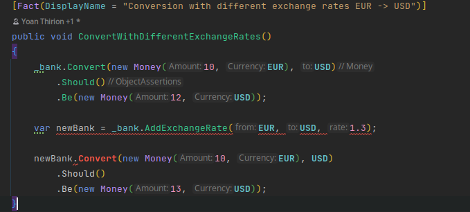
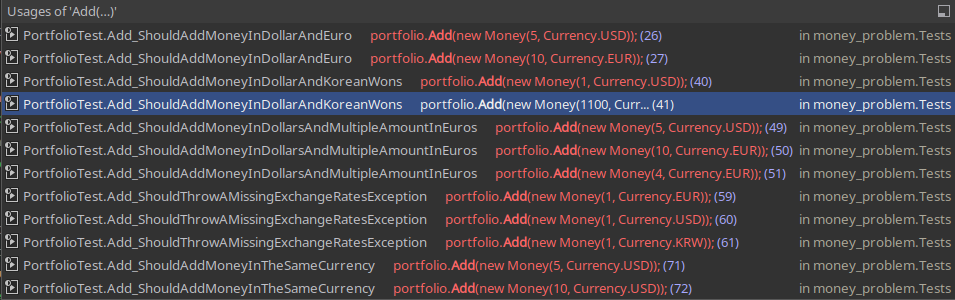
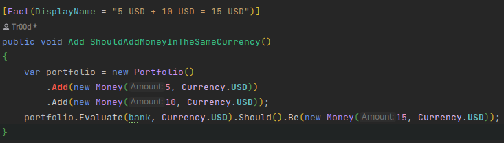

# Only Immutable Types
- Let's identify mutable types
  - Find where we have mutations in our classes

```java
public class Bank {
    ...
    
      public void AddExchangeRate(Currency from, Currency to, double rate)
          => _exchangeRates[KeyFor(from, to)] = rate;


    ...
}

public class Portfolio {
    ...
    public void Add(Money money) => this.moneys.Add(money);
    ...
}
```

## Bank
- We start by the `Bank` implementation
  - What we want to achieve by making it immutable is to have a method `addExchangeRate` with a signature like this `Currency` -> `Currency` -> `double` -> `Bank`
  - Let's start by adapting a test to make it `red`
    - We don't compile



- Make it `green`
```c#
public Bank AddExchangeRate(Currency from, Currency to, double rate)
{
    var updatedRates = this._exchangeRates;
    var key = KeyFor(from, to);
    updatedRates.TryAdd(key, default);
    updatedRates[key] = rate;
    return new Bank(updatedRates);
}

```
- Now we can refactor
  - Let's simplify our test
```c#
[Fact(DisplayName = "Conversion with different exchange rates EUR -> USD")]
public void ConvertWithDifferentExchangeRates()
{
    _bank.Convert(new Money(10, EUR), USD)
        .Should()
        .Be(new Money(12, USD));

    _bank.AddExchangeRate(EUR, USD, 1.3)
        .Convert(new Money(10, EUR), USD)
        .Should()
        .Be(new Money(13, USD));
}
```
- Let's make it impossible to mutate accidentally our `exchangeRates` from the `Bank`
  - We can force it by using `ReadOnlyDictionary` from the private constructor
```c#
public class Bank {
    private readonly ReadOnlyDictionary<string, double> _exchangeRates;
  
    private Bank(IDictionary<string, double> exchangeRates) => _exchangeRates = new ReadOnlyDictionary<string, double>(exchangeRates);
  
    public static Bank WithExchangeRate(Currency from, Currency to, double rate) => 
    new Bank(new Dictionary<string, double>()).AddExchangeRate(from, to, rate);
  
    public Bank AddExchangeRate(Currency from, Currency to, double rate)
    {
        var updatedRates = new Dictionary<string, double>(this._exchangeRates);
        var key = KeyFor(from, to);
        updatedRates.TryAdd(key, default);
        updatedRates[key] = rate;
        return new Bank(updatedRates);
    }
}
```

- We had an impact on `Portfolio` tests by doing it and need to adapt the test code as well
  - Now that `Bank` is immutable we need to change the private field instantiation
```c#
public class PortfolioTest {
    private readonly Bank bank;

    public PortfolioTest()
    {
        this.bank = Bank
            .WithExchangeRate(Currency.EUR, Currency.USD, 1.2)
            .AddExchangeRate(Currency.USD, Currency.KRW, 1100);
    }
    
    ...
}
```

## Portfolio
- Regarding the `Add` method, it is used a lot of time, so we need to have a different refactoring strategy



- Let's use the [Wrap Technique](https://understandlegacycode.com/blog/key-points-of-working-effectively-with-legacy-code/#2-the-wrap-technique) like we did already


- Rename the existing method to `AddOld`
```c#
public void AddOld(Money money) => this.moneys.Add(money);
```

- Adapt a test to have a red test that will call the new method



- Generate the new `add` method from test
  - Call the old method from the new one
  
```c#
public Portfolio Add(Money money)
{
    this.AddOld(money);
    return this;
}
```

- Now we can refactor
  - We add a private constructor
  - And need to define a public one as well

```c#
public class Portfolio {
    private readonly ICollection<Money> moneys;

    public Portfolio()
    {
        this.moneys = new List<Money>();
    }

    private Portfolio(IEnumerable<Money> moneys)
    {
        this.moneys = moneys.ToImmutableList();
    }

    public Portfolio Add(Money money)
    {
        List<Money> updatedMoneys = this.moneys.ToList();
        updatedMoneys.Add(money);
        return new Portfolio(updatedMoneys);
    }
    ...
}
```

- Now out test is green
- Let's refactor our test to make it simple to instantiate `Portfolio`
  - We encapsulate `Portfolio` instantiation in a dedicated method taking n Moneys as args

```c#
[Fact(DisplayName = "5 USD + 10 USD = 15 USD")]
public void Add_ShouldAddMoneyInTheSameCurrency()
{
    var portfolio = PortfolioWith(
        new Money(5, Currency.USD),
        new Money(10, Currency.USD));
    
    portfolio.Evaluate(bank, Currency.USD).Should().Be(new Money(15, Currency.USD));
}

private static Portfolio PortfolioWith(params Money[] moneys) =>
    moneys.Aggregate(new Portfolio(), (portfolio, money) => portfolio.Add(money));
```

- Let's plug remaining tests to the new `add` method

````c#
[Fact(DisplayName = "5 USD + 10 EUR = 17 USD")]
public void Add_ShouldAddMoneyInDollarAndEuro() =>
    PortfolioWith(new Money(5, Currency.USD), new Money(10, Currency.EUR))
        .Evaluate(this.bank, Currency.USD)
        .Should()
        .Be(new Money(17, Currency.USD));

[Fact(DisplayName = "1 USD + 1100 KRW = 2200 KRW")]
public void Add_ShouldAddMoneyInDollarAndKoreanWons() =>
    PortfolioWith(new Money(1, Currency.USD), new Money(1100, Currency.KRW))
        .Evaluate(this.bank, Currency.KRW)
        .Should()
        .Be(new Money(2200, Currency.KRW));

[Fact(DisplayName = "5 USD + 10 EUR + 4 EUR = 21.8 USD")]
public void Add_ShouldAddMoneyInDollarsAndMultipleAmountInEuros() =>
    PortfolioWith(new Money(5, Currency.USD), new Money(10, Currency.EUR), new Money(4, Currency.EUR))
        .Evaluate(bank, Currency.USD)
        .Should()
        .Be(new Money(21.8, Currency.USD));

[Fact(DisplayName = "Throws a MissingExchangeRatesException in case of missing exchange rates")]
public void Add_ShouldThrowAMissingExchangeRatesException()
{
    Action act = () => PortfolioWith(new Money(1, Currency.EUR), new Money(1, Currency.USD), new Money(1, Currency.KRW))
        .Evaluate(this.bank, Currency.EUR);
    act.Should().Throw<MissingExchangeRatesException>()
        .WithMessage("Missing exchange rate(s): [USD->EUR],[KRW->EUR]");
}

[Fact(DisplayName = "5 USD + 10 USD = 15 USD")]
public void Add_ShouldAddMoneyInTheSameCurrency()
{
    PortfolioWith(new Money(5, Currency.USD), new Money(10, Currency.USD))
        .Evaluate(bank, Currency.USD).Should().Be(new Money(15, Currency.USD));
}
````

- We can safely delete the `addOld` method

