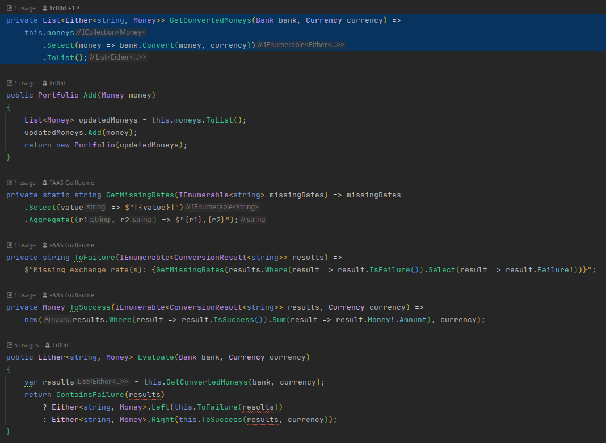

# Use an existing monad
During the last few iterations, a concept emerged from our code: `ConversionResult`.
It has evolved since it first appeared and now looks like a `monad`. 
Let's try to use the advantages of existing ones instead of having our own one.

In `C#`, we can use a library called [language-ext](https://github.com/louthy/language-ext) that extends `C#` with a lot of functional programming oriented classes and features.

As a reminder, this is what our `ConversionResult` looks like at the moment:
```csharp
public class ConversionResult<T>
{
    public ConversionResult(Money money)
    {
        this.Money = money;
    }

    public ConversionResult(T failure)
    {
        this.Failure = failure;
    }

    public Money? Money { get; }

    public T? Failure { get; }

    public bool IsFailure() => this.Failure is { };

    public bool IsSuccess() => this.Money is { };

    public static ConversionResult<T> FromFailure(T failure) => new ConversionResult<T>(failure);

    public static ConversionResult<T> FromMoney(Money money) => new ConversionResult<T>(money);
}
```

## Which monad?
In `language-ext`, some useful monad types have already been defined.


> Given the ConversionResult behavior, we are looking for a monad that can hold one of the 2 possible values: either a `success` or a `failure`.

- [`Option`](https://louthy.github.io/language-ext/LanguageExt.Core/Monads/Alternative%20Value%20Monads/Option/Option/index.html) is a monadic container type which represents an optional value
  - Instances of Option are either an instance of `Some` or `None`
  - It cannot hold 2 different types of value
- [`Try`](https://louthy.github.io/language-ext/LanguageExt.Core/Monads/Alternative%20Value%20Monads/Try/Try/index.html) is a monadic container type which represents a computation that may either result in an exception, or return a successfully computed value 
  - Instances of Try, are either an instance of `Success` or `Failure`
  - `It looks like a good candidate`
- [`Either`](https://louthy.github.io/language-ext/LanguageExt.Core/Monads/Alternative%20Value%20Monads/Either/Either/index.html) represents a value of two possible types
  - An `Either` is either a Left or a Right
  - `Another good candidate`
- [`Validation`](https://louthy.github.io/language-ext/LanguageExt.Core/Monads/Alternative%20Value%20Monads/Validation/index.html) is an applicative functor and facilitates accumulating errors
  - Not exactly what we're looking for at the moment 

The `Try` monad could be a good idea with notions of success/failure but it seems it won't fit.
We recently removed exceptions and our current monad return either a Money or a String. 

Finally, we decide to use the `Either` monad.

## Either monad
We start by adding the `LanguageExt.Core` package to our projects:

```xml
<ItemGroup>
  <PackageReference Include="LanguageExt.Core" Version="4.2.9" />
</ItemGroup>
```

As we rely a lot on `FluentAssertions`, we can also include `FluentAssertions.LanguageExt` to simplify the use of monads in our tests.
It means we won't have to extract values from monads in order to assert them.

```xml
<ItemGroup>
  <PackageReference Include="FluentAssertions.LanguageExt" Version="0.2.1" />
</ItemGroup>
```

### Portfolio
:red_circle: You know the drill by now, new `TDD` cycle. As usual, we start with a red test on the `Portfolio`.

We are going to use a technique we used before, the `Strangler` pattern, to change a method signature without breaking our production code or our tests.

- We rename the current `Evaluate` method into `EvaluateWithConversionResult`
- We adapt a test to use the future `Evaluate` method with a signature like this: `Bank` -> `Currency` -> `Either<String, Money>`
  - By convention, `Left` is the failure case when using `Either`
- We use `FluentAssertions.LanguageExt`

```csharp
[Fact(DisplayName = "5 USD + 10 EUR = 17 USD")]
public void Add_ShouldAddMoneyInDollarAndEuro() =>
    PortfolioWith(5d.Dollars(), 10d.Euros())
        .Evaluate(this.bank, Currency.USD)
        .Should()
        .Be(17d.Dollars());
```

It's not eye-popping but `FluentAssertions.LanguageExt` is really helpful here. 
`Evaluate` returns an `Either<string, Money>` and, thanks to the library, `.Should().Be(...)` will assert on the left or right part of the monad depending on the object we pass. 
`string` will evaluate the left part while `Money` will evaluate the right part.


Then, we generate the new method from the test:

```csharp
public Either<string, Money> Evaluate(Bank bank, Currency usd)
{
    throw new NotImplementedException();
}

public ConversionResult<string> EvaluateWithConversionResult(Bank bank, Currency currency)
{
    var results = this.GetConvertedMoneys(bank, currency);
    return ContainsFailure(results)
        ? ConversionResult<string>.FromFailure(this.ToFailure(results))
        : ConversionResult<string>.FromMoney(this.ToSuccess(results, currency));
}
```

:green_circle: We implement the method using the old one by using `Left()` and `Right()` methods from `Either`.

```csharp
public Either<string, Money> Evaluate(Bank bank, Currency currency)
{
    var result = this.EvaluateWithConversionResult(bank, currency);
    return result.IsFailure()
        ? Either<string, Money>.Left(result.Failure!)
        : Either<string, Money>.Right(result.Money!);
}
```

:large_blue_circle: Refactor time!
We can now put the logic from `EvaluateWithConversionResult` into `Evaluate` and verify if our tests still pass.

```csharp
public Either<string, Money> Evaluate(Bank bank, Currency currency)
{
    var results = this.GetConvertedMoneys(bank, currency);
    return ContainsFailure(results)
        ? Either<string, Money>.Left(this.ToFailure(results))
        : Either<string, Money>.Right(this.ToSuccess(results, currency));
}
```

`Evaluate` is now independent from `EvaluateWithConversionResult`.

:large_blue_circle: We can now decommission `EvaluateWithConversionResult` by calling `Evaluate` from our tests.

```csharp
[Fact(DisplayName = "1 USD + 1100 KRW = 2200 KRW")]
public void Add_ShouldAddMoneyInDollarAndKoreanWons() =>
    PortfolioWith(1d.Dollars(), 1100d.KoreanWons())
        .Evaluate(this.bank, Currency.KRW)
        .Should()
        .Be(2200d.KoreanWons());

[Fact(DisplayName = "5 USD + 10 EUR + 4 EUR = 21.8 USD")]
public void Add_ShouldAddMoneyInDollarsAndMultipleAmountInEuros() =>
    PortfolioWith(5d.Dollars(), 10d.Euros(), 4d.Euros())
        .Evaluate(bank, Currency.USD)
        .Should()
        .Be(21.8.Dollars());

[Fact(DisplayName = "Throws a MissingExchangeRatesException in case of missing exchange rates")]
public void Add_ShouldThrowAMissingExchangeRatesException()
{
    PortfolioWith(1d.Euros(), 1d.Dollars(), 1d.KoreanWons())
        .Evaluate(this.bank, Currency.EUR)
        .Should()
        .Be("Missing exchange rate(s): [USD->EUR],[KRW->EUR]");
}

[Fact(DisplayName = "5 USD + 10 USD = 15 USD")]
public void Add_ShouldAddMoneyInTheSameCurrency() =>
    PortfolioWith(5d.Dollars(), 10d.Dollars())
        .Evaluate(bank, Currency.USD)
        .Should()
        .Be(15d.Dollars());
```

Finally, `EvaluateWithConversionResult` is now considered `dead code` and we can safely remove it safely.

Another refactoring done right with `TDD`!

### Bank
Let's do the same at the `Bank` level

:red_circle: We adapt an existing test.

```csharp
[Fact(DisplayName = "10 EUR -> USD = 12 USD")]
public void ConvertEuroToUsd() =>
    _bank.ConvertWithConversionResult(10d.Euros(), USD)
        .Money
        .Should()
        .Be(12d.Dollars());
```

Then we generate our new method from it.

```csharp
public class Bank
{ 
    public Either<string, Money> Convert(Money money, Currency currency)
    {
        throw new NotImplementedException();
    }
    
    public ConversionResult<string> ConvertWithConversionResult(Money money, Currency to) =>
              this.CanConvert(money.Currency, to)
                  ? ConversionResult<string>.FromMoney(ConvertSafely(money, to))
                  : ConversionResult<string>.FromFailure($"{money.Currency}->{to}");
}

public class BankShould
{     
    [Fact(DisplayName = "10 EUR -> USD = 12 USD")]
    public void ConvertEuroToUsd() =>
        _bank.Convert(10d.Euros(), USD)
            .Should()
            .Be(12d.Dollars());
}
```

:green_circle: Same step than before. 
We implement the method by calling `ConvertWithConversionResult`.

```csharp
public Either<string, Money> Convert(Money money, Currency currency)
{
    var result = this.ConvertWithConversionResult(money, currency);
    return result.IsFailure()
        ? Either<string, Money>.Left(result.Failure!)
        : Either<string, Money>.Right(result.Money!);
}
```

:large_blue_circle: Refactor time!
We can now put the logic from `ConvertWithConversionResult` into `Convert` and verify if our tests still pass.

```csharp
public Either<string, Money> Convert(Money money, Currency currency) =>
    this.CanConvert(money.Currency, currency)
        ? Either<string, Money>.Right(this.ConvertSafely(money, currency))
        : Either<string, Money>.Left($"{money.Currency}->{currency}");
```

`Convert` is now independent from `ConvertWithConversionResult`.

:large_blue_circle: We can now decommission `ConvertWithConversionResult` by calling `Convert` from our tests.

```csharp
[Fact(DisplayName = "10 EUR -> EUR = 10 EUR")]
public void ConvertMoneyInSameCurrency() =>
    _bank.Convert(10d.Euros(), EUR)
        .Should()
        .Be(10d.Euros());

[Fact(DisplayName = "Throws a MissingExchangeRateException in case of missing exchange rates")]
public void ReturnsFailureResultGivenMissingExchangeRate() =>
    this._bank.Convert(10d.Euros(), KRW)
        .Should()
        .Be("EUR->KRW");

[Fact(DisplayName = "Conversion with different exchange rates EUR -> USD")]
public void ConvertWithDifferentExchangeRates()
{
    _bank.Convert(10d.Euros(), USD)
        .Should()
        .Be(12d.Dollars());

    _bank.AddExchangeRate(EUR, USD, 1.3)
        .Convert(10d.Euros(), USD)
        .Should()
        .Be(13d.Dollars());
}
```

Unfortunately, we have one more step to go.
`ConvertWithConversionResult` is still used in `GetConvertedMoneys` from `Portfolio`.

```csharp
private List<ConversionResult<string>> GetConvertedMoneys(Bank bank, Currency currency) =>
    this.moneys
        .Select(money => bank.ConvertWithConversionResult(money, currency))
        .ToList();
```
We can remove the use from the old method by converting the result back to a `ConversionResult`:

```csharp
private List<ConversionResult<string>> GetConvertedMoneys(Bank bank, Currency currency) =>
    this.moneys
        .Select(money => bank.Convert(money, currency))
        .Select(monad => monad.Match(money => new ConversionResult<string>(money), failure => new ConversionResult<string>(failure)))
        .ToList();
```

Finally, `ConvertWithConversionResult` is now considered `dead code` and we can safely remove it safely.

### Portfolio refactoring
We were able to remove `ConvertWithConversionResult` and finish our refactoring. But it leads us to another one: we need to remove every use of `ConversionResult` in the Portfolio. 

We can't use the same technique anymore.
Indeed, we can't use a test as driver here because none of these methods are exposed. 
They're all internals to `Portfolio`, only `Evaluate` is available.  

:large_blue_circle: Then, let's use our compiler errors as a refactoring driver. We use `GetConvertedMoneys` as starting point and make it return an `Either<>`.



The refactoring is easier than it seems. Here's what it looks like:
```csharp
private static bool ContainsFailure(IEnumerable<Either<string, Money>> results) =>
        results.Any(result => result.IsLeft);

private List<Either<string, Money>> GetConvertedMoneys(Bank bank, Currency currency) =>
    this.moneys
        .Select(money => bank.Convert(money, currency))
        .ToList();

public Portfolio Add(Money money)
{
    List<Money> updatedMoneys = this.moneys.ToList();
    updatedMoneys.Add(money);
    return new Portfolio(updatedMoneys);
}

private static string GetMissingRates(IEnumerable<string> missingRates) => missingRates
    .Select(value => $"[{value}]")
    .Aggregate((r1, r2) => $"{r1},{r2}");

private string ToFailure(IEnumerable<Either<string, Money>> results) =>
    $"Missing exchange rate(s): {GetMissingRates(results.Where(result => result.IsLeft).Select(result => result.IfRight(string.Empty)))}";

private Money ToSuccess(IEnumerable<Either<string, Money>> results, Currency currency) =>
    new(results.Where(result => result.IsRight).Sum(result => result.IfLeft(new Money(0, currency)).Amount), currency);

public Either<string, Money> Evaluate(Bank bank, Currency currency)
{
    var results = this.GetConvertedMoneys(bank, currency);
    return ContainsFailure(results)
        ? Either<string, Money>.Left(this.ToFailure(results))
        : Either<string, Money>.Right(this.ToSuccess(results, currency));
}
```

An important thing you may have realized: we are using `IfLeft()` and `IfRight()`. 
Even if we filter to have only failures or only moneys, the library does not trust us. We need to provide a default value in case the monad contains the other value.

For example:
```csharp
Either<string, Money> monad = ...
Money result = monad.IfLeft(new Money(0, Currency.Eur));
// result will contain:
// - new Money(0, Currency.Eur) if the monad contains a string
// - the monad value if the monad contains a money
```

:large_blue_circle: By providing a default value, we directly used the `Money` constructor.
We would like to give it a better meaning.

```csharp
private Money ToSuccess(IEnumerable<Either<string, Money>> results, Currency currency) =>
    new(results.Where(result => result.IsRight).Sum(result => result.IfLeft(Money.Empty(currency)).Amount), currency);
    
public record Money(double Amount, Currency Currency)
{
    public static Money Empty(Currency currency) => new Money(default, currency);
}
```

:large_blue_circle: We were able to remove all use from `ConversionResult`. So let's safely remove it.

## Use vavr collections
:large_blue_circle: Let's use the advantages of `vavr` to simplify our code

It comes with a large variety of immutable collections and functions that we can use to simplify our code. You can check them [here](https://docs.vavr.io/#_performance_characteristics).

### Bank
:red_circle: We start by using `io.vavr.collection.Map`, we can remove the call to `Collections.unmodifiableMap`

```java
import io.vavr.collection.HashMap;
import io.vavr.collection.Map;
import io.vavr.control.Either;

public final class Bank {
    private final Map<String, Double> exchangeRates;

    private Bank(Map<String, Double> exchangeRates) {
        this.exchangeRates = exchangeRates;
    }
    ...
```

:green_circle: Then we adapt other methods and make our tests green again.

```java
public final class Bank {
    private final Map<String, Double> exchangeRates;

    private Bank(Map<String, Double> exchangeRates) {
        this.exchangeRates = exchangeRates;
    }

    public static Bank withExchangeRate(Currency from, Currency to, double rate) {
        var bank = new Bank(HashMap.empty());
        return bank.addExchangeRate(from, to, rate);
    }

    public Bank addExchangeRate(Currency from, Currency to, double rate) {
        // put method returns a new instance of the Map
        return new Bank(exchangeRates.put(keyFor(from, to), rate));
    }
    
    ...
    
    // We use the getOrElse method allowing us to get the result safely and provide a default value if not found
    private Money convertSafely(Money money, Currency to) {
        return money.currency() == to
                ? money
                : new Money(money.amount() * exchangeRates.getOrElse(keyFor(money.currency(), to), 0d), to);
    }
}
```

### Portfolio
:red_circle: We start by using `io.vavr.collection.Seq`, we can remove the call to `Collections.unmodifiableMap`

```java
public final class Portfolio {
    private final Seq<Money> moneys;

    public Portfolio() {
        this.moneys = Vector.empty();
    }

    private Portfolio(Seq<Money> moneys) {
        this.moneys = moneys;
    }

    public Portfolio add(Money money) {
        return new Portfolio(moneys.append(money));
    }
    ...
}
```

:green_circle: Then we adapt other methods and make our tests green again

> Observe that we don't need to use stream api anymore. Functions like `map` are accessible directly from the data structure itself.

```java
public Either<String, Money> evaluate(Bank bank, Currency toCurrency) {
    var convertedMoneys = convertAllMoneys(bank, toCurrency);

    return containsFailure(convertedMoneys)
            ? left(toFailure(convertedMoneys))
            : right(sumConvertedMoney(convertedMoneys, toCurrency));
}

private Seq<Either<String, Money>> convertAllMoneys(Bank bank, Currency toCurrency) {
    return moneys.map(money -> bank.convert(money, toCurrency));
}

private boolean containsFailure(Seq<Either<String, Money>> convertedMoneys) {
    return convertedMoneys.exists(Either::isLeft);
}

// Use mkstring method instead of Collector
private String toFailure(Seq<Either<String, Money>> convertedMoneys) {
    return convertedMoneys
            .filter(Either::isLeft)
            .map(e -> String.format("[%s]", e.getLeft()))
            .mkString("Missing exchange rate(s): ", ",", "");
}

// Use the reduce method on double amounts
private Money sumConvertedMoney(Seq<Either<String, Money>> convertedMoneys, Currency toCurrency) {
    return new Money(convertedMoneys
            .filter(Either::isRight)
            .map(e -> e.getOrElse(new Money(0, toCurrency)))
            .map(Money::amount)
            .reduce(Double::sum), toCurrency);
}
```

We take advantage of this refactoring to reorganise the methods so that they can be read in their order of usage.

### DomainUtility
We use `streams` in this class as well so let's simplify it by using `vavr` as well

```java
public static Portfolio portfolioWith(Money... moneys) {
    return Vector.of(moneys)
            .foldLeft(new Portfolio(), Portfolio::add);
}
```

## Reflect
- What do you think about those concepts and this library?
- What could you do with it?


