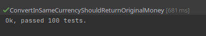
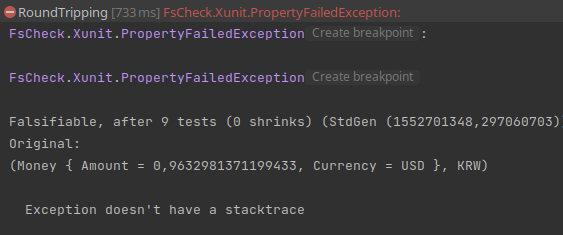
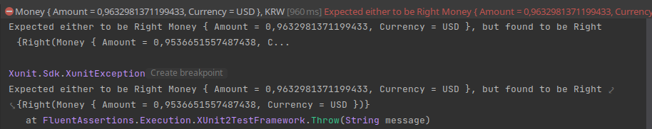
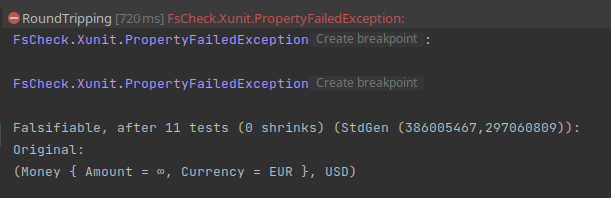
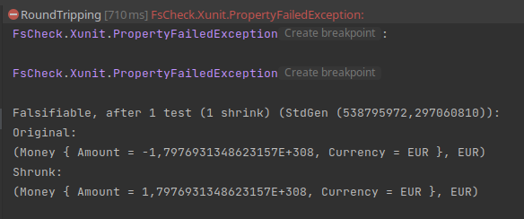

# Bank Properties 
We have worked closely with our domain experts and, at one point, we spotted a problem with the exchange rates.

| From | To   | Rate    |
|------|------|---------|
| EUR  | USD  | 1.2     |
| USD  | EUR  | 0.82    |
| USD  | KRW  | 1100    |
| KRW  | EUR  | 0.0009  |
| EUR  | KRW  | 1344    |
| KRW  | EUR  | 0.00073 |

We have 2 different exchange rates for `KRW` to `EUR`.

While discussing with our experts, they explained they have `simply` written the wrong destination currency (To) on line 4. Apparently, it can `often` happens...

The table now looks like this:

| From | To  | Rate    |
|------|-----|---------|
| EUR  | USD | 1.2     |
| USD  | EUR | 0.82    |
| USD  | KRW | 1100    |
| KRW  | USD | 0.0009  |
| EUR  | KRW | 1344    |
| KRW  | EUR | 0.00073 |

Still, we are not fully confident about this table being the core of our system. After more discussion with our experts, a way to enforce this table coherence/consistency is to implement what they call `Round-Tripping`: `from(to(x)) == x`

```gherkin
Given an original amount in currency A
When we convert it to currency B 
And convert it back to currency A
Then we should receive the original amount 
```

## Property-Based Testing
We will use [Property-Based Testing](https://xtrem-tdd.netlify.app/Flavours/pbt) to implement `Round-Tripping` properties in a first step. 
It could help us better understand the business and discover edge cases.

In `C#`, we can use [FsCheck](https://github.com/fscheck/FsCheck) to do so:

```xml
<PackageReference Include="FsCheck.Xunit" Version="2.16.5" />
``` 

### Round-Tripping in same currency
We want to create a first property like this:

```text
for all (Money money)
such that (bank.convert(money, money.currency()) equals money)) is satisfied
```

:red_circle: Let's create a new test class to host the properties: `BankProperties`

```c#
public class BankProperties
{
    private Dictionary<(Currency From, Currency To), double> exchangeRates = new Dictionary<(Currency, Currency), double>
    {
        { (Currency.EUR, Currency.USD), 1.2 },
        { (Currency.USD, Currency.EUR), 0.82 },
        { (Currency.USD, Currency.KRW), 1100 },
        { (Currency.KRW, Currency.USD), 0.0009 },
        { (Currency.EUR, Currency.KRW), 1344 },
        { (Currency.KRW, Currency.EUR), 0.00073 },
    };

    [Property]
    public void ConvertInSameCurrencyShouldReturnOriginalMoney()
    {
        // TODO: implement the test
    }
}
```

We want our property to look like this:

```csharp
[Property]
public void ConvertInSameCurrencyShouldReturnOriginalMoney()
{
    var originalAmount = new Money(amount, currency);
    var convertedAmount = this.bank.Convert(new Money(amount, currency), currency);
    return (originalAmount == convertedAmount).ToProperty();
}
```

:green_circle: In order to do so, we need to instantiate a `Bank` with business exchange rates.

```csharp
[Property]
private Property ConvertInSameCurrencyShouldReturnOriginalMoney(double amount, Currency currency)
{
    var originalAmount = new Money(amount, currency);
    var convertedAmount = this.bank.Convert(new Money(amount, currency), currency);
    return (originalAmount == convertedAmount).ToProperty();
}

private readonly Bank bank;

public BankProperties() {
    this.bank = this.NewBankWithExchangeRates(this.exchangeRates);
}

private Bank NewBankWithExchangeRates(Dictionary<(Currency From, Currency To), double> exchangeRates) {
    return exchangeRates.Aggregate(this.NewBank(), (bank, pair) => bank.AddExchangeRate(pair.Key.From, pair.Key.To, pair.Value));
}

private Bank NewBank() {
    var firstEntry = exchangeRates.First();
    return Bank.WithExchangeRate(firstEntry.Key.From, firstEntry.Key.To, firstEntry.Value);
}
```

As you can see, the following code is pretty "ugly"
- `Tuples` making it a bit hard to read.
It is because we have not encapsulated the exchange rates into a business entity.
A refactoring idea emerged here, we need to fight primitive obsession [again](3.no-primitive-types.md).
- We used a workaround to instantiate the bank: extract the first exchange rate to create the bank then iterate of every element from the list. The factory method `.WithExchangeRate` allows us to create a bank from a single exchange rate but we should be able to provide a list of exchange rates too.

We will tackle this refactoring later on, at the end of this step.

Another thing to mention, you maye have realized that this test takes longer to run than the others.
It's because `FsCheck` runs the test with one hundred random values (default configuration). 



:large_blue_circle: Let's refactor our test to simplify it
```csharp
[Property]
private Property ConvertInSameCurrencyShouldReturnOriginalMoney(double amount, Currency currency)
{
    var originalAmount = new Money(amount, currency);
    return (originalAmount == this.bank.Convert(originalAmount, currency)).ToProperty();
}
```

:large_blue_circle: Something we may try too: is `FsCheck` able to generate random moneys directly?

```csharp
[Property]
private Property ConvertInSameCurrencyShouldReturnOriginalMoney(Money originalAmount) => 
    (originalAmount == this.bank.Convert(originalAmount, originalAmount.Currency)).ToProperty();
```

It does!

Congratulations on this first `Property` 👌

### Round-Tripping in random currency
Now that we have our working property, let's go a little further by implementing it on random currency couples

```text
for all (double amount, Currency from, Currency to)
such that (bank.convert(bank.convert(money, to), from) equals money)) is satisfied
```
 
```csharp
[Property]
private Property RoundTripping(Money originalAmount, Currency currency) =>
    (originalAmount == this.bank
        .Convert(originalAmount, currency)
        .Bind(convertedMoney => this.bank.Convert(convertedMoney, originalAmount.Currency))).ToProperty();
```

When we run it we have a surprise:

:red_circle: Round-Tripping is not working as expected.
Our `Property` has been easily falsified.



One good practice of `Property-Based Testing` is to investigate failure by writing a classic Unit Test/Example-Based Test

> Never re-run on failures
 
:large_blue_circle: We refactor our `Property` code to be able to reuse the `Round-Tripping` logic.

```csharp
[Property]
private Property RoundTripping(Money originalAmount, Currency currency) =>
    (originalAmount == this.RoundTripConversion(originalAmount, currency)).ToProperty();

private Either<string, Money> RoundTripConversion(Money originalAmount, Currency currency) =>
    this.bank
        .Convert(originalAmount, currency)
        .Bind(convertedMoney => this.bank.Convert(convertedMoney, originalAmount.Currency));
```

We can now describe the example found by `quickcheck`
```csharp
[Fact(DisplayName = "Money { Amount = 0,9632981371199433, Currency = USD }, KRW")]
public void RoundTripError()
{
    var originalAmount = new Money(0.9632981371199433, Currency.USD);
    this.RoundTripConversion(originalAmount, Currency.KRW)
        .Should()
        .Be(originalAmount);
}
```

:red_circle: As expected we have an assertion error



We need to iterate oh this finding with our domain experts. 
We have to tolerate some loss because the lack of accuracy of the exchange rates.

> For them, it is OK to have 0.01 loss for a round-tripping

:green_circle: We change the way we assert the `Round-Tripping` by integrating this knowledge
Our example test is now passing to green.

```csharp
private Property RoundTripping(Money originalAmount, Currency currency) =>
    this.RoundTripConversion(originalAmount, Currency.KRW)
        .Map(convertedAmount => this.VerifyTolerance(originalAmount, convertedAmount))
        .IfLeft(false)
        .ToProperty();
            
[Fact(DisplayName = "Money { Amount = 0,9632981371199433, Currency = USD }, KRW")]
public void RoundTripError()
{
    var originalAmount = new Money(0.9632981371199433, Currency.USD);
    this.RoundTripConversion(originalAmount, Currency.KRW)
        .Map(convertedAmount => this.VerifyTolerance(originalAmount, convertedAmount))
        .Should().Be(true);
}

private const double Tolerance = 0.01;
/home/tr00d/Sources/xtrem-tdd-agilille/c#
private bool VerifyTolerance(Money originalAmount, Money convertedAmount) => Math.Abs(originalAmount.Amount - convertedAmount.Amount) <= Tolerance;
```

:red_circle: Even after the integration of this tolerance, the `Property` is still falsified.
The property still fails for various reasons.
One of them needs to be addressed (approximate rates), others need to be discussed (infinite amount, negative amount). 






> First of all, our domain experts recognize that exchange rates are not enough accurate and up-to-date...

They provide us an updated table for our tests:

| From | To  | Rate           |
|------|-----|----------------|
| EUR  | USD | 1.0567         |
| USD  | EUR | 0.9466         |
| USD  | KRW | 1302.0811      |
| KRW  | USD | 0.00076801737  |
| EUR  | KRW | 1368.51779     |
| KRW  | EUR | 0.00073        |

```csharp
private readonly Dictionary<(Currency From, Currency To), double> exchangeRates = new()
{
    {(Currency.EUR, Currency.USD), 1.0567},
    {(Currency.USD, Currency.EUR), 0.9466},
    {(Currency.USD, Currency.KRW), 1302.0811},
    {(Currency.KRW, Currency.USD), 0.00076801737},
    {(Currency.EUR, Currency.KRW), 1368.51779},
    {(Currency.KRW, Currency.EUR), 0.00073},
};
```

We cleared one problem but we are still not in the green zone yet.
Previous tests results showed us cases that may not make sense in our system, like infinite amount or small values.

One solution could be to implement a generator to define the boundaries of our `Money`: minimum and maximum amount. 

> According to our domain experts, our system should handle positive and negative numbers to a limit of 1 Billion no matter the currency.

```csharp
public class MoneyGenerator
{
    private const double MaxAMount = 1000000000;
    
    public static Arbitrary<Money> GenerateMoneys() =>
        Arb.From(from amount in Arb.Generate<double>()
            from currency in Arb.Generate<Currency>()
            where amount is >= 0 - MaxAMount and <= MaxAMount 
            select new Money(amount, currency));
}
```

Finally, we need to register it in our property using `Arb.Register<>()`. 

```csharp
public class BankProperties
{
    public BankProperties()
    {
        this.bank = this.NewBankWithExchangeRates(this.exchangeRates);
        Arb.Register<MoneyGenerator>();
    }
}
```

Out test is still failing.
It appears that we still have an issue with our `Property`


Generating random values by our own from -MAX_AMOUNT to MAX_AMOUNT seemed to have an effect on shrinking.
We discuss again with our domain experts and have a better understanding about what they meant regarding loss:
```text
for all (Money originalMoney, Currency to)
such that (bank.convert(bank.convert(originalMoney, to), from) equals money with a tolerance of 0.1% of the originalMoney)) is satisfied
```

We are going to implement a `relative` tolerance instead of an `absolute` tolerance.
Let's implement the tolerance as described above:
```csharp
public double GetTolerance(Money originalMoney) => Math.Abs(originalMoney.Amount * Tolerance);
```

The last step is to handle small values.


The problem is the value is so small that the framework treats it as a zero. 

Given our context, we will never face a money so small, even after conversion from a weak currency to a strong currency.
We can decide then to limit the number of decimals of the generated amounts.

```csharp
public class MoneyGenerator
{
    private const double MaxAMount = 1000000000;
    private const int MaxDigits = 5;

    public static Arbitrary<Money> GenerateMoneys() =>
        Arb.From(from amount in GetAmountGenerator()
            from currency in Arb.Generate<Currency>()
            select new Money(amount, currency));

    private static Gen<double> GetAmountGenerator() => Arb.Default.Float()
        .MapFilter(x => Math.Round(x, MaxDigits), x => x is >= 0 - MaxAMount and <= MaxAMount).Generator;
}
```

:green_circle: Our properties are now all green

```csharp
public class BankProperties
{
    private const double Tolerance = 0.01;
    private readonly Bank bank;

    private readonly Dictionary<(Currency From, Currency To), double> exchangeRates = new()
    {
        {(Currency.EUR, Currency.USD), 1.0567},
        {(Currency.USD, Currency.EUR), 0.9466},
        {(Currency.USD, Currency.KRW), 1302.0811},
        {(Currency.KRW, Currency.USD), 0.00076801737},
        {(Currency.EUR, Currency.KRW), 1368.51779},
        {(Currency.KRW, Currency.EUR), 0.00073},
    };

    public BankProperties()
    {
        this.bank = this.NewBankWithExchangeRates(this.exchangeRates);
        Arb.Register<MoneyGenerator>();
    }

    [Property]
    private Property ConvertInSameCurrencyShouldReturnOriginalMoney(Money originalAmount) =>
        (originalAmount == this.bank.Convert(originalAmount, originalAmount.Currency)).ToProperty();

    [Property]
    private Property RoundTripping(Money originalAmount, Currency currency) =>
        this.IsRoundTripConversionSuccessful(originalAmount, currency)
            .ToProperty();

    private bool IsRoundTripConversionSuccessful(Money originalAmount, Currency currency) =>
        this.bank
            .Convert(originalAmount, currency)
            .Bind(convertedMoney => this.bank.Convert(convertedMoney, originalAmount.Currency))
            .Map(convertedAmount => this.VerifyTolerance(originalAmount, convertedAmount))
            .IfLeft(false);

    [Fact(DisplayName = "Money { Amount = 0,9632981371199433, Currency = USD }, KRW")]
    public void RoundTripError()
    {
        var originalAmount = new Money(0.9632981371199433, Currency.USD);
        this.IsRoundTripConversionSuccessful(originalAmount, Currency.KRW)
            .Should()
            .BeTrue();
    }

    private bool VerifyTolerance(Money originalAmount, Money convertedAmount) =>
        Math.Abs(originalAmount.Amount - convertedAmount.Amount) <= GetTolerance(originalAmount);

    private double GetTolerance(Money originalMoney) => Math.Abs(originalMoney.Amount * Tolerance);

    private Bank NewBankWithExchangeRates(Dictionary<(Currency From, Currency To), double> rates)
    {
        return rates.Aggregate(this.NewBank(),
            (aggregatedBank, pair) => aggregatedBank.AddExchangeRate(pair.Key.From, pair.Key.To, pair.Value));
    }

    private Bank NewBank()
    {
        var firstEntry = exchangeRates.First();
        return Bank.WithExchangeRate(firstEntry.Key.From, firstEntry.Key.To, firstEntry.Value);
    }
}
```

## Reflect
During this iteration with `Property-Based Testing`, we asked ourselves a lot of questions regarding the Domain.
We have discovered a lot of rules that should be implemented in our Domain:
- Amount accepted for a Money representation
    - We now have a definition of what is a Valid Amount
- Round-Tripping should be checked when adding a currency inside the `Bank`
  - We have a clear description of the tolerance to apply

> Let's do it in the next iteration : add invariants to our domain
 


## Bonus - Bank Refactoring
We mentioned previously that our Bank could be improved.

Right now, creating a bank without exchange rates is not possible.
The only way is to call `.WithExchangeRate` and provide one rate.

We should be able to provide no rates, only one rate, or several rates `with the same method`.

:large_blue_circle: So let's refactor!

The first step would be to simplify the code by removing tuples.
We need to fight primitive obsession [again](3.no-primitive-types.md).
We can introduce an new type `ExchangeRate` from a test, using [a technique you should be familiar with](https://xtrem-tdd.netlify.app/Flavours/strangler-pattern).

```csharp
Bank bank = Bank.WithExchangeRate(new ExchangeRate(EUR, USD, 1.2));

public record ExchangeRate(Currency From, Currency To, double Rate);

public static Bank WithExchangeRate(Currency from, Currency to, double rate) => 
    new Bank(new Map<string, double>()).AddExchangeRate(from, to, rate);
    
public static Bank WithExchangeRate(ExchangeRate exchange) => WithExchangeRate(exchange.From, exchange.To, exchange.Rate);
```

:large_blue_circle: Then, we have to call the new method from `PortfolioTest` and `BankProperty` too before removing the method.

:large_blue_circle: We can apply the same process to the method `AddExchangeRate`.

:large_blue_circle: For now, our exchanges are stored in a `<string, double>` pair.
Now that we have a record for that, we can keep a `Seq<ExchangeRate>` instead.
It will also reduce the noise from the code.

```csharp
public sealed class Bank
{
    private readonly Seq<ExchangeRate> _exchangeRates;

    private Bank(Seq<ExchangeRate> exchangeRates) => this._exchangeRates = new Seq<ExchangeRate>(exchangeRates);

    private Money ConvertSafely(Money money, Currency to) =>
        to == money.Currency
            ? money
            : money with
            {
                Amount = money.Amount * this._exchangeRates
                    .Find(exchange => exchange.IsSameExchange(ExchangeRate.Default(money.Currency, to)))
                    .Map(exchange => exchange.Rate)
                    .IfNone(0),
                Currency = to,
            };

    private bool CanConvert(Currency from, Currency to) =>
        from == to || this._exchangeRates.Any(exchange => exchange.IsSameExchange(ExchangeRate.Default(from, to)));

    public Either<string, Money> Convert(Money money, Currency currency) =>
        this.CanConvert(money.Currency, currency)
            ? Either<string, Money>.Right(this.ConvertSafely(money, currency))
            : Either<string, Money>.Left($"{money.Currency}->{currency}");

    public static Bank WithExchangeRate(ExchangeRate exchange) =>
        new Bank(new Seq<ExchangeRate>()).AddExchangeRate(exchange);

    public Bank AddExchangeRate(ExchangeRate exchange) =>
        new(new Seq<ExchangeRate>(this._exchangeRates.Filter(element => !element.IsSameExchange(exchange)))
            .Add(exchange));
}
```

:large_blue_circle: We can now improve the way we instantiate the Bank.

We can use `params` to allow a list of elements, without changing the way our code is structured.

```csharp
public static Bank WithExchangeRate(ExchangeRate exchange) =>
  new Bank(new Seq<ExchangeRate>()).AddExchangeRate(exchange);

public static Bank WithExchangeRates(params ExchangeRate[] exchanges) =>
  new Bank(exchanges.ToSeq());
```

We can finally simplify the Bank instantiation in our property testing and remove our workaround.

```csharp
this.bank = this.exchangeRates.Aggregate(Bank.WithExchangeRates(), 
            (aggregatedBank, pair) => aggregatedBank.AddExchangeRate(new ExchangeRate(pair.Key.From, pair.Key.To, pair.Value)));
```

:large_blue_circle: Last refactoring, we can remove the dictionary of `Currency, Currency, double` in our property test and replace it by a `Seq<ExchangeRate>`.

```csharp
private readonly Seq<ExchangeRate> exchangeRates = new Seq<ExchangeRate>()
    .Add(new ExchangeRate(Currency.EUR, Currency.USD, 1.0567))
    .Add(new ExchangeRate(Currency.USD, Currency.EUR, 0.9466))
    .Add(new ExchangeRate(Currency.USD, Currency.KRW, 1302.0811))
    .Add(new ExchangeRate(Currency.KRW, Currency.USD, 0.00076801737))
    .Add(new ExchangeRate(Currency.EUR, Currency.KRW, 1368.51779))
    .Add(new ExchangeRate(Currency.KRW, Currency.EUR, 0.00073));

public BankProperties()
{
    this.bank = this.exchangeRates.Aggregate(Bank.WithExchangeRates(),
        (aggregatedBank, exchange) => aggregatedBank.AddExchangeRate(exchange));
    Arb.Register<MoneyGenerator>();
}
```