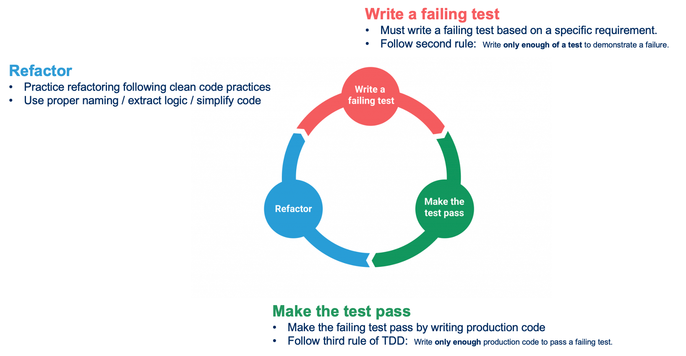
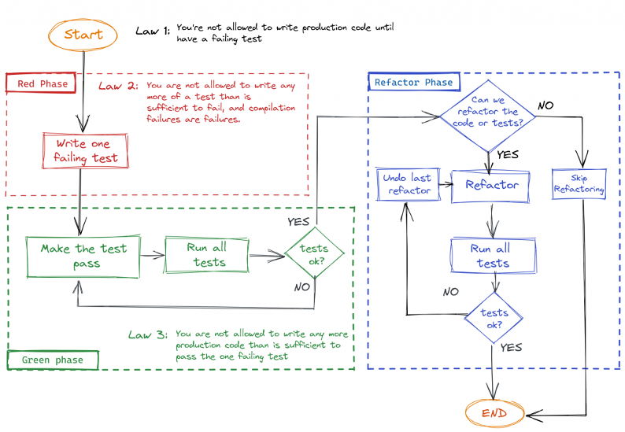
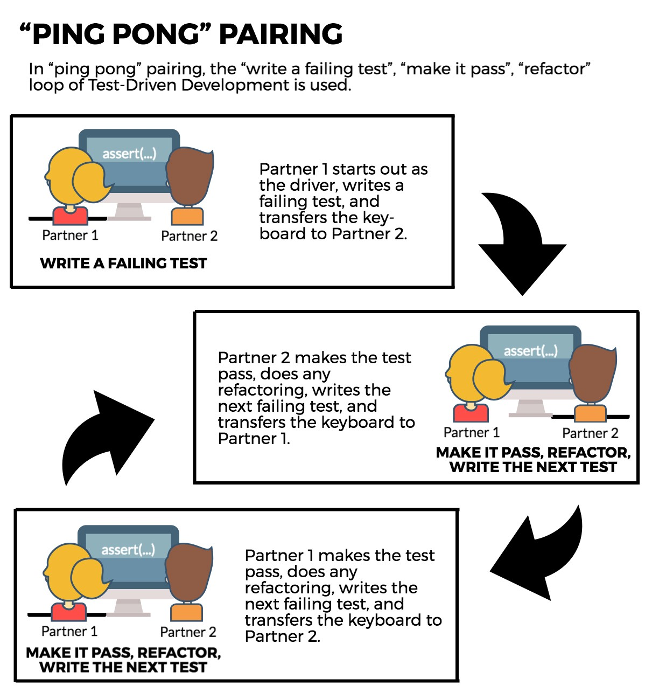

# What is Test-Driven Development (TDD)
TDD is a technique born of a set of beliefs about code :

* Simplicity - the art of maximizing the amount of work *not* done
* Obviousness and clarity are more virtuous than cleverness
* Writing uncluttered code is a key component of being successful

It's a methodology from Extreme Programming (XP) which was developed by Kent Beck while working on the C3 project.

`Test-Driven Development is a way of managing fear during programming - Kent Beck`

## Designing and structuring code
Test-Driven Development is **not** about testing code.
Tests are a mean to an end, our **safety net**, not the objective.

It is about
* Improving the design / structure of the code
* Allowing us to **safely** refactor thanks to our tests

## A bias toward simplicity
There are multiple ways to measure simplicity in Software :
* Fewer lines of code per feature
* Lower Cyclomatic Complexity
* Fewer side effects
* Smaller runtime / memory requirements

TDD forces us to craft the simplest thing that works
* Don't write more code than necessary (**YAGNI**)
* Stop the temptation to introduce artificial complexity

Still, TDD isn't a magic wand. It won't reduce:
* your development time
* the lines of code
* defect count

## Increased Confidence
TDD increases our confidence in our code :

* Each new test flexes the system in new, and previously untested, ways
* Over time, the tests suite guards us against regression failures
* We constantly have a fast feedback on the system's state (fast feedback-loop)

## Building block of TDD

* TDD is a scientific approach to Software Development
    * Write an hypothesis
    * Run the experiment
    * Observe the outcome
    * Try something new
    * Run the experiment
    * Observe the outcome
    * Try something new  
    * etc...

A 3-phase process :
* :red_circle: ***Red*** : We write a failing test
    * Including possible compilation failures
    * We run the test suite to verify the failing test
* :green_circle: ***Green*** : We write **just enough production code** to make the test green
    * Become the dirty developer for a minute
      * Hardcode
      * Duplicate
      * Copy/Paste
    * This step needs to be fast
    * We run the test suite to verify this
* :large_blue_circle: ***Refactor*** : We remove any code smells
    * Duplication, hardcoded values, improper use of language idioms, ...
    * If we break any test during this phase :
        * Prioritize getting back to green before exiting this phase
        * The longer it takes to come back to a safe state, the harder it is
        * Avoid sunk cost fallacy

## 3 Rules from Uncle Bob
1. Write production code only to pass a failing unit test.
1. Write no more of a unit test than sufficient to fail (compilation failures are failures).
1. Write no more production code than necessary to pass the one failing unit test.

# Xtrem TDD
Your craft mentor available online [here](https://xtrem-tdd.netlify.app/)

# A word on Pair Programming
Change role at each new failing test.

If you're more familiar with another pairing style, feel free to apply it.
