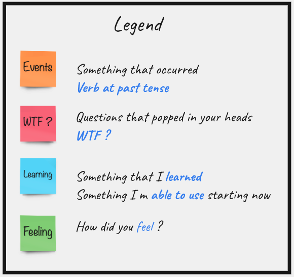

# Feedback Event Storming
EventStorming is a flexible workshop format for collaborative exploration of complex business domains.

It comes in different flavours, that can be used in different scenarios:

- to assess health of an existing line of business and to discover the most effective areas for improvements;
- to explore the viability of a new startup business model;
- to envision new services, that maximise positive outcomes to every party involved;
- to design clean and maintainable Event-Driven software, to support rapidly evolving businesses.

The adaptive nature of EventStorming allows sophisticated cross-discipline conversation between stakeholders with different backgrounds, delivering a new type of collaboration beyond silo and specialisation boundaries.

More about it [here](https://www.eventstorming.com/)

## Lets Event Storm

## Contribution
Please contact us through our [Xtrem repository](https://github.com/les-tontons-crafters/xtrem-tdd)