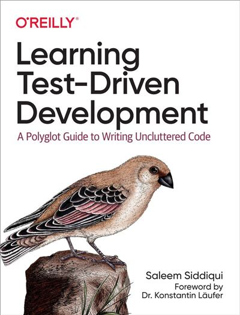
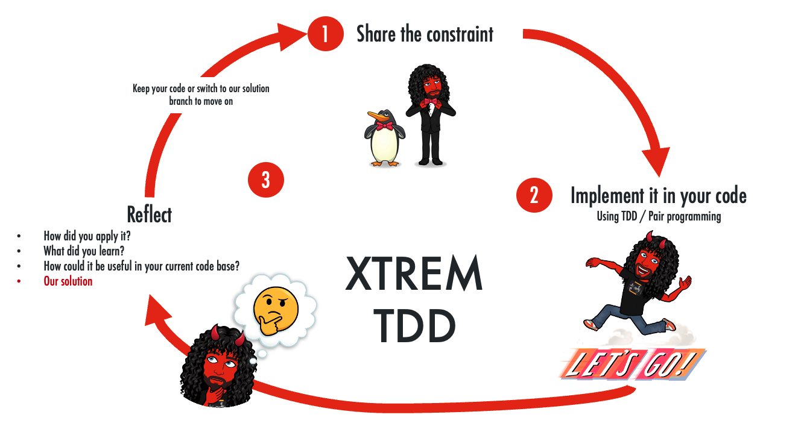
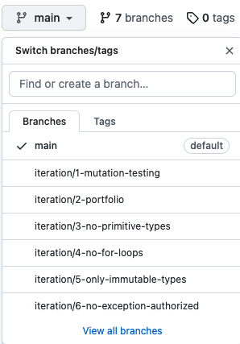

# Money Problem
This kata comes from [Saleem Siddiqui](https://www.linkedin.com/in/ssiddiqui/) 's book

[](https://www.oreilly.com/library/view/learning-test-driven-development/9781098106461/)

## What's the problem ?
We have  to build a spreadsheet to manage money in more than one currency : perhaps to manage a stock portfolio ?

| Stock | Stock exchange | Shares | Share Price | Total |
|---|---|---|---|---|
| IBM | NASDAQ | 100 | 124 USD | 12400 USD |
| BMW | DAX | 400 | 75 EUR | 30000 EUR |
| Samsung | KSE | 300 | 68000 KRW | 20400000 KRW |

To build it, we'd need to do simple arithmetic operations on numbers :

```text
5 USD x 2 = 10 USD
4002 KRW / 4 = 1000.5 KRW

// convert
5 USD + 10 EUR = 17 USD
1 USD + 1100 KRW = 2200 KRW
```

* We can use this table to determine exchange rates :

| From | To   | Rate    |
|------|------|---------|
| EUR  | USD  | 1.2     |
| USD  | EUR  | 0.82    |
| USD  | KRW  | 1100    |
| KRW  | EUR  | 0.0009  |
| EUR  | KRW  | 1344    |
| KRW  | EUR  | 0.00073 |

## List of Features to implement
We have already started the implementation by using TDD. We have discovered examples that helped us drive our implementation.

```text
Money Calculator :
✅ 10 EUR x 2 = 20 EUR
✅ 4002 KRW / 4 = 1000.5 KRW
✅ 5 USD + 10 USD = 15 USD

Bank implementation :
✅ Determine exchange rate based on the currencies involved (from -> to)
✅ Improve the implementation of exchange rates
✅ Allow exchange rates to be modified
```

## Constraints
You will have to develop using the main constraints:

- Test-Driven Development
- Pair Programming

### Xtrem Iteration
We will work in small iterations



- Share the constraint
- Implement it in your code
- Debriefing
	- How did you apply it?
	- What did you learn?
	- How could it be useful in your current code base?
	- Our solution
		- Keep your code or switch to our solution branch to move on

### Iterations
In this workshop, we will make those iterations in this order:

1. [Let's Mutate Some Code](facilitation/1.mutation-testing.md)
2. [Implement Portfolio](facilitation/2.portfolio.md)
3. [Fight Primitive Obsession](facilitation/3.no-primitive-types.md)
4. [No For Loops](facilitation/4.no-for-loops.md)
5. [Use Only Immutable Types](facilitation/5.only-immutable-types.md)
6. [Avoid Exceptions](facilitation/6.no-exception-authorized.md)
7. [Use an existing monad](facilitation/7.use-existing-monad.md)
8. [Property-Based Testing to challenge our Domain Model](facilitation/8.bank-properties.md)

### Solution
We have created 1 branch per iteration solution



Each branch contains:
- a possible `solution` for the given constraint in `java`, `c#` and `scala`
- a `step-by-step` guide to reproduce how we came from previous state to the state in the branch
  - 1 guide per language in `<language>/docs/<#iteration>.<constraint>.md`
