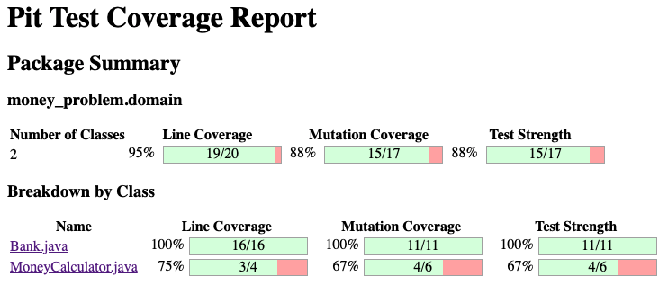
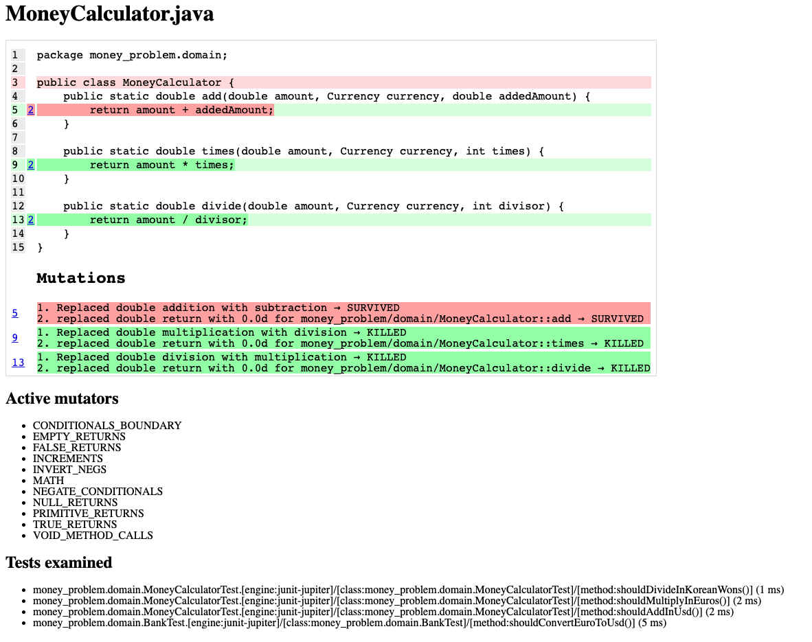
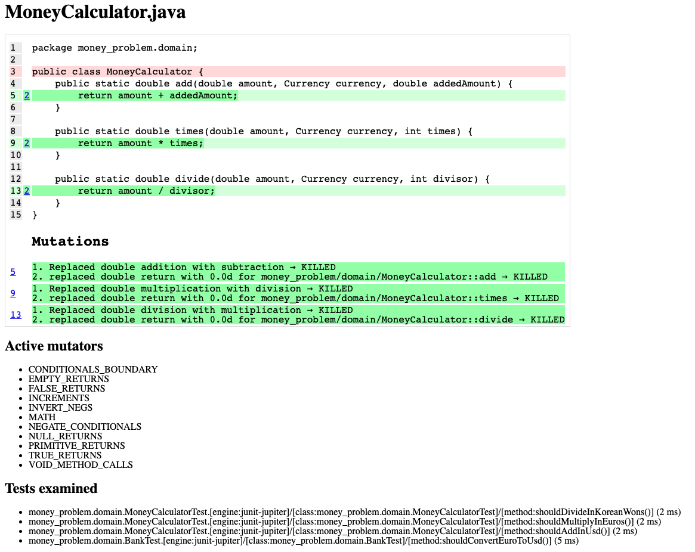

# Mutation Testing
- In java we can use [pitest](https://pitest.org/) as mutation testing library :

```xml
<properties>
    <pitest.version>1.8.0</pitest.version>
    <pitest.junit5.version>0.15</pitest.junit5.version>
</properties>
    
<plugin>
    <groupId>org.pitest</groupId>
    <artifactId>pitest-maven</artifactId>
    <version>${pitest.version}</version>
</plugin>

<dependency>
    <groupId>org.pitest</groupId>
    <artifactId>pitest-junit5-plugin</artifactId>
    <version>${pitest.junit5.version}</version>
    <scope>test</scope>
</dependency>
```

- After that we can run `pitest:report`
	- It mutates your code and run mutation coverage analysis
- Check the report inside `target/pit-reports`



- We can see that we have a `line coverage` of `95%` and a `mutation coverage` of `88%`
	- Let's analyze which mutants survived

## MoneyCalculator
- We have an issue with our tests on the `MoneyCalculator` on the `add` method :

	- We just assert that the result is not null...

```java
@Test
@DisplayName("5 USD + 10 USD = 15 USD")
void shouldAddInUsd() {
	 // Missing assertion
    assertThat(MoneyCalculator.add(5, USD, 10))
            .isNotNull();
}
```

### The fix
- Let's fix the test by improving our assertion :

```java
@Test
@DisplayName("5 USD + 10 USD = 15 USD")
void shouldAddInUsd() {
    assertThat(MoneyCalculator.add(5, USD, 10))
            .isEqualTo(15);
}
```

- When implemented, verify your test pass and run the `pitest` analysis again



## Mutants eradicated!

- Congratulations you have killed your first mutant !!!


- Why you should focus on good assertion?
	- Take a look at the [Test Desiderata](https://kentbeck.github.io/TestDesiderata/)
