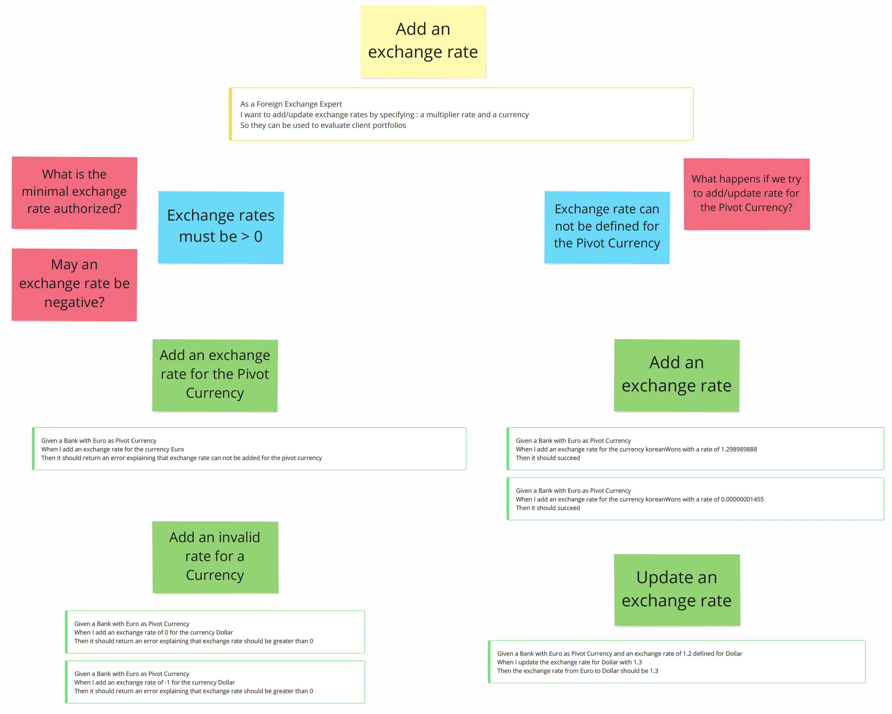
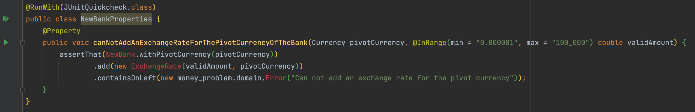

## Redesign the Bank
Based on our new understanding / discoveries from the `example mapping` workshop we can work on the redesign of the `Bank`.
The examples will serve to drive our implementation.

If we increment on the existing `Bank` code, we will have directly huge impact on the whole system.

### Sprout Technique
One way to avoid it is to use a technique called [Sprout Technique](https://understandlegacycode.com/blog/key-points-of-working-effectively-with-legacy-code/#1-the-sprout-technique) from [Michael Feathers](https://wiki.c2.com/?MichaelFeathers) in his book [Working Effectively with Legacy Code](https://www.oreilly.com/library/view/working-effectively-with/0131177052/):
- Create your code somewhere else (use T.D.D to drive your implementation)
- Identify where you should call that code from the existing code: the insertion point.
- Call your code from the Existing or Legacy Code.

> Let's use this technique

### Tests list
Based on the example mapping outcome we can create a test list and think about the design of our `Bank`.

#### Define pivot currency


Regarding our business, those rules are really important and should be at the heart of our system.
To implement those, we can simply well encapsulate our class by making impossible `by design` to change the pivot currency of a living `Bank` instance.

We have not really test cases here, but it gives us ideas for preserving the integrity of our system.

#### Add an exchange rate


We can use `Property-Based Testing` here to check those rules

Can not add an exchange rate for the pivot currency of the `Bank`:
```text
for all (currency, positiveDouble)
createBankWithPivotCurrency(currency)
    .add(new ExchangeRate(positiveDouble, currency)) should return an error("Can not add an exchange rate for the pivot currency")
```

Let's start to work on this property first.

:red_circle: As usual, we start by a failing test / property on a new bank implementation

```java
@RunWith(JUnitQuickcheck.class)
public class NewBankProperties {
    @Property
    public void canNotAddAnExchangeRateForThePivotCurrencyOfTheBank(Currency pivotCurrency, @InRange(min = "0.000001", max = "100_000") double validAmount) {
        assertThat(NewBank.withPivotCurrency(pivotCurrency)
                .add(new ExchangeRate(validAmount, pivotCurrency))
                .containsOnLeft(new money_problem.domain.Error("Can not add an exchange rate for the pivot currency"));
    }
}
```

We have some code to generate from here, you remember we wanted to fight primitive obsession so decided to represent the `ExchangeRate` as a business concept.



```java
public class NewBank {
    public static NewBank withPivotCurrency(Currency pivotCurrency) {
        return null;
    }

    public Either<Error, NewBank> add(ExchangeRate exchangeRate) {
        return null;
    }
}

public record Error(String message) {
}

public record ExchangeRate(double amount, Currency currency) {
}
```

:green_circle: We can then fake the expected behavior to make it green.
```java
public class NewBank {
    public static NewBank withPivotCurrency(Currency pivotCurrency) {
        return new NewBank();
    }

    public Either<Error, NewBank> add(ExchangeRate exchangeRate) {
        return Left(new Error("Can not add an exchange rate for the pivot currency"));
    }
}
```

:large_blue_circle: Any improvement?

Can not use a negative double or 0 as exchange rate: 
```text
for all (pivotCurrency, currency, negativeOr0Double)
such that currency != pivotCurrency
createBankWithPivotCurrency(pivotCurrency)
    .add(new ExchangeRate(negativeOr0Double, currency)) should return error("Exchange rate should be greater than 0")
```

:red_circle: Let's add a second property regarding the fact an `Exchange rate` should never be negative or equal to 0.
It should be a responsibility of the `EchangeRate` data structure so let's write this property aside from the ones of the `Bank`:
```java
@RunWith(JUnitQuickcheck.class)
public class ExchangeRateProperties {
    @Property
    public void canNotUseANegativeDoubleOrZeroAsExchangeRate(
            @InRange(max = "0") double invalidAmount,
            Currency anyCurrency) {
        assertThat(ExchangeRate.from(invalidAmount, anyCurrency))
                .containsOnLeft(new Error("Exchange rate should be greater than 0"));
    }
}
```

:green_circle: Create the method and fake its behavior for now.
Here to preserve encapsulation and force the usage of the `from` factory method, we choose to use a classic class and not a record.

You can see the `from` method as a parsing one. Here we apply a principle called [`parse don't validate`](https://lexi-lambda.github.io/blog/2019/11/05/parse-don-t-validate/). 
> Once an object is instantiated, we know for sure that it is valid.

If you use only primitive types, this property is hard to achieve and you will have to make a lot of validation in different places inside your system. 

```java
public class ExchangeRate {
    private double rate;
    private Currency currency;

    private ExchangeRate(double rate, Currency currency) {
        this.rate = rate;
        this.currency = currency;
    }

    public static Either<Error, ExchangeRate> from(double rate, Currency currency) {
        return Left(new Error("Exchange rate should be greater than 0"));
    }
}
```

:large_blue_circle: Improve our exchange rate instantiation in test
```java
@RunWith(JUnitQuickcheck.class)
public class NewBankProperties {
    @Property
    public void canNotAddAnExchangeRateForThePivotCurrencyOfTheBank(Currency pivotCurrency, @InRange(min = "0.000001", max = "100000") double validRate) {
        assertThat(withPivotCurrency(pivotCurrency)
                .add(createExchangeRate(pivotCurrency, validRate)))
                .containsOnLeft(new Error("Can not add an exchange rate for the pivot currency"));
    }

    private ExchangeRate createExchangeRate(Currency pivotCurrency, double validRate) {
        return from(validRate, pivotCurrency).get();
    }
}
```


Add an exchange rate for a Currency:
```text
for all (pivotCurrency, currency, positiveDouble)
such that currency != pivotCurrency
createBankWithPivotCurrency(pivotCurrency)
    .add(new ExchangeRate(positiveDouble, currency)) should return success
```

:red_circle: Let's triangulate the success implementation now
```java
@Property
public void canAddAnExchangeRateForAnyCurrencyDifferentFromThePivot(
        Currency pivotCurrency,
        Currency otherCurrency,
        @InRange(min = MINIMUM_RATE, max = MAXIMUM_RATE) double validRate) {
    assumeTrue(pivotCurrency != otherCurrency);

    assertThat(withPivotCurrency(pivotCurrency)
            .add(createExchangeRate(otherCurrency, validRate)))
            .isRight();
}
```

:green_circle: Improve the `ExchangeRate` design to move on.
```java
public class ExchangeRate {
    private double rate;
    private Currency currency;

    private ExchangeRate(double rate, Currency currency) {
        this.rate = rate;
        this.currency = currency;
    }

    private static boolean isPositive(double rate) {
        return rate > 0;
    }

    public static Either<Error, ExchangeRate> from(double rate, Currency currency) {
        return isPositive(rate)
                ? Right(new ExchangeRate(rate, currency))
                : Left(new Error("Exchange rate should be greater than 0"));
    }
}
```

We then need to work at the `Bank` level:
```java
public class NewBank {
    private Currency pivotCurrency;

    private NewBank(Currency pivotCurrency) {
        this.pivotCurrency = pivotCurrency;
    }

    public static NewBank withPivotCurrency(Currency pivotCurrency) {
        return new NewBank(pivotCurrency);
    }

    public Either<Error, NewBank> add(ExchangeRate exchangeRate) {
        if (exchangeRate.getCurrency() == pivotCurrency) {
            return Left(new Error("Can not add an exchange rate for the pivot currency"));
        }
        return Right(new NewBank(pivotCurrency));
    }
}

And expose the currency of the ExchangeRate

public class ExchangeRate {
    ...
    public Currency getCurrency() {
        return currency;
    }
    ...
}
```

:large_blue_circle: We can improve our `Bank` implementation:

```java
public class NewBank {
    private final Currency pivotCurrency;

    private NewBank(Currency pivotCurrency) {
        this.pivotCurrency = pivotCurrency;
    }

    public static NewBank withPivotCurrency(Currency pivotCurrency) {
        return new NewBank(pivotCurrency);
    }

    public Either<Error, NewBank> add(ExchangeRate exchangeRate) {
        return exchangeRate.getCurrency() != pivotCurrency
                ? Right(new NewBank(pivotCurrency))
                : Left(new Error("Can not add an exchange rate for the pivot currency"));
    }
}
```

#### Convert a Money


Convert in unknown currencies:
```text
for all (pivotCurrency, currency, money)
such that currency != pivotCurrency
createBankWithPivotCurrency(pivotCurrency)
    .convert(money, currency) should return error(money.currency->currency)
```

:red_circle: add this failing test
```java
@Property
public void canNotConvertToAnUnknownCurrencies(
        Currency pivotCurrency,
        Currency otherCurrency,
        @From(MoneyGenerator.class) Money money) {
    notPivotCurrency(pivotCurrency, otherCurrency);

    assertThat(withPivotCurrency(pivotCurrency)
            .convert(money, otherCurrency))
            .containsOnLeft(new Error("No exchange rate defined for " + money.currency() + "->" + otherCurrency));
}

public class NewBank {
    private final Currency pivotCurrency;

    private NewBank(Currency pivotCurrency) {
        this.pivotCurrency = pivotCurrency;
    }

    public static NewBank withPivotCurrency(Currency pivotCurrency) {
        return new NewBank(pivotCurrency);
    }

    public Either<Error, NewBank> add(ExchangeRate exchangeRate) {
        return exchangeRate.getCurrency() != pivotCurrency
                ? Right(new NewBank(pivotCurrency))
                : Left(new Error("Can not add an exchange rate for the pivot currency"));
    }

    // To compile
    public Either<Error, NewBank> convert(Money money, Currency to) {
        return null;
    }
}
```

:green_circle: Make it pass.


- From examples: edge cases
- ConvertThroughPivotCurrency
- PBT removed after we learned a lot ?
   - Check which property makes still sense
- [Parse don't validate](https://lexi-lambda.github.io/blog/2019/11/05/parse-don-t-validate/)
- Continuation functions instead of procedural code
- Test improvement 
    - Parameterized Tests
    - Higher order function
    - Organize tests: failure vs success -> Nested classes
- Public contract of the bank:
    - add(ExchangeRate rate) -> ExchangeRate Currency + double
    - convert(Money money, Currency currency) -> Either<Error, Bank>
- Use Error types instead of String when using Either
- Call the branch -> 10-bank-redesign