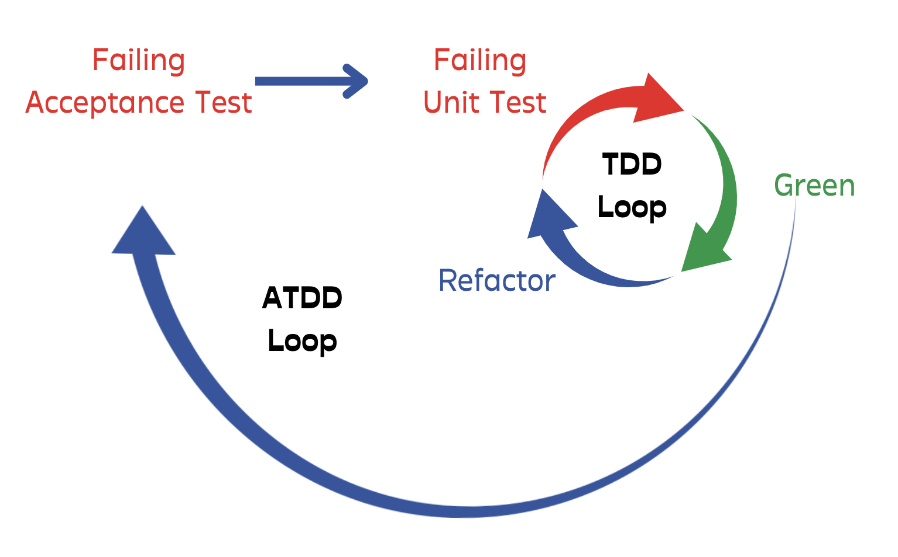
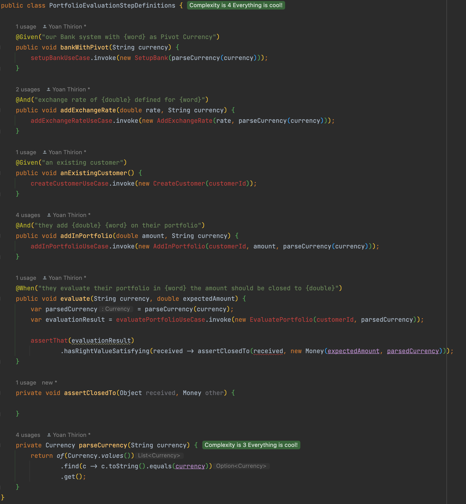
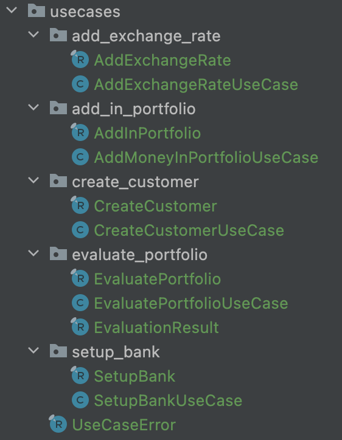
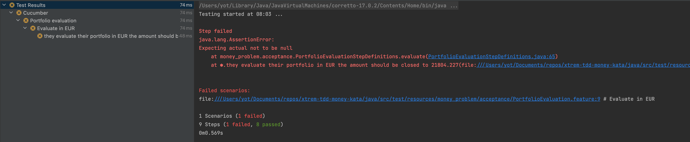
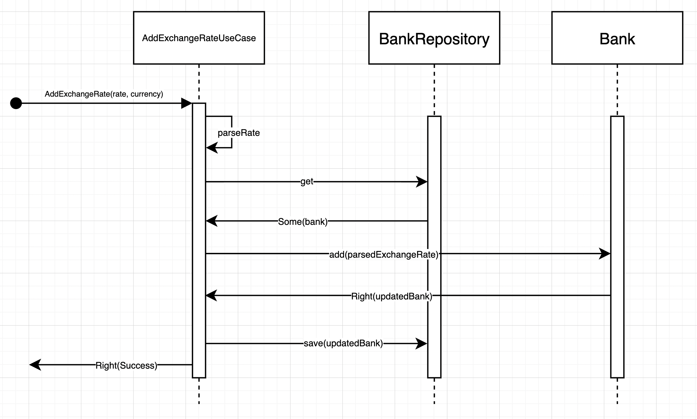
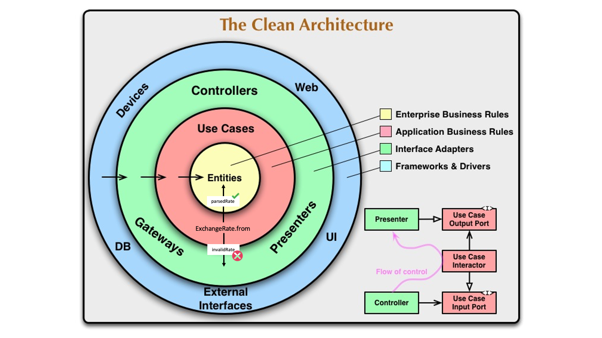
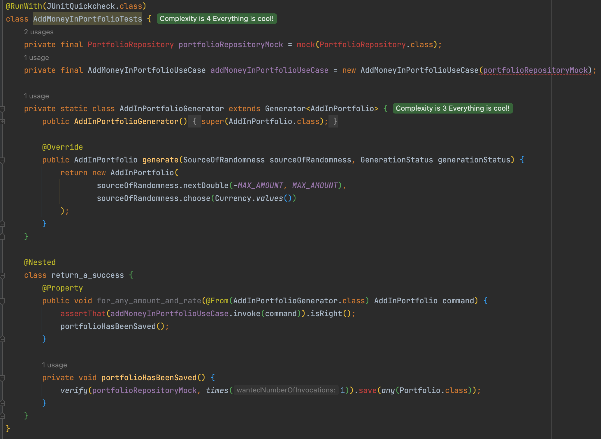
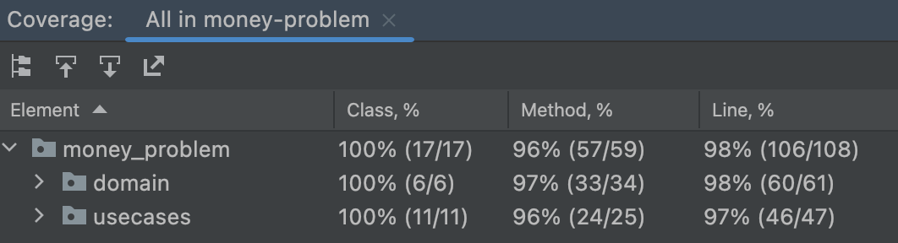

## Add an Acceptance Test
### Outside-In TDD




### Clean Architecture


### Write a failing Acceptance Test
- Add cucumber
```xml
<properties>
    ...
    <cucumber.version>7.8.1</cucumber.version>
</properties>

<dependency>
    <groupId>io.cucumber</groupId>
    <artifactId>cucumber-java</artifactId>
    <version>${cucumber.version}</version>
    <scope>test</scope>
</dependency>
<dependency>
    <groupId>io.cucumber</groupId>
    <artifactId>cucumber-junit</artifactId>
    <version>${cucumber.version}</version>
    <scope>test</scope>
</dependency>
```
- Install Cucumber plugin available [here](https://plugins.jetbrains.com/plugin/7212-cucumber-for-java)
- Automate run through junit

```java
@RunWith(Cucumber.class)
public class CucumberRunnerTest {

}
```

- Suppress warning by adding cucumber.properties

```properties
cucumber.publish.quiet=true
```

- Fix `SL4J` issue:

```xml
<dependency>
    <groupId>org.slf4j</groupId>
    <artifactId>slf4j-api</artifactId>
    <version>${slf4j.version}</version>
</dependency>
<dependency>
    <groupId>org.slf4j</groupId>
    <artifactId>slf4j-simple</artifactId>
    <version>${slf4j.version}</version>
</dependency>
```


- Create a first `scenario`

```gherkin
Feature: Portfolio evaluation
  Customers can evaluate their Portfolio in the 3 currencies supported by our system.

  Background:
    Given our Bank system with EUR as Pivot Currency
    And exchange rate of 1.2 defined for USD
    And exchange rate of 1344 defined for KRW

  Scenario: Evaluate in EUR
    Given an existing portfolio
    And our customer adds 5678.89 USD on their portfolio
    And our customer adds 5674567.245 KRW on their portfolio
    And our customer adds 9432 USD on their portfolio
    And our customer adds 4989.67 EUR on their portfolio
    When they evaluate their portfolio in EUR the amount should be 21804.227
```

:red_circle: generate steps for `Background` and the `Scenario`

What do we need in this test if we follow Clean Architecture principles?



- Create what we need with `generate code from usage`
```java
public class PortfolioEvaluationStepDefinitions {

    private final SetupBankUseCase setupBankUseCase = new SetupBankUseCase();
    private final AddExchangeRateUseCase addExchangeRateUseCase = new AddExchangeRateUseCase();
    private final AddMoneyInPortfolioUseCase addInPortfolioUseCase = new AddMoneyInPortfolioUseCase();
    private final EvaluatePortfolioUseCase evaluatePortfolioUseCase = new EvaluatePortfolioUseCase();
    private final UUID customerId = UUID.randomUUID();

    @Given("our Bank system with {word} as Pivot Currency")
    public void bankWithPivot(String currency) {
        setupBankUseCase.invoke(new SetupBank(parseCurrency(currency)));
    }

    @And("exchange rate of {double} defined for {word}")
    public void addExchangeRate(double rate, String currency) {
        addExchangeRateUseCase.invoke(new AddExchangeRate(rate, parseCurrency(currency)));
    }

    @Given("an existing portfolio")
    public void anExistingPortfolio() {
    }

    @And("our customer adds {double} {word} on their portfolio")
    public void addInPortfolio(double amount, String currency) {
        addInPortfolioUseCase.invoke(new AddInPortfolio(customerId, amount, parseCurrency(currency)));
    }

    @When("they evaluate their portfolio in {word} the amount should be {double}")
    public void evaluate(String currency, double expectedAmount) {
        var parsedCurrency = parseCurrency(currency);
        var evaluationResult = evaluatePortfolioUseCase.invoke(new EvaluatePortfolio(customerId, parsedCurrency));

        assertThat(evaluationResult)
                .hasRightValueSatisfying(received -> assertClosedTo(received, new Money(expectedAmount, parsedCurrency)));
    }

    private void assertClosedTo(EvaluationResult evaluationResult, Money expected) {
        Assertions.assertThat(evaluationResult.evaluatedAt()).isCloseTo(LocalDateTime.now(), byLessThan(1, ChronoUnit.SECONDS));
        Assertions.assertThat(evaluationResult.currency()).isEqualTo(expected.currency());
        Assertions.assertThat(evaluationResult.amount()).isCloseTo(expected.amount(), offset(0.001d));
    }

    private Currency parseCurrency(String currency) {
        return of(Currency.values())
                .find(c -> c.toString().equals(currency))
                .get();
    }
}
```

We should avoid manipulating `non deterministic data` in our tests: `LocalDateTime.now()`. We will have to do something about it...

- Take a look at code organization



After having generated the code, our `acceptance test` fails because nothing is implement.

Congrats, you have a first failing `acceptance test` that we will use as an implementation driver.



## TDD Loops
- Go at the Unit Test Level and work on a first Use Case.

> What are the responsibilities of Use Cases?

- Fetch a repository to identify if the customer exists in the system
  - If so, delegate the business logic to the domain entity then store the new state
  - If no, return an error

### Use cases tests
- Use Case tests are coupled to the system API, not the system implementation
- Use Case tests are readable as requirement specs, rather than implementation specs
- High coverage at low test maintenance costs, thus increasing ROI
- High test robustness, we can refactor the system safely without breaking tests

### Set up Bank
Let's think about test cases for the setup of the Bank:

```text
Bank already setup (can not change Pivot by design) -> returns a failure
Bank not existing -> return a success
```

> What do we mean by Bank already exists?

:red_circle: add the non-passing test

```java
class SetupBankTest {
    @Test
    void return_an_error_when_bank_already_setup() {
        assertThat(new SetupBankUseCase().invoke(new SetupBank(EUR)))
                .containsOnLeft(new UseCaseError("Bank is already setup"));
    }
} 
```

:green_circle: implement the `invoke` method

```java
public class SetupBankUseCase {
    public Either<UseCaseError, Void> invoke(SetupBank setupBank) {
        return left(new UseCaseError("Bank is already setup"));
    }
}
```

:large_blue_circle: create a factory method for instantiating `UseCaseError`

```java
public class SetupBankUseCase {
    public Either<UseCaseError, Void> invoke(SetupBank setupBank) {
        return left(error("Bank is already setup"));
    }
}
```

:red_circle: add the passing test

```java
@Test
void return_a_success_when_bank_not_already_setup() {
    assertThat(new SetupBankUseCase().invoke(new SetupBank(EUR)))
            .isRight();
}
```

We need a state to check if the `Bank` has already been set up in the Use Case.

For that purpose we will need a `datastore`, we will represent it through a `Repository`.
For now, we just need the definition of this `port` (a driven one) and pass it to our `Use Case`.

We need to use a `mock` for `BankRepository`
- Add `mockito` dependency

```xml
<dependency>
    <groupId>org.mockito</groupId>
    <artifactId>mockito-core</artifactId>
    <version>${mockito-core.version}</version>
    <scope>test</scope>
</dependency>
```

Then adapt the tests

```java
class SetupBankTest {
    private final BankRepository bankRepositoryMock = mock(BankRepository.class);

    @Test
    void return_an_error_when_bank_already_setup() {
        when(bankRepositoryMock.exists()).thenReturn(true);

        assertThat(new SetupBankUseCase(bankRepository).invoke(new SetupBank(EUR)))
                .containsOnLeft(new UseCaseError("Bank is already setup"));
    }

    @Test
    void return_a_success_when_bank_not_already_setup() {
        when(bankRepositoryMock.exists()).thenReturn(false);

        assertThat(new SetupBankUseCase(bankRepositoryMock).invoke(new SetupBank(EUR)))
                .isRight();

        verify(bankRepositoryMock, times(1))
                .save(any(Bank.class));
    }
}
```

:green_circle: implement the missing pieces in the `UseCase`

```java
public class SetupBankUseCase {
    private final BankRepository bankRepository;

    public SetupBankUseCase(BankRepository bankRepository) {
        this.bankRepository = bankRepository;
    }

    public Either<UseCaseError, Success<Void>> invoke(SetupBank setupBank) {
        return bankRepository.exists()
                ? left(error("Bank is already setup"))
                : right(setupBank(setupBank.currency()));
    }

    private Success<Void> setupBank(Currency currency) {
        bankRepository.save(withPivotCurrency(currency));
        return emptySuccess();
    }
}

public record Success<T>() {
    public static Success<Void> emptySuccess() {
        return new Success<>();
    }
}
```

:large_blue_circle: Make our tests more readable

```java
class SetupBankTest {
    private final BankRepository bankRepositoryMock = mock(BankRepository.class);
    private final SetupBankUseCase setupBankUseCase = new SetupBankUseCase(bankRepositoryMock);
    private final SetupBank setupBankCommand = new SetupBank(EUR);

    @Test
    void return_an_error_when_bank_already_setup() {
        bankAlreadySetup();

        assertThat(setupBankUseCase.invoke(setupBankCommand))
                .containsOnLeft(error("Bank is already setup"));
    }

    @Test
    void return_a_success_when_bank_not_already_setup() {
        bankNotSetup();

        assertThat(setupBankUseCase.invoke(setupBankCommand))
                .containsOnRight(emptySuccess());

        bankHasBeenSaved();
    }

    private void bankAlreadySetup() {
        when(bankRepositoryMock.exists()).thenReturn(true);
    }

    private void bankNotSetup() {
        when(bankRepositoryMock.exists()).thenReturn(false);
    }

    private void bankHasBeenSaved() {
        verify(bankRepositoryMock, times(1))
                .save(any(Bank.class));
    }
}
```

### Add exchange rate
Let's think about test cases for adding exchange rates:

```text
Bank is not setup -> returns a failure : No bank defined
Bank is setup with EUR as pivot, add invalid rate : -2 USD -> Exchange rate should be greater than 0
Bank is setup with EUR as pivot, trying to add exchange rate for EUR when EUR is pivot -> Can not add an exchange rate for the pivot currency
Bank is setup with EUR as pivot, add a valid rate : 0.8 USD -> return a success
```

What will be the passing flow for this `Use Case`?



:red_circle: Bank is not setup -> returns a failure : No bank defined

```java
class AddExchangeRateTest {
    private final AddExchangeRateUseCase addExchangeRate = new AddExchangeRateUseCase();

    @Test
    void return_an_error_when_bank_not_setup() {
        assertThat(addExchangeRate.invoke(new AddExchangeRate(1, EUR)))
                .containsOnLeft(error("No bank defined"));
    }
}

public class AddExchangeRateUseCase {
    public Either<UseCaseError, Success<Void>> invoke(AddExchangeRate addExchangeRate) {
        return null;
    }
}
```

:green_circle: fake the result

```java
public class AddExchangeRateUseCase {
    public Either<UseCaseError, Success<Void>> invoke(AddExchangeRate addExchangeRate) {
        return left(error("No bank defined"));
    }
}
```

:large_blue_circle: Anything to refactor?

:red_circle: Bank is setup with EUR as pivot, add invalid rate : -2 USD -> Exchange rate should be greater than 0

```java
@Test
void return_an_error_when_exchange_rate_is_invalid() {
    assertThat(addExchangeRate.invoke(new AddExchangeRate(-2, USD)))
            .containsOnLeft(error("Exchange rate should be greater than 0"));
}
```

:green_circle: use `Parse don't validate` principle

```java
public class AddExchangeRateUseCase {
    public Either<UseCaseError, Success<Void>> invoke(AddExchangeRate addExchangeRate) {
        return from(addExchangeRate.rate(), addExchangeRate.currency())
                .flatMap(this::addExchangeRate)
                .mapLeft(domainError -> error(domainError.message()));
    }

    private Either<Error, Success<Void>> addExchangeRate(ExchangeRate rate) {
        return left(new Error("No bank defined"));
    }
}
```

By using this principle and no primitive types we can ensure that we can not represent an invalid state in our `domain`.



:large_blue_circle: Improve our test class by splitting passing and non-passing tests

```java
class AddExchangeRateTest {
    private final AddExchangeRateUseCase addExchangeRate = new AddExchangeRateUseCase();

    @Nested
    class return_an_error {
        @Test
        void when_bank_not_setup() {
            var aValidExchangeRate = new AddExchangeRate(1, USD);
            assertError(aValidExchangeRate, "No bank defined");
        }
        
        @Test
        void when_exchange_rate_is_invalid() {
            var invalidExchangeRate = new AddExchangeRate(-2, USD);
            assertError(invalidExchangeRate, "Exchange rate should be greater than 0");
        }

        private void assertError(AddExchangeRate invalidExchangeRate, String message) {
            assertThat(addExchangeRate.invoke(invalidExchangeRate))
                    .containsOnLeft(error(message));
        }
    }
}
```

:red_circle: Bank is setup with EUR as pivot, trying to add exchange rate for EUR when EUR is pivot -> Can not add an exchange rate for the pivot currency.

We need to use a state for the `Bank` here, here is our `BankRepository`

```java
class AddExchangeRateTest {
    private final BankRepository bankRepositoryMock = mock(BankRepository.class);
    private final AddExchangeRateUseCase addExchangeRate = new AddExchangeRateUseCase(bankRepositoryMock);

    @Nested
    class return_an_error {
        @Test
        void when_bank_not_setup() {
            var aValidExchangeRate = new AddExchangeRate(1, USD);
            assertError(aValidExchangeRate, "No bank defined");
        }

        @Test
        void when_exchange_rate_is_invalid() {
            var invalidExchangeRate = new AddExchangeRate(-2, USD);
            assertError(invalidExchangeRate, "Exchange rate should be greater than 0");
        }

        @Test
        void when_passing_a_rate_for_pivot_currency() {
            var pivotCurrency = EUR;
            var exchangeRateForPivot = new AddExchangeRate(0.9, pivotCurrency);

            setupBankWithPivot(pivotCurrency);

            assertError(exchangeRateForPivot, "Can not add an exchange rate for the pivot currency");
        }

        private void assertError(AddExchangeRate invalidExchangeRate, String message) {
            assertThat(addExchangeRate.invoke(invalidExchangeRate))
                    .containsOnLeft(error(message));
        }
    }

    private void setupBankWithPivot(Currency pivotCurrency) {}
}
```

:green_circle: call the repository and create a functional pipeline.

```java
public interface BankRepository {
    boolean exists();
    Option<Bank> get();
    void save(Bank bank);
}

public class AddExchangeRateUseCase {
    private final BankRepository bankRepository;

    public AddExchangeRateUseCase(BankRepository bankRepository) {
        this.bankRepository = bankRepository;
    }

    public Either<UseCaseError, Success<Void>> invoke(AddExchangeRate addExchangeRate) {
        return from(addExchangeRate.rate(), addExchangeRate.currency())
                .flatMap(this::addExchangeRate)
                .map(bank -> emptySuccess())
                .mapLeft(domainError -> error(domainError.message()));
    }

    private Either<Error, Bank> addExchangeRate(ExchangeRate rate) {
        return bankRepository.getBank()
                .toEither(new Error("No bank defined"))
                .flatMap(bank -> bank.add(rate));
    }
}
```

:large_blue_circle: What could be improved?

:red_circle: add the passing test : Bank is set up with EUR as pivot -> return a success.
```java
@Nested
class return_a_success {
    @Test
    void when_passing_a_valid_rate_for_a_currency_different_than_pivot() {
        setupBankWithPivot(EUR);
        var aValidExchangeRate = new AddExchangeRate(1, USD);

        assertThat(addExchangeRate.invoke(aValidExchangeRate))
                .containsOnRight(emptySuccess());

        bankHasBeenSaved();
    }
}

private void setupBankWithPivot(Currency pivotCurrency) {
    when(bankRepositoryMock.getBank())
            .thenReturn(Some(Bank.withPivotCurrency(pivotCurrency)));
}

private void bankHasBeenSaved() {
    verify(bankRepositoryMock, times(1))
            .save(any(Bank.class));
}
```

:green_circle: we need to store the `Bank` now to make it pass.
```java
public class AddExchangeRateUseCase {
    private final BankRepository bankRepository;

    public AddExchangeRateUseCase(BankRepository bankRepository) {
        this.bankRepository = bankRepository;
    }

    public Either<UseCaseError, Success<Void>> invoke(AddExchangeRate addExchangeRate) {
        return from(addExchangeRate.rate(), addExchangeRate.currency())
                .flatMap(this::addExchangeRate)
                .map(bank -> emptySuccess())
                .mapLeft(domainError -> error(domainError.message()));
    }

    private Either<Error, Bank> addExchangeRate(ExchangeRate rate) {
        return bankRepository.getBank()
                .toEither(new Error("No bank defined"))
                .flatMap(bank -> bank.add(rate))
                .peek(bankRepository::save);
    }
}
```

:large_blue_circle: we have a pattern emerging from UseCases for the invoke method: `Command` -> `Either<UseCaseError, Success<T>>`.
- We may represent it and constrain it in an interface maybe?
- Remove `Void` usage and use a `Unit` type

```java
public interface UseCase<TRequest extends Request, TSuccess> {
    Either<UseCaseError, Success<TSuccess>> invoke(TRequest command);
}

public class AddExchangeRateUseCase implements UseCase<AddExchangeRateCommand, Unit> {
    private final BankRepository bankRepository;

    public AddExchangeRateUseCase(BankRepository bankRepository) {
        this.bankRepository = bankRepository;
    }

    @Override
    public Either<UseCaseError, Success<Unit>> invoke(AddExchangeRateCommand addExchangeRate) {
        return from(addExchangeRate.rate(), addExchangeRate.currency())
                .flatMap(this::addExchangeRate)
                .map(bank -> emptySuccess())
                .mapLeft(domainError -> error(domainError.message()));
    }

    private Either<Error, Bank> addExchangeRate(ExchangeRate rate) {
        return bankRepository.getBank()
                .toEither(new Error("No bank defined"))
                .flatMap(bank -> bank.add(rate))
                .peek(bankRepository::save);
    }
}

public final class Unit {
    private static final Unit INSTANCE = new Unit();

    private Unit() {
    }

    public static Unit unit() {
        return INSTANCE;
    }

    @Override
    public String toString() {
        return "<Unit>";
    }
}
```

### Add some Money in the Portfolio
Let's think about test cases for adding money in a Portfolio:

```text
Add a money, no matter its amount -> return a success and save the portfolio
```

:red_circle: let's use a `Property` for it



Make it compile:
- adapt the test so JunitQuickCheck can run it
- create the `Portfolio` repository
  - with `get` and `save` methods
- `AddMoneyInPortfolioUseCase` implements `UseCase<AddInPortfolio, Unit>`
- adapt the command to be a `Request`

```java
@RunWith(JUnitQuickcheck.class)
public class AddMoneyInPortfolioTests {
    private final PortfolioRepository portfolioRepositoryMock = mock(PortfolioRepository.class);
    private final AddMoneyInPortfolioUseCase addMoneyInPortfolioUseCase = new AddMoneyInPortfolioUseCase(portfolioRepositoryMock);

    @Property
    public void return_a_success_for_any_amount_and_rate(@From(AddInPortfolioGenerator.class) AddInPortfolio command) {
        when(portfolioRepositoryMock.get()).thenReturn(new Portfolio());
        assertThat(addMoneyInPortfolioUseCase.invoke(command)).isRight();
        portfolioHasBeenSaved();
    }

    private void portfolioHasBeenSaved() {
        verify(portfolioRepositoryMock, times(1)).save(any(Portfolio.class));
    }

    public static class AddInPortfolioGenerator extends Generator<AddInPortfolio> {
        public AddInPortfolioGenerator() {
            super(AddInPortfolio.class);
        }

        @Override
        public AddInPortfolio generate(SourceOfRandomness sourceOfRandomness, GenerationStatus generationStatus) {
            return new AddInPortfolio(
                    sourceOfRandomness.nextDouble(-MAX_AMOUNT, MAX_AMOUNT),
                    sourceOfRandomness.choose(Currency.values())
            );
        }
    }
}

public interface PortfolioRepository {
    void save(Portfolio portfolio);
}

public record AddInPortfolio(double amount, Currency currency) implements Request { }

public class AddMoneyInPortfolioUseCase implements UseCase<AddInPortfolio, Unit> {
    private final PortfolioRepository portfolioRepository;

    public AddMoneyInPortfolioUseCase(PortfolioRepository portfolioRepository) {
        this.portfolioRepository = portfolioRepository;
    }

    @Override
    public Either<UseCaseError, Success<Unit>> invoke(AddInPortfolio command) {
        return null;
    }
}
```

:green_circle: implement the `UseCase` "logic"

```java
    @Override
    public Either<UseCaseError, Success<Unit>> invoke(AddInPortfolio command) {
        Portfolio portfolio = portfolioRepository.get();
        Portfolio updatedPortfolio = portfolio.add(new Money(command.amount(), command.currency()));
        portfolioRepository.save(updatedPortfolio);

        return right(emptySuccess());
    }
```

:large_blue_circle: improve the `UseCase`
- extract `Money`
- inline `Portfolio`

```java
@Override
public Either<UseCaseError, Success<Unit>> invoke(AddInPortfolio command) {
    portfolioRepository.save(
            portfolioRepository.get()
                    .add(mapToMoney(command))
    );
    return right(emptySuccess());
}

private Money mapToMoney(AddInPortfolio command) {
    return new Money(command.amount(), command.currency());
}
```

### Evaluate Portfolio
Let's think about test cases for evaluating a Portfolio:
```text
Bank is not setup -> returns a failure : No bank defined
Bank is setup with EUR as pivot without rates, trying to evaluate the Portfolio in USD -> Missing exchange rate(s): "USD","KRW"  
Bank is setup with EUR as pivot with rates for USD and KRW, evaluate a Portfolio(3992 EUR, 4567 USD, -30543 KRW, 8967.89 USD) in USD -> return a success with 18298.02 USD
```

:red_circle: Bank is not setup -> returns a failure : No bank defined

```java
class EvaluatePortfolioTest {
    private final BankRepository bankRepositoryMock = mock(BankRepository.class);
    private final PortfolioRepository portfolioRepositoryMock = mock(PortfolioRepository.class);
    private final EvaluatePortfolioUseCase evaluatePortfolioUseCase = new EvaluatePortfolioUseCase(bankRepositoryMock, portfolioRepositoryMock);

    @Nested
    class return_an_error {
        @BeforeEach
        void setup() {
            when(bankRepositoryMock.getBank()).thenReturn(none());
        }

        @Test
        void when_bank_not_setup() {
            assertError(new EvaluatePortfolio(Currency.EUR), "No bank defined");
        }

        private void assertError(EvaluatePortfolio evaluatePortfolio, String message) {
            assertThat(evaluatePortfolioUseCase.invoke(evaluatePortfolio))
                    .containsOnLeft(error(message));
        }
    }
}
```

:green_circle: make it pass by calling the `BankRepository` and map the `Option` to the expected outcome type 

```java
public class EvaluatePortfolioUseCase {
    private final BankRepository bankRepository;
    private final PortfolioRepository portfolioRepository;

    public EvaluatePortfolioUseCase(BankRepository bankRepository, PortfolioRepository portfolioRepository) {
        this.bankRepository = bankRepository;
        this.portfolioRepository = portfolioRepository;
    }

    public Either<UseCaseError, EvaluationResult> invoke(EvaluatePortfolio evaluatePortfolio) {
        return bankRepository.getBank()
                .toEither(new UseCaseError("No bank defined"))
                .map(b -> EvaluationResult.ZERO);
    }
}

public record EvaluationResult(double amount, Currency currency) {
    public static final EvaluationResult ZERO = new EvaluationResult(0, EUR);
}
```

:large_blue_circle: anything to refactor?

:red_circle: Bank is setup with EUR as pivot without rates, trying to evaluate the Portfolio in USD -> Missing exchange rate(s): "USD","KRW"  

```java
class EvaluatePortfolioTest {
    private final BankRepository bankRepositoryMock = mock(BankRepository.class);
    private final PortfolioRepository portfolioRepositoryMock = mock(PortfolioRepository.class);
    private final EvaluatePortfolioUseCase evaluatePortfolioUseCase = new EvaluatePortfolioUseCase(bankRepositoryMock, portfolioRepositoryMock);

    private void setupBankWithPivot(Currency pivotCurrency) {
        when(bankRepositoryMock.getBank())
                .thenReturn(Some(Bank.withPivotCurrency(pivotCurrency)));
    }

    private void setupPortfolio(Portfolio portfolio) {
        when(portfolioRepositoryMock.get()).thenReturn(portfolio);
    }

    @Nested
    class return_an_error {
        private void bankNotSetup() {
            when(bankRepositoryMock.getBank()).thenReturn(none());
        }

        @Test
        void when_bank_not_setup() {
            bankNotSetup();
            assertError(new EvaluatePortfolio(EUR), "No bank defined");
        }

        @Test
        void when_missing_rates() {
            setupBankWithPivot(EUR);
            setupPortfolio(portfolioWith(dollars(1), koreanWons(1)));

            assertError(new EvaluatePortfolio(EUR), "Missing exchange rate(s): [USD->EUR],[KRW->EUR]");
        }

        private void assertError(EvaluatePortfolio evaluatePortfolio, String message) {
            assertThat(evaluatePortfolioUseCase.invoke(evaluatePortfolio))
                    .containsOnLeft(error(message));
        }
    }
}
```

:green_circle: make it pass by calling the `PortfolioRepository` and map the result

```java
public class EvaluatePortfolioUseCase implements UseCase<EvaluatePortfolio, EvaluationResult> {
    private final BankRepository bankRepository;
    private final PortfolioRepository portfolioRepository;

    public EvaluatePortfolioUseCase(BankRepository bankRepository, PortfolioRepository portfolioRepository) {
        this.bankRepository = bankRepository;
        this.portfolioRepository = portfolioRepository;
    }

    @Override
    public Either<UseCaseError, Success<EvaluationResult>> invoke(EvaluatePortfolio command) {
        return bankRepository.getBank()
                .toEither(new Error("No bank defined"))
                .flatMap(bank -> evaluatePortfolio(bank, command))
                .map(money -> Success.of(EvaluationResult.ZERO))
                .mapLeft(error -> new UseCaseError(error.message()));
    }

    private Either<Error, Money> evaluatePortfolio(Bank bank, EvaluatePortfolio command) {
        return portfolioRepository.get()
                .evaluate(bank, command.currency());
    }
}
``` 

:large_blue_circle: remove duplication in our tests

```java
class return_an_error {
    private void bankNotSetup() {
        when(bankRepositoryMock.getBank()).thenReturn(none());
    }

    @Test
    void when_bank_not_setup() {
        bankNotSetup();
        assertError(evaluateIn(EUR), "No bank defined");
    }

    @Test
    void when_missing_rates() {
        setupBankWithPivot(EUR);
        setupPortfolio(portfolioWith(dollars(1), koreanWons(1)));

        assertError(evaluateIn(EUR), "Missing exchange rate(s): [USD->EUR],[KRW->EUR]");
    }

    private void assertError(EvaluatePortfolio evaluatePortfolio, String message) {
        assertThat(evaluatePortfolioUseCase.invoke(evaluatePortfolio))
                .containsOnLeft(error(message));
    }
}
```

:red_circle: Bank is setup with EUR as pivot with rates for USD and KRW, evaluate a Portfolio(3992 EUR, 4567 USD, -30543 KRW, 8967.89 USD) in USD -> return a success with 18298.02 USD

```java
@Nested
class return_a_success {
    @BeforeEach
    void setup() {
        setupBank(EUR);
    }

     @Test
    void when_evaluating_empty_portfolio() {
        setupBank(EUR, rateFor(1.2, USD), rateFor(1344, KRW));
        setupPortfolio(portfolioWith(
                euros(3992),
                dollars(4567),
                koreanWons(-30543),
                dollars(8967.89))
        );

        assertThat(evaluatePortfolioUseCase.invoke(evaluateIn(USD)))
                .hasRightValueSatisfying(result -> {
                    Assertions.assertThat(result.value().amount())
                            .isCloseTo(18298.02, offset(0.001d));
                    Assertions.assertThat(result.value().currency()).isEqualTo(USD);
                });
    }
}
```

Work a bit on the `setupBank` method

```java
private void setupBank(Currency pivotCurrency, ExchangeRate... rates) {
    when(bankRepositoryMock.getBank())
            .thenReturn(
                    Some(of(rates).foldLeft(
                            withPivotCurrency(pivotCurrency),
                            (b, rate) -> b.add(rate).get())
                    )
            );
}
```

:green_circle: adapt the implementation to map `Money` to `EvaluationResult`

```java
public class EvaluatePortfolioUseCase implements UseCase<EvaluatePortfolio, EvaluationResult> {
    private final BankRepository bankRepository;
    private final PortfolioRepository portfolioRepository;

    public EvaluatePortfolioUseCase(BankRepository bankRepository, PortfolioRepository portfolioRepository) {
        this.bankRepository = bankRepository;
        this.portfolioRepository = portfolioRepository;
    }

    @Override
    public Either<UseCaseError, Success<EvaluationResult>> invoke(EvaluatePortfolio command) {
        return bankRepository.getBank()
                .toEither(new Error("No bank defined"))
                .flatMap(bank -> evaluatePortfolio(bank, command))
                .map(money -> Success.of(new EvaluationResult(money.amount(), money.currency())))
                .mapLeft(error -> new UseCaseError(error.message()));
    }

    private Either<Error, Money> evaluatePortfolio(Bank bank, EvaluatePortfolio command) {
        return portfolioRepository.get()
                .evaluate(bank, command.currency());
    }
}
```

:large_blue_circle: 
- improve test readability
- add map method in the `UseCase`

```java
@Nested
class return_a_success {
    @BeforeEach
    void setup() {
        setupBank(EUR);
    }

    @Test
    void when_evaluating_empty_portfolio() {
        setupBank(EUR, rateFor(1.2, USD), rateFor(1344, KRW));
        setupPortfolio(portfolioWith(
                euros(3992),
                dollars(4567),
                koreanWons(-30543),
                dollars(8967.89))
        );
        assertSuccess(18298.02, USD);
    }

    private void assertSuccess(double expectedAmount, Currency expectedCurrency) {
        assertThat(evaluatePortfolioUseCase.invoke(evaluateIn(USD)))
                .hasRightValueSatisfying(result -> {
                    Assertions.assertThat(result.value().amount()).isCloseTo(expectedAmount, offset(0.001d));
                    Assertions.assertThat(result.value().currency()).isEqualTo(expectedCurrency);
                });
    }
}

public class EvaluatePortfolioUseCase implements UseCase<EvaluatePortfolio, EvaluationResult> {
    ...

    @Override
    public Either<UseCaseError, Success<EvaluationResult>> invoke(EvaluatePortfolio command) {
        return bankRepository.getBank()
                .toEither(new Error("No bank defined"))
                .flatMap(bank -> evaluatePortfolio(bank, command))
                .map(money -> Success.of(mapToResult(money)))
                .mapLeft(error -> new UseCaseError(error.message()));
    }

    private EvaluationResult mapToResult(Money money) {
        return new EvaluationResult(money.amount(), money.currency());
    }
    ...
}
```

:large_blue_circle: at this point, I don't think the `Success` abstraction brings anything.

Let's refactor our `UseCases` to remove it:
- change the `interface`
- then adapt the code
  - With our high coverage it takes a few seconds to do it
- remove the `Success` class 

```java
public interface UseCase<TRequest extends Request, TSuccess> {
    Either<UseCaseError, TSuccess> invoke(TRequest command);
}
```

By the way, take a look at your code coverage 😉


It is a side effect of our TDD cycles...

## Make our Acceptance Test goes to Green
:red_circle: Our test is still red.
```java
public class PortfolioEvaluationStepDefinitions {
    private final SetupBankUseCase setupBankUseCase = new SetupBankUseCase(null);
    private final AddExchangeRateUseCase addExchangeRateUseCase = new AddExchangeRateUseCase(null);
    private final AddMoneyInPortfolioUseCase addInPortfolioUseCase = new AddMoneyInPortfolioUseCase(null);
    private final EvaluatePortfolioUseCase evaluatePortfolioUseCase = new EvaluatePortfolioUseCase(null, null);

    @Given("our Bank system with {word} as Pivot Currency")
    public void bankWithPivot(String currency) {
        setupBankUseCase.invoke(new SetupBankCommand(parseCurrency(currency)));
    }

    @And("exchange rate of {double} defined for {word}")
    public void addExchangeRate(double rate, String currency) {
        addExchangeRateUseCase.invoke(new AddExchangeRateCommand(rate, parseCurrency(currency)));
    }

    @Given("an existing portfolio")
    public void anExistingPortfolio() {
    }

    @And("our customer adds {double} {word} on their portfolio")
    public void addInPortfolio(double amount, String currency) {
        addInPortfolioUseCase.invoke(new AddInPortfolio(amount, parseCurrency(currency)));
    }

    @When("they evaluate their portfolio in {word} the amount should be {double}")
    public void evaluate(String currency, double expectedAmount) {
        var parsedCurrency = parseCurrency(currency);
        var evaluationResult = evaluatePortfolioUseCase.invoke(new EvaluatePortfolio(parsedCurrency));

        assertThat(evaluationResult)
                .hasRightValueSatisfying(received -> assertClosedTo(received, new Money(expectedAmount, parsedCurrency)));
    }

    private void assertClosedTo(EvaluationResult evaluationResult, Money expected) {
        Assertions.assertThat(evaluationResult.amount()).isCloseTo(expected.amount(), offset(0.001d));
        Assertions.assertThat(evaluationResult.currency()).isEqualTo(expected.currency());
    }

    private Currency parseCurrency(String currency) {
        return of(Currency.values())
                .find(c -> c.toString().equals(currency))
                .get();
    }
}
```

By implementing the inside layers of our `Clean Architecture` we have made some decisions that lead us to adapt this test.

We need 2 `adapters` for our ports: `BankRepository` and `PortfolioRepository`.

We will simply use `Fake` repositories (in memory) for that purpose.

Let's adapt our test

```java
public class PortfolioEvaluationStepDefinitions {
    private final BankRepository bankRepositoryFake = new BankRepositoryFake();
    private final PortfolioRepository portfolioRepositoryFake = new PortfolioRepositoryFake();
    private final SetupBankUseCase setupBankUseCase = new SetupBankUseCase(bankRepositoryFake);
    private final AddExchangeRateUseCase addExchangeRateUseCase = new AddExchangeRateUseCase(bankRepositoryFake);
    private final AddMoneyInPortfolioUseCase addInPortfolioUseCase = new AddMoneyInPortfolioUseCase(portfolioRepositoryFake);
    private final EvaluatePortfolioUseCase evaluatePortfolioUseCase = new EvaluatePortfolioUseCase(bankRepositoryFake, portfolioRepositoryFake);
    ...
}
```

:green_circle: To make it pass we need to define storage through `BankRepositoryFake` and `PortfolioRepositoryFake`.

```java
public class BankRepositoryFake implements BankRepository {
    private Bank bank;

    @Override
    public boolean exists() {
        return bank != null;
    }

    @Override
    public Option<Bank> getBank() {
        return exists()
                ? some(bank)
                : none();
    }

    @Override
    public void save(Bank bank) {
        this.bank = bank;
    }
}

public class PortfolioRepositoryFake implements PortfolioRepository {
    private Portfolio portfolio;

    @Override
    public Portfolio get() {
        return portfolio;
    }

    @Override
    public void save(Portfolio portfolio) {
        this.portfolio = portfolio;
    }
}
```

Then we adapt the step `an existing portfolio` and we are green 😍😍😍

```java
@Given("an existing portfolio")
public void anExistingPortfolio() {
    portfolioRepositoryFake.save(new Portfolio());
}
```

:large_blue_circle: refactor our acceptance test and use `DataTable`

```gherkin
Feature: Portfolio evaluation
  Customers can evaluate their Portfolio in the 3 currencies supported by our system.

  Background:
    Given our Bank system with EUR as Pivot Currency
    And exchange rate of 1.2 defined for USD
    And exchange rate of 1344 defined for KRW

  Scenario: Evaluate in supported currencies
    Given an existing portfolio containing
      | 5678.89     | USD |
      | 5674567.245 | KRW |
      | 9432        | USD |
      | 4989.67     | EUR |
    When they evaluate their portfolio in the given currency the result should be
      | 21804.227            | EUR |
      | 26165.072            | USD |
      | 2.9304880525000002E7 | KRW |
```

And use `DataTable` in our step definitions:

```java
public class PortfolioEvaluationStepDefinitions {
    private final BankRepository bankRepositoryFake = new BankRepositoryFake();
    private final PortfolioRepository portfolioRepositoryFake = new PortfolioRepositoryFake();
    private final SetupBankUseCase setupBankUseCase = new SetupBankUseCase(bankRepositoryFake);
    private final AddExchangeRateUseCase addExchangeRateUseCase = new AddExchangeRateUseCase(bankRepositoryFake);
    private final AddMoneyInPortfolioUseCase addInPortfolioUseCase = new AddMoneyInPortfolioUseCase(portfolioRepositoryFake);
    private final EvaluatePortfolioUseCase evaluatePortfolioUseCase = new EvaluatePortfolioUseCase(bankRepositoryFake, portfolioRepositoryFake);

    @Given("our Bank system with {word} as Pivot Currency")
    public void bankWithPivot(String currency) {
        setupBankUseCase.invoke(new SetupBankCommand(parseCurrency(currency)));
    }

    @And("exchange rate of {double} defined for {word}")
    public void addExchangeRate(double rate, String currency) {
        addExchangeRateUseCase.invoke(new AddExchangeRateCommand(rate, parseCurrency(currency)));
    }

    @Given("an existing portfolio containing")
    public void anExistingPortfolioContaining(DataTable moneys) {
        portfolioRepositoryFake.save(new Portfolio());
        moneys.asLists(String.class)
                .stream()
                .map(row -> new AddInPortfolio(parseDouble(row.get(0)), parseCurrency(row.get(1))))
                .forEach(addInPortfolioUseCase::invoke);
    }

    @When("they evaluate their portfolio in the given currency the result should be")
    public void evaluate(DataTable evaluations) {
        evaluations.asLists(String.class)
                .stream()
                .map(row -> Tuple.of(parseDouble(row.get(0)), parseCurrency(row.get(1))))
                .forEach(expectedResult -> {
                    var evaluationResult = evaluatePortfolioUseCase.invoke(new EvaluatePortfolio(expectedResult._2));
                    assertThat(evaluationResult)
                            .hasRightValueSatisfying(received ->
                                    assertClosedTo(received, new Money(expectedResult._1, expectedResult._2))
                            );
                });
    }

    private void assertClosedTo(EvaluationResult evaluationResult, Money expected) {
        Assertions.assertThat(evaluationResult.amount()).isCloseTo(expected.amount(), offset(0.001d));
        Assertions.assertThat(evaluationResult.currency()).isEqualTo(expected.currency());
    }

    private Currency parseCurrency(String currency) {
        return of(Currency.values())
                .find(c -> c.toString().equals(currency))
                .get();
    }
}
```

## Reflect
In this step we have:
- used `Outside-in TDD` by writing an `Acceptance Test` in the language of our business (with `Cucumber`) and used it as a driver for our implementation 
- followed `Clean Architecture` principles (Ports / Adapters, Use Cases)
- and more...

> What do you think about it? How could you apply it on a daily basis?

