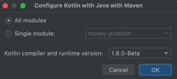
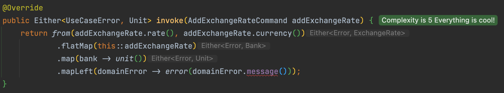
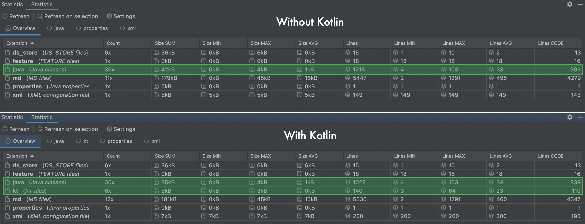

## Functional Core Imperative Shell


Read more about it [here](https://kennethlange.com/functional-core-imperative-shell/)

By using `immutability`, `monads` in our `domain` we have already implemented a `Functional Core`.

Let's go a little further by using a more functional language for our `Functional Core`:
- for `java` let's use `kotlin`
- for `C#` let's use `F#`

We will make our system `polyglot` in terms of programming language.

### Migrate to `Kotlin`
`IntelliJ` integrates a conversion tool we can use:


It will ask you to configure `Kotlin with Java with Maven`



It will add the `kotlin-maven-plugin` in your `pom.xml`
```xml
<plugin>
    <groupId>org.jetbrains.kotlin</groupId>
    <artifactId>kotlin-maven-plugin</artifactId>
    <version>${kotlin.version}</version>
    <executions>
        <execution>
            <id>compile</id>
            <phase>compile</phase>
            <goals>
                <goal>compile</goal>
            </goals>
        </execution>
        <execution>
            <id>test-compile</id>
            <phase>test-compile</phase>
            <goals>
                <goal>test-compile</goal>
            </goals>
        </execution>
    </executions>
    <configuration>
        <jvmTarget>17</jvmTarget>
    </configuration>
</plugin>
```

### Fix migration mistakes
Automatic migration have still some limitations that we need to fix, here we use our `compiler` as our driver:
- Use `data` classes for java `record`

```diff kotlin
- class Error
+ data class Error(val message: String)

- class Money
+ data class Money(val amount: Double, val currency: Currency)
```

- Fix `record` callers access



```java
@Override
public Either<UseCaseError, Unit> invoke(AddExchangeRateCommand addExchangeRate) {
    return from(addExchangeRate.rate(), addExchangeRate.currency())
            .flatMap(this::addExchangeRate)
            .map(bank -> unit())
            .mapLeft(domainError -> error(domainError.getMessage()));
}
```

- Use proper types everywhere
  - Automatic migration has added `nullable` almost everywhere (`?`, `!`, `!!`)

Here is an example:
```kotlin
   private fun toFailure(convertedMoneys: List<Either<Error?, Money?>?>): Error {
        return Error(convertedMoneys
            .filter { obj: Either<Error?, Money?>? -> obj!!.isLeft }
            .map { e: Either<Error?, Money?>? -> String.format("[%s]", e!!.left.message()) }
            .mkString("Missing exchange rate(s): ", ",", ""))
    }
```

We can fix it like this:
```kotlin
private fun toFailure(convertedMoneys: List<Either<Error, Money>>): Error =
        Error(convertedMoneys
            .filter { result -> result.isLeft }
            .joinToString(",", "Missing exchange rate(s): ") { result -> String.format("[%s]", result.left.message) })
```

We can also use inner `Kotlin` collections instead the ones from `vavr` (they are `ReadOnly` by design and easy to use)

For example, our `Bank` implementation may look like this by using `typealias`, `Map`, `companion object`, `extension functions`

```kotlin
typealias CanConvert = (Money, Currency) -> Boolean
typealias Convert = (Money, Currency) -> Money

class Bank private constructor(
    private val pivotCurrency: Currency,
    private val exchangeRates: Map<String, ExchangeRate> = emptyMap()
) {
    private val convert: Map<CanConvert, Convert> = mapOf(
        { money: Money, to: Currency -> isSameCurrency(money.currency, to) } to { money: Money, _: Currency -> money },
        { money: Money, to: Currency -> canConvertDirectly(money, to) } to { money: Money, to: Currency -> convertDirectly(money, to) },
        { money: Money, to: Currency -> canConvertThroughPivotCurrency(money, to) } to { money: Money, to: Currency -> convertThroughPivotCurrency(money, to) }
    )

    fun add(exchangeRate: ExchangeRate): Either<Error, Bank> =
        if (!isSameCurrency(exchangeRate.currency, pivotCurrency))
            right(addMultiplierAndDividerExchangeRate(exchangeRate))
        else left(Error("Can not add an exchange rate for the pivot currency"))

    private fun isSameCurrency(currency: Currency, otherCurrency: Currency): Boolean = currency == otherCurrency

    private fun addMultiplierAndDividerExchangeRate(exchangeRate: ExchangeRate): Bank =
        Bank(
            pivotCurrency, exchangeRates
                    + (keyFor(pivotCurrency, exchangeRate.currency) to exchangeRate)
                    + (keyFor(exchangeRate.currency, pivotCurrency) to dividerRate(exchangeRate))
        )

    private fun dividerRate(exchangeRate: ExchangeRate): ExchangeRate =
        ExchangeRate.from(1 / exchangeRate.rate, exchangeRate.currency).orNull

    fun convert(money: Money, to: Currency): Either<Error, Money> =
        convert.filterKeys { canConvert -> canConvert(money, to) }
            .firstNotNullOfOrNull { convert -> convert.value(money, to) }
            .toEither(money.currency, to)

    private fun canConvertDirectly(money: Money, to: Currency): Boolean =
        exchangeRates.containsKey(keyFor(money.currency, to))

    private fun canConvertThroughPivotCurrency(money: Money, to: Currency): Boolean =
        (exchangeRates.containsKey(keyFor(pivotCurrency, money.currency))
                && exchangeRates.containsKey(keyFor(pivotCurrency, to)))

    private fun convertDirectly(money: Money, to: Currency): Money =
        exchangeRates[keyFor(money.currency, to)]
            ?.let { Money(money.amount * it.rate, to) }!!

    private fun convertThroughPivotCurrency(money: Money, to: Currency): Money =
        convertDirectly(convertDirectly(money, pivotCurrency), to)

    companion object {
        @JvmStatic
        fun withPivotCurrency(pivotCurrency: Currency): Bank = Bank(pivotCurrency)
        private fun keyFor(from: Currency, to: Currency): String = "$from->$to"

        private fun Money?.toEither(from: Currency, to: Currency): Either<Error, Money> =
            if (this != null) right(this) else left(Error(keyFor(from, to)))
    }
}
```

### What is the impact?
- On the tests, almost none
- On the `imperative shell` / `use cases`, we had to adapt the `UseCases` to interop with `kotlin`

By using `kotlin` for our `Functional Core` we have reduced the amount of code and its complexity. Let's demonstrate it with the [Statistic plugin]
(https://plugins.jetbrains.com/plugin/4509-statistic) 

Here are the figures:


We have saved a lot of code: 
- migrated `993 - 839 = 154 LOC in java` to `110 LOC in kotlin` for the same features
- concretely saved `44 LOC of java` meaning `28.6%` of our `domain`

