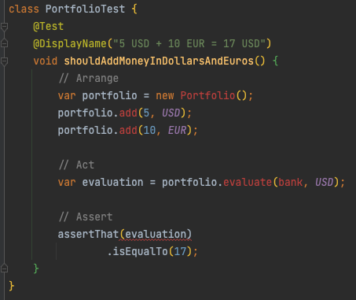
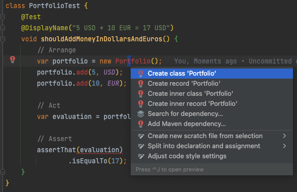
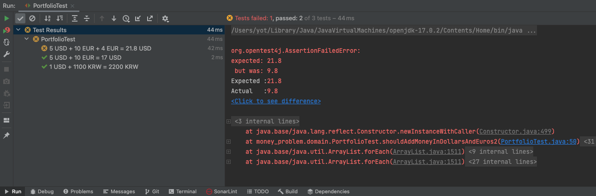

# Implement Portfolio
Implement the 2 new features :

```text
5 USD + 10 EUR = 17 USD
1 USD + 1100 KRW = 2200 KRW
```

## Write our first test

```java
class PortfolioTest {
    private final Bank bank = Bank.withExchangeRate(EUR, USD, 1.2);

    @Test
    @DisplayName("5 USD + 10 EUR = 17 USD")
    void shouldAddMoneyInDollarsAndEuros() {
        // Arrange
        var portfolio = new Portfolio();
        portfolio.add(5, USD);
        portfolio.add(10, EUR);

        // Act
        var evaluation = portfolio.evaluate(bank, USD);

        // Assert
        assertThat(evaluation)
                .isEqualTo(17);
    }
}
```

- From your IDE you should see your code like this



- Congratulations you have a first failing test (You don't compile)
- Now we have a failing test : `Make it pass as fast as possible`
	- We start by using the power of our IDE and `generate code from usage` 



- Generated code :

```java
public class Portfolio {

    public void add(double amount, Currency currency) {

    }

    public double evaluate(Bank bank, Currency currency) {
        return 0;
    }
}
```	

- Then we can use the strategy for that is called `Fake It 'Til You Make It` (more about it [here](https://dzone.com/articles/three-modes-of-tdd))


```java
public double evaluate(Bank bank, Currency currency) {
	 // Fake It 'Til You Make It
    return 17;
}
```

Where we are:

```text
✅ 5 USD + 10 EUR = 17 USD
1 USD + 1100 KRW = 2200 KRW
5 USD + 10 EUR + 4 EUR = 21.8 USD
Improve error handling
```

## Handle currencies in KoreanWons
- Let's write a new failing test

```java
@Test
@DisplayName("1 USD + 1100 KRW = 2200 KRW")
void shouldAddMoneyInDollarsAndKoreanWons() throws MissingExchangeRateException {
    var portfolio = new Portfolio();
    portfolio.add(1, USD);
    portfolio.add(1100, KRW);

    assertThat(portfolio.evaluate(bank, KRW))
            .isEqualTo(2200);
}
```

- The test is failing because we have faked the result of the `evaluated` method
	- Here we use what we call `triangulation`
		- We start by hardcoding the result
		- We provide another test that leads us closer to the final solution

```java
public class Portfolio {
    private final Map<Currency, List<Double>> moneys = new EnumMap<>(Currency.class);

    public void add(double amount, Currency currency) {
        this.moneys.put(currency, List.of(amount));
    }

    public double evaluate(Bank bank, Currency toCurrency) throws MissingExchangeRateException {
        var convertedResult = 0d;

        for (Map.Entry<Currency, List<Double>> entry : moneys.entrySet()) {
            for (Double amount : entry.getValue()) {
                var convertedAmount = bank.convert(amount, entry.getKey(), toCurrency);
                convertedResult += convertedAmount;
            }
        }
        return convertedResult;
    }
}
```

- Any refactoring ?
	- In the tests, we could centralize the exchange rates setup
	
```java
private Bank bank;

@BeforeEach
void setup() {
    bank = Bank.withExchangeRate(EUR, USD, 1.2);
    bank.addExchangeRate(USD, KRW, 1100);
}
```

- New stuff / refactoring ideas are emerging from the current implementation :
	- If we have the same currency twice we have a problem in the `add` method
		- We need to increase our confidence by adding a new test on it
	- Missing Exchange rate -> how to improve error handling?
- Let's add new test cases for our portfolio :

```text
✅ 5 USD + 10 EUR = 17 USD
✅ 1 USD + 1100 KRW = 2200 KRW
5 USD + 10 EUR + 4 EUR = 21.8 USD
Improve error handling
```

## Portfolio containing amounts in same currencies
- Let's write a red test

```java
@Test
@DisplayName("5 USD + 10 EUR + 4 EUR = 21.8 USD")
void shouldAddMoneyInDollarsAndMultipleAmountInEuros() throws MissingExchangeRateException {
    var portfolio = new Portfolio();
    portfolio.add(5, USD);
    portfolio.add(10, EUR);
    portfolio.add(4, EUR);

    assertThat(portfolio.evaluate(bank, USD))
            .isEqualTo(21.8);
}
```



- Make it pass by refactoring the `add` method

```java
public void add(double amount, Currency currency) {
    moneys.compute(currency, (c, amounts) -> {
        if (amounts == null) {
            amounts = new ArrayList<>();
        }
        amounts.add(amount);
        return amounts;
    });
}
```

```text
✅ 5 USD + 10 EUR = 17 USD
✅ 1 USD + 1100 KRW = 2200 KRW
✅ 5 USD + 10 EUR + 4 EUR = 21.8 USD
Improve error handling
```

## Improve error handling
- Here we may improve error handlings
	- If we have multiple missing exchange rates we return the information only for the first missing one...

```java
@Test
@DisplayName("Throws a MissingExchangeRatesException in case of missing exchange rates")
void shouldThrowAMissingExchangeRatesException() throws MissingExchangeRateException {
    var portfolio = new Portfolio();
    portfolio.add(1, EUR);
    portfolio.add(1, USD);
    portfolio.add(1, KRW);

    assertThatThrownBy(() -> portfolio.evaluate(bank, EUR))
            .isInstanceOf(MissingExchangeRatesException.class)
            .hasMessage("Missing exchange rate(s): [USD->EUR],[KRW->EUR]");
}
```

- Generate the Exception class from the test

```java
public class MissingExchangeRatesException extends Exception {
    public MissingExchangeRatesException(List<MissingExchangeRateException> missingExchangeRates) {
        super("Missing exchange rate(s): [USD->EUR],[KRW->EUR]");
    }
}
```

- Adapt our evaluation to pass the test

```java
public double evaluate(Bank bank, Currency toCurrency) throws MissingExchangeRatesException {
    var convertedResult = 0d;
    var missingExchangeRates = new ArrayList<MissingExchangeRateException>();

    for (Map.Entry<Currency, List<Double>> entry : moneys.entrySet()) {
        for (Double amount : entry.getValue()) {
            try {
                var convertedAmount = bank.convert(amount, entry.getKey(), toCurrency);
                convertedResult += convertedAmount;
            } catch (MissingExchangeRateException missingExchangeRateException) {
                missingExchangeRates.add(missingExchangeRateException);
            }
        }
    }

    if (!missingExchangeRates.isEmpty()) {
        throw new MissingExchangeRatesException(missingExchangeRates);
    }
    return convertedResult;
}
```

- Let's adapt our tests accordingly
	- The `evaluate` method is now throwing only `MissingExchangeRatesException`

```java
@Test
@DisplayName("5 USD + 10 EUR + 4 EUR = 21.8 USD")
void shouldAddMoneyInDollarsAndMultipleAmountInEuros() throws MissingExchangeRatesException {
    var portfolio = new Portfolio();
    portfolio.add(5, USD);
    portfolio.add(10, EUR);
    portfolio.add(4, EUR);

    assertThat(portfolio.evaluate(bank, USD))
            .isEqualTo(21.8);
}

@Test
@DisplayName("Throws a MissingExchangeRatesException in case of missing exchange rates")
void shouldThrowAMissingExchangeRatesException() {
    var portfolio = new Portfolio();
    portfolio.add(1, EUR);
    portfolio.add(1, USD);
    portfolio.add(1, KRW);

    assertThatThrownBy(() -> portfolio.evaluate(bank, EUR))
            .isInstanceOf(MissingExchangeRatesException.class)
            .hasMessage("Missing exchange rate(s): [USD->EUR],[KRW->EUR]");
}
```

- The tests are now all green
- Let's refactor now
	- We have some harcoded values in the new `MissingExchangeRatesException` class

```java
public class MissingExchangeRatesException extends Exception {
    public MissingExchangeRatesException(List<MissingExchangeRateException> missingExchangeRates) {
        super(missingExchangeRates.stream()
                .map(e -> String.format("[%s]", e.getMessage()))
                .collect(Collectors.joining(",", "Missing exchange rate(s): ", "")));
    }
}
```

```text
✅ 5 USD + 10 EUR = 17 USD
✅ 1 USD + 1100 KRW = 2200 KRW
✅ 5 USD + 10 EUR + 4 EUR = 21.8 USD
✅ Improve error handling
```

- We have a code that grows in our `Portfolio`
	- Let's keep it for the coming constraints 😊

## Reflect
During this iteration we have implemented a `Portfolio` that allows to add different amounts in different currencies. Let's take a look at our test cases :


- With our new features it would make sense to use only `Portfolio` to add moneys together
- Let's move this test in our `PortfolioTest` suite

```java
@Test
@DisplayName("5 USD + 10 USD = 15 USD")
void shouldAddMoneyInTheSameCurrency() throws MissingExchangeRatesException {
    var portfolio = new Portfolio();
    portfolio.add(5, USD);
    portfolio.add(10, USD);

    assertThat(portfolio.evaluate(bank, USD))
            .isEqualTo(15);
}
```

- Refactor :
	- Remove the `add` method from our `MoneyCalculator`

`Always put the same attention on your test code than on your production code`
