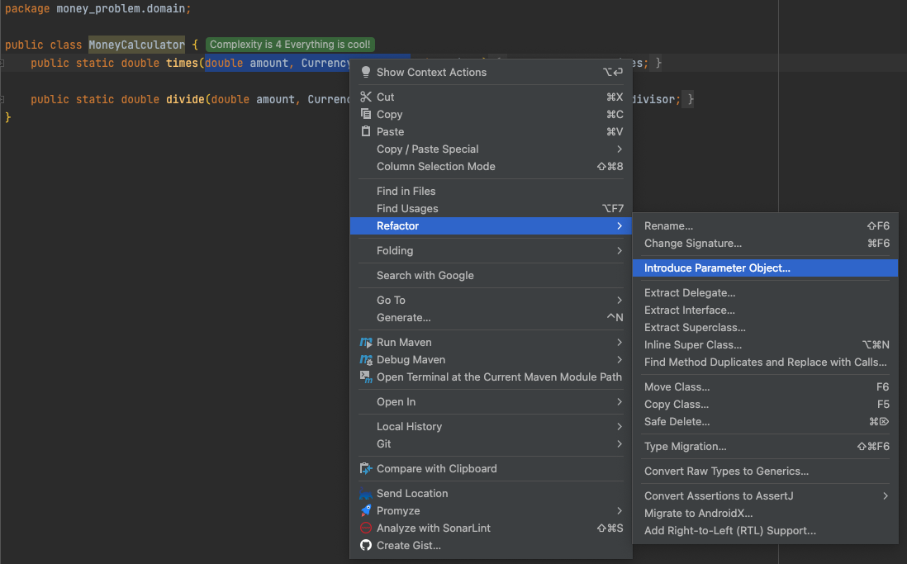
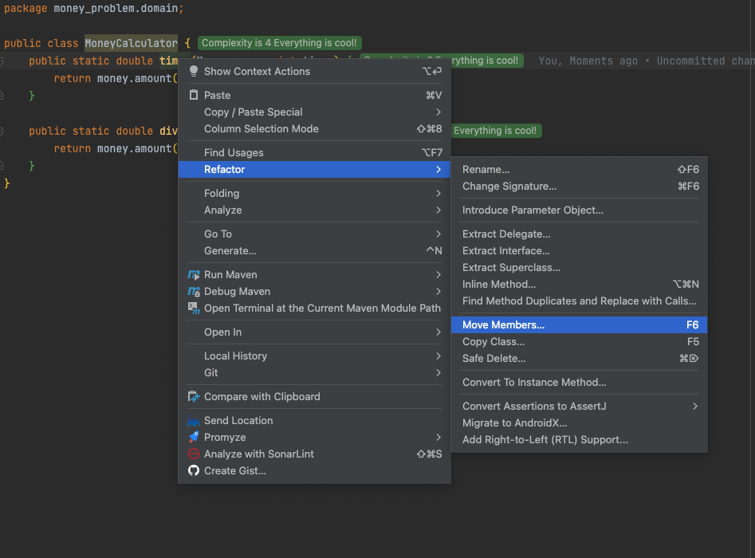
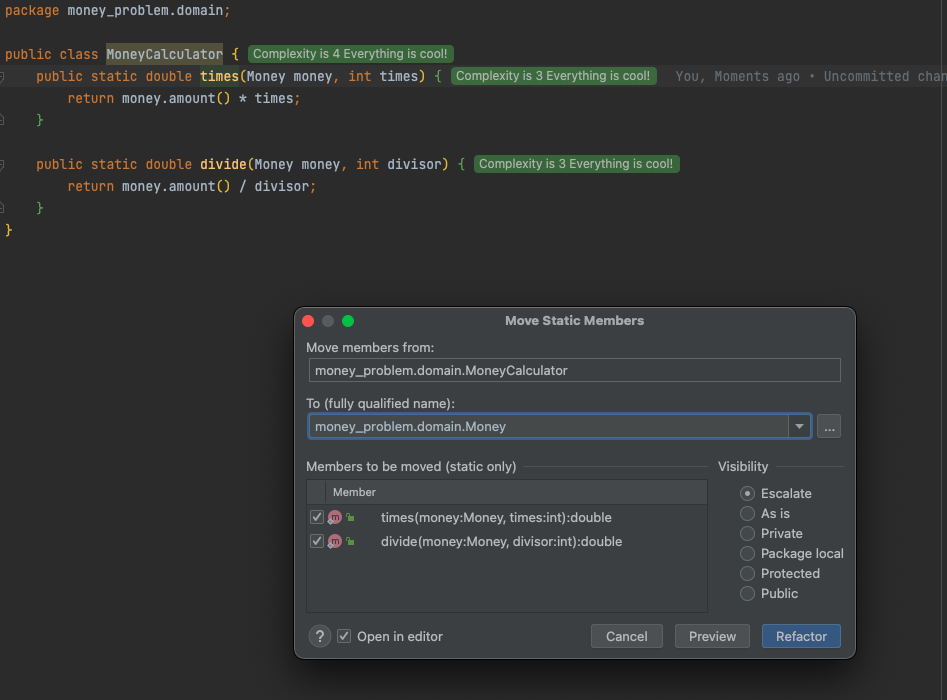
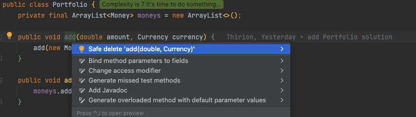

# No Primitive Types
## Introduce Money concept
A new concept emerged from the code:
A `Money` concept which is not cohesive with behavior in the `MoneyCalculator`. 

```java
public class MoneyCalculator {
    public static double times(double amount, Currency currency, int times) { ... }
    public static double divide(double amount, Currency currency, int divisor) { ... }
}

public class Portfolio {
    public void add(double amount, Currency currency) { ... }
    ...
}
```

:large_blue_circle: Let's see what it looks like when we group `amount` and `currency` into a `Money` type: 

- Introduce Parameter Object from `MoneyCalculator`
  - You can use `Introduce Parameter Object` from your IDE



Refactoring result :

```java
public class MoneyCalculator {
    public static double times(Money money, int times) {
        return money.amount() * times;
    }

    public static double divide(double amount, Currency currency, int divisor) {
        return amount / divisor;
    }
}

public record Money(double amount, Currency currency) { }

@Test
@DisplayName("10 EUR x 2 = 20 EUR")
void shouldMultiplyInEuros() {
    assertThat(MoneyCalculator.times(new Money(10, EUR), 2))
            .isEqualTo(20);
}
```

Let's adapt the `divide` as well

```java
public class MoneyCalculator {
    public static double times(Money money, int times) {
        return money.amount() * times;
    }

    public static double divide(Money money, int divisor) {
        return money.amount() / divisor;
    }
}

@Test
@DisplayName("4002 KRW / 4 = 1000.5 KRW")
void shouldDivideInKoreanWons() {
    assertThat(MoneyCalculator.divide(new Money(4002, KRW), 4))
            .isEqualTo(1000.5);
}
```

Now that we have a dedicated concept for our money operations we can move methods from `MoneyCalculator` to `Money`
- We can use `Move Members` feature from our IDE



Then configure the refactoring `move to` and `members`



Here is this step result

```java
public record Money(double amount, Currency currency) {
    public static double times(Money money, int times) {
        return money.amount() * times;
    }

    public static double divide(Money money, int divisor) {
        return money.amount() / divisor;
    }
}

class MoneyCalculatorTest {
    @Test
    @DisplayName("10 EUR x 2 = 20 EUR")
    void shouldMultiplyInEuros() {
        assertThat(Money.times(new Money(10, EUR), 2))
                .isEqualTo(20);
    }

    @Test
    @DisplayName("4002 KRW / 4 = 1000.5 KRW")
    void shouldDivideInKoreanWons() {
        assertThat(Money.divide(new Money(4002, KRW), 4))
                .isEqualTo(1000.5);
    }
}

public class MoneyCalculator { }
```

We can refactor the `Money` to return `Money` objects from methods and no more `double`
- Here we can use `isEqualTo` method to assert the result because we used `record` class for `Money`
- It uses value equality and no reference equality

```java
public record Money(double amount, Currency currency) {
    public static Money times(Money money, int times) {
        return new Money(money.amount * times, money.currency);
    }

    public static Money divide(Money money, int divisor) {
        return new Money(money.amount / divisor, money.currency);
    }
}


class MoneyCalculatorTest {
    @Test
    @DisplayName("10 EUR x 2 = 20 EUR")
    void shouldMultiplyInEuros() {
        assertThat(Money.times(new Money(10, EUR), 2))
                .isEqualTo(new Money(20, EUR));
    }

    @Test
    @DisplayName("4002 KRW / 4 = 1000.5 KRW")
    void shouldDivideInKoreanWons() {
        assertThat(Money.divide(new Money(4002, KRW), 4))
                .isEqualTo(new Money(1000.5, KRW));
    }
}
```

## Clean our code
We can now make some cleanup
- Delete `MoneyCalculator`
- Rename `MoneyCalculatorTest` to `MoneyTest`
- Make methods non static in `Money`
  - Adapt the tests as well

```java
public record Money(double amount, Currency currency) {
    public Money times(int times) {
        return new Money(amount * times, currency);
    }

    public Money divide(int divisor) {
        return new Money(amount / divisor, currency);
    }
}

class MoneyTest {
    @Test
    @DisplayName("10 EUR x 2 = 20 EUR")
    void shouldMultiplyInEuros() {
        assertThat(new Money(10, EUR).times(2))
                .isEqualTo(new Money(20, EUR));
    }

    @Test
    @DisplayName("4002 KRW / 4 = 1000.5 KRW")
    void shouldDivideInKoreanWons() {
        assertThat(new Money(4002, KRW).divide(4))
                .isEqualTo(new Money(1000.5, KRW));
    }
}
```

## Adapt the Portfolio
:red_circle: Now that we have introduced our `Money` concept let's enrich our `Portfolio` as well
- Adapt an existing test
- Generate a new `add` method from the test taking `Money` as parameter

```java
@Test
@DisplayName("5 USD + 10 USD = 15 USD")
void shouldAddMoneyInTheSameCurrency() throws MissingExchangeRatesException {
    var portfolio = new Portfolio();
    portfolio.add(new Money(5, USD));
    portfolio.add(new Money(10, USD));

    assertThat(portfolio.evaluate(bank, USD))
            .isEqualTo(15);
}
```

Our test is now red... 

:green_circle: We have to come back in the green state by plug-in the new `add` method to the existing one

```java
public class Portfolio {
    private final Map<Currency, List<Double>> moneys = new EnumMap<>(Currency.class);

    public void add(double amount, Currency currency) {
        moneys.compute(currency, (c, amounts) -> {
            if (amounts == null) {
                amounts = new ArrayList<>();
            }
            amounts.add(amount);
            return amounts;
        });
    }

    public void add(Money money) {
        this.add(money.amount(), money.currency());
    }

    public double evaluate(Bank bank, Currency toCurrency) throws MissingExchangeRatesException {
        ...
    }
}
```

:large_blue_circle: We are back in a safe state with our green test. But it's not over, we have to go through the third state of TDD: Refactoring!
- Change the `add(Money money)` to add `Money` to a private List
- Plug the existing `add` method to the new one
- Change the loop from the `evaluate` method to use the `moneys` List

```java
public class Portfolio {
    private final ArrayList<Money> moneys = new ArrayList<>();

    public void add(double amount, Currency currency) {
        add(new Money(amount, currency));
    }

    public void add(Money money) {
        moneys.add(money);
    }

    public double evaluate(Bank bank, Currency toCurrency) throws MissingExchangeRatesException {
        var convertedResult = 0d;
        var missingExchangeRates = new ArrayList<MissingExchangeRateException>();

        for (Money money : moneys) {
            try {
                var convertedAmount = bank.convert(money.amount(), money.currency(), toCurrency);
                convertedResult += convertedAmount;
            } catch (MissingExchangeRateException missingExchangeRateException) {
                missingExchangeRates.add(missingExchangeRateException);
            }
        }

        if (!missingExchangeRates.isEmpty()) {
            throw new MissingExchangeRatesException(missingExchangeRates);
        }
        return convertedResult;
    }
}
```

Now that we have a new `add` method, let's use it in `PortfolioTest`.

```java
package money_problem.domain;

import org.junit.jupiter.api.BeforeEach;
import org.junit.jupiter.api.DisplayName;
import org.junit.jupiter.api.Test;

import static money_problem.domain.Currency.*;
import static org.assertj.core.api.Assertions.assertThat;
import static org.assertj.core.api.Assertions.assertThatThrownBy;

class PortfolioTest {
    private Bank bank;

    @BeforeEach
    void setup() {
        bank = Bank.withExchangeRate(EUR, USD, 1.2);
        bank.addExchangeRate(USD, KRW, 1100);
    }

    @Test
    @DisplayName("5 USD + 10 USD = 15 USD")
    void shouldAddMoneyInTheSameCurrency() throws MissingExchangeRatesException {
        var portfolio = new Portfolio();
        portfolio.addOld(new Money(5, USD));
        portfolio.addOld(new Money(10, USD));

        assertThat(portfolio.evaluateWithException(bank, USD))
                .isEqualTo(15);
    }

    @Test
    @DisplayName("5 USD + 10 EUR = 17 USD")
    void shouldAddMoneyInDollarsAndEuros() throws MissingExchangeRatesException {
        var portfolio = new Portfolio();
        portfolio.addOld(new Money(5, USD));
        portfolio.addOld(new Money(10, EUR));

        assertThat(portfolio.evaluateWithException(bank, USD))
                .isEqualTo(17);
    }

    @Test
    @DisplayName("1 USD + 1100 KRW = 2200 KRW")
    void shouldAddMoneyInDollarsAndKoreanWons() throws MissingExchangeRatesException {
        var portfolio = new Portfolio();
        portfolio.addOld(new Money(1, USD));
        portfolio.addOld(new Money(1100, KRW));

        assertThat(portfolio.evaluateWithException(bank, KRW))
                .isEqualTo(2200);
    }

    @Test
    @DisplayName("5 USD + 10 EUR + 4 EUR = 21.8 USD")
    void shouldAddMoneyInDollarsAndMultipleAmountInEuros() throws MissingExchangeRatesException {
        var portfolio = new Portfolio();
        portfolio.addOld(new Money(5, USD));
        portfolio.addOld(new Money(10, EUR));
        portfolio.addOld(new Money(4, EUR));

        assertThat(portfolio.evaluateWithException(bank, USD))
                .isEqualTo(21.8);
    }

    @Test
    @DisplayName("Throws a MissingExchangeRatesException in case of missing exchange rates")
    void shouldThrowAMissingExchangeRatesException() {
        var portfolio = new Portfolio();
        portfolio.addOld(new Money(1, EUR));
        portfolio.addOld(new Money(1, USD));
        portfolio.addOld(new Money(1, KRW));

        assertThatThrownBy(() -> portfolio.evaluateWithException(bank, EUR))
                .isInstanceOf(MissingExchangeRatesException.class)
                .hasMessage("Missing exchange rate(s): [USD->EUR],[KRW->EUR]");
    }
}
```

We can now remove the former `add` method from our `Portfolio`



:red_circle: We need to change the signature of the `evaluate` method as well
Its signature should be `Bank -> Currency -> Money` to ensure we don't return primitive types anymore

Adapting a first test will guide us through.

```java
@Test
@DisplayName("5 USD + 10 USD = 15 USD")
void shouldAddMoneyInTheSameCurrency() throws MissingExchangeRatesException {
    var portfolio = new Portfolio();
    portfolio.add(new Money(5, USD));
    portfolio.add(new Money(10, USD));

    assertThat(portfolio.evaluate(bank, USD))
            .isEqualTo(new Money(15, USD));
}

public class Portfolio {
    private final ArrayList<Money> moneys = new ArrayList<>();

    public void add(Money money) {
        moneys.add(money);
    }

    public Money evaluate(Bank bank, Currency toCurrency) throws MissingExchangeRatesException {
        var convertedResult = 0d;
        var missingExchangeRates = new ArrayList<MissingExchangeRateException>();

        for (Money money : moneys) {
            try {
                var convertedAmount = bank.convert(money.amount(), money.currency(), toCurrency);
                convertedResult += convertedAmount;
            } catch (MissingExchangeRateException missingExchangeRateException) {
                missingExchangeRates.add(missingExchangeRateException);
            }
        }

        if (!missingExchangeRates.isEmpty()) {
            throw new MissingExchangeRatesException(missingExchangeRates);
        }
        // Simply instantiate a Money from here
        return new Money(convertedResult, toCurrency);
    }
}
```
:green_circle: Our test is now green.

:red_circle: Still, others are failing.

:green_circle: We need to adapt assertions accordingly

> During `Portfolio` refactoring to use `Money` type, we have "discovered" that we need to adapt our `Bank` as well to return `Money` from `convert`

## Adapt the Bank
:red_circle: We can apply the same strategy as on the `Portfolio`
- Adapt an existing test
- Generate code from usage and then make the test pass
- Then refactor
- Apply to other tests

```java
@Test
@DisplayName("10 EUR -> USD = 12 USD")
void shouldConvertEuroToUsd() throws MissingExchangeRateException {
    assertThat(bank.convert(new Money(10, EUR), USD))
            .isEqualTo(new Money(12, USD));
}

public final class Bank {
    public Money convert(Money money, Currency to) {
        return null;
    }
}
```

:green_circle: Make it green.

```java
public Money convert(Money money, Currency to) throws MissingExchangeRateException {
    return new Money(convert(money.amount(), money.currency(), to), to);
} 
```

:large_blue_circle: Refactor time!

Implement the new `convert` method and plug the former method to it

```java
public double convert(double amount, Currency from, Currency to) throws MissingExchangeRateException {
    return convert(new Money(amount, from), to).amount();
}

public Money convert(Money money, Currency to) throws MissingExchangeRateException {
    if (!canConvert(money.currency(), to)) {
        throw new MissingExchangeRateException(money.currency(), to);
    }
    return new Money(convertSafely(money.amount(), money.currency(), to), to);
}
```

Adapt private methods to use `Money` as well

```java
public final class Bank {
    ...
    
    public Money convert(Money money, Currency to) throws MissingExchangeRateException {
        if (!canConvert(money, to)) {
            throw new MissingExchangeRateException(money.currency(), to);
        }
        return convertSafely(money, to);
    }
        
    private boolean canConvert(Money money, Currency to) {
        return money.currency() == to || exchangeRates.containsKey(keyFor(money.currency(), to));
    }

    private Money convertSafely(Money money, Currency to) {
        return money.currency() == to
                ? money
                : new Money(money.amount() * exchangeRates.get(keyFor(money.currency(), to)), to);
    }
}
```

Adapt callers from the `convert` methods

```java
class BankTest {
    private final Bank bank = Bank.withExchangeRate(EUR, USD, 1.2);

    @Test
    @DisplayName("10 EUR -> USD = 12 USD")
    void shouldConvertEuroToUsd() throws MissingExchangeRateException {
        assertThat(bank.convert(new Money(10, EUR), USD))
                .isEqualTo(new Money(12, USD));
    }

    @Test
    @DisplayName("10 EUR -> EUR = 10 EUR")
    void shouldConvertInSameCurrency() throws MissingExchangeRateException {
        assertThat(bank.convert(new Money(10, EUR), EUR))
                .isEqualTo(new Money(10, EUR));
    }

    @Test
    @DisplayName("Throws a MissingExchangeRateException in case of missing exchange rates")
    void shouldReturnALeftOnMissingExchangeRate() {
        assertThatThrownBy(() -> bank.convert(new Money(10, EUR), KRW))
                .isInstanceOf(MissingExchangeRateException.class)
                .hasMessage("EUR->KRW");
    }

    @Test
    @DisplayName("Conversion with different exchange rates EUR to USD")
    void shouldConvertWithDifferentExchangeRates() throws MissingExchangeRateException {
        assertThat(bank.convert(new Money(10, EUR), USD))
                .isEqualTo(new Money(12, USD));

        bank.addExchangeRate(EUR, USD, 1.3);

        assertThat(bank.convert(new Money(10, EUR), USD))
                .isEqualTo(new Money(13, USD));
    }
} 
```

Same process in `Portfolio`.

```java
public class Portfolio {
    private final ArrayList<Money> moneys = new ArrayList<>();

    public void add(Money money) {
        moneys.add(money);
    }

    public Money evaluate(Bank bank, Currency toCurrency) throws MissingExchangeRatesException {
        var convertedResult = 0d;
        var missingExchangeRates = new ArrayList<MissingExchangeRateException>();

        for (Money money : moneys) {
            try {
                var convertedAmount = bank.convert(money, toCurrency);
                convertedResult += convertedAmount.amount();
            } catch (MissingExchangeRateException missingExchangeRateException) {
                missingExchangeRates.add(missingExchangeRateException);
            }
        }

        if (!missingExchangeRates.isEmpty()) {
            throw new MissingExchangeRatesException(missingExchangeRates);
        }
        return new Money(convertedResult, toCurrency);
    }
}
```

Now, we can safely delete the former `convert` method from `Bank`

## Reflect
During this iteration we have introduced a new Business concept `Money` and adapted our code accordingly to manipulate more meaningful concepts from our domain.

In the meantime, by making the refactoring we have seen duplication everywhere in our tests regarding `Money` instantiation
If the constructor of this object changes at one point it will have a huge impact on our tests and on the production code.
 
We want to avoid this situation so let's make something on it.
  
Ideally we would like something that looks like this :

```java
assertThat(10.Euros().times(2))
    .isEqualTo(20.Euros());
```

In java, we do not have extension methods yet
- Let's create a `Utility` class allowing us to write our tests like this :

```java
assertThat(euros(10)
    .times(2))
    .isEqualTo(euros(20));
```

Here is the result

```java
public class DomainUtility {
    public static Money dollars(double amount) {
        return new Money(amount, Currency.USD);
    }

    public static Money euros(double amount) {
        return new Money(amount, Currency.EUR);
    }

    public static Money koreanWons(double amount) {
        return new Money(amount, Currency.KRW);
    }
}

class PortfolioTest {
    private Bank bank;

    @BeforeEach
    void setup() {
        bank = Bank.withExchangeRate(EUR, USD, 1.2);
        bank.addExchangeRate(USD, KRW, 1100);
    }

    @Test
    @DisplayName("5 USD + 10 USD = 15 USD")
    void shouldAddMoneyInTheSameCurrency() throws MissingExchangeRatesException {
        var portfolio = new Portfolio();
        portfolio.add(dollars(5));
        portfolio.add(dollars(10));

        assertThat(portfolio.evaluate(bank, USD))
                .isEqualTo(dollars(15));
    }

    @Test
    @DisplayName("5 USD + 10 EUR = 17 USD")
    void shouldAddMoneyInDollarsAndEuros() throws MissingExchangeRatesException {
        var portfolio = new Portfolio();
        portfolio.add(dollars(5));
        portfolio.add(euros(10));

        assertThat(portfolio.evaluate(bank, USD))
                .isEqualTo(dollars(17));
    }

    @Test
    @DisplayName("1 USD + 1100 KRW = 2200 KRW")
    void shouldAddMoneyInDollarsAndKoreanWons() throws MissingExchangeRatesException {
        var portfolio = new Portfolio();
        portfolio.add(dollars(1));
        portfolio.add(koreanWons(1100));

        assertThat(portfolio.evaluate(bank, KRW))
                .isEqualTo(koreanWons(2200));
    }

    @Test
    @DisplayName("5 USD + 10 EUR + 4 EUR = 21.8 USD")
    void shouldAddMoneyInDollarsAndMultipleAmountInEuros() throws MissingExchangeRatesException {
        var portfolio = new Portfolio();
        portfolio.add(dollars(5));
        portfolio.add(euros(10));
        portfolio.add(euros(4));

        assertThat(portfolio.evaluate(bank, USD))
                .isEqualTo(dollars(21.8));
    }

    @Test
    @DisplayName("Throws a MissingExchangeRatesException in case of missing exchange rates")
    void shouldThrowAMissingExchangeRatesException() {
        var portfolio = new Portfolio();
        portfolio.add(euros(1));
        portfolio.add(dollars(1));
        portfolio.add(koreanWons(1));

        assertThatThrownBy(() -> portfolio.evaluate(bank, EUR))
                .isInstanceOf(MissingExchangeRatesException.class)
                .hasMessage("Missing exchange rate(s): [USD->EUR],[KRW->EUR]");
    }
}
```


