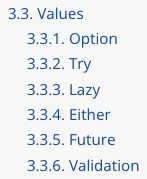
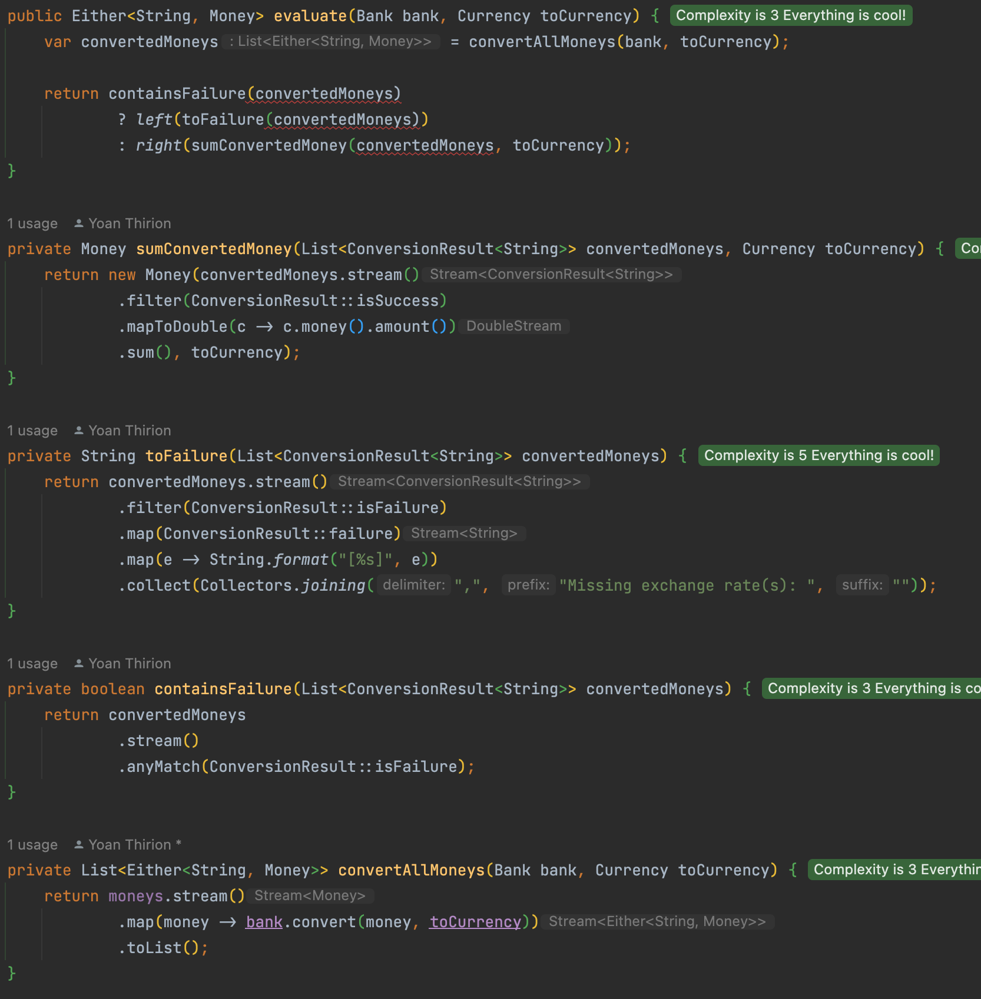

# Use an existing monad
To remove exceptions, a concept emerged from our code: `ConversionResult`.
This type looks like a monad. Instead of defining our own type let's try to use the advantages of existing ones.

In `java`, we can use a library called `vavr` that turns java upside down by adding a lot of features and types.

As a reminder, the `ConversionResult` looks like this at the moment:
```java
public record ConversionResult<Failure>(Money money, Failure failure) {
    private ConversionResult(Money money) {
        this(money, null);
    }

    private ConversionResult(Failure exception) {
        this(null, exception);
    }

    public static <F> ConversionResult<F> fromFailure(F failure) {
        return new ConversionResult<>(failure);
    }

    public static <F> ConversionResult<F> fromSuccess(Money money) {
        return new ConversionResult<>(money);
    }

    public boolean isFailure() {
        return failure != null;
    }

    public boolean isSuccess() {
        return money != null;
    }
}
```

## Which monad?
In `vavr`, some useful monad types have already been defined.



> We are looking for one as a replacement of a type that can hold one of the 2 possible values: either a `success` or a `failure`.

- [`Option`](https://docs.vavr.io/#_option) is a monadic container type which represents an optional value
  - Instances of Option are either an instance of `Some` or the `None`.
  - It can not hold 2 different types of value
- [`Try`](https://docs.vavr.io/#_try) is a monadic container type which represents a computation that may either result in an exception, or return a successfully computed value. 
  - Instances of Try, are either an instance of `Success` or `Failure`.
  - A good candidate
- [`Lazy`](https://docs.vavr.io/#_lazy) is a monadic container type which represents a lazy evaluated value.
  - Not useful for us at the moment
- [`Either`](https://docs.vavr.io/#_either) represents a value of two possible types. 
  - An `Either` is either a Left or a Right.
  - Another good candidate
- [`Future`](https://docs.vavr.io/#_future) is a computation result that becomes available at some point. 
  - All operations provided are non-blocking.
- [`Validation`](https://docs.vavr.io/#_validation) is an applicative functor and facilitates accumulating errors.

We choose to use the `Either` monad.

## Either monad
We start by adding `vavr` dependency in our `pom.xml`:
- We add `assertj-vavr` as well to facilitate the assertions on `vavr` types

```xml
<properties>
    ...
    <vavr.version>0.10.4</vavr.version>
    <assertj-vavr.version>0.4.2</assertj-vavr.version>
</properties>

<dependency>
    <groupId>io.vavr</groupId>
    <artifactId>vavr</artifactId>
    <version>${vavr.version}</version>
</dependency>
...
<dependency>
    <groupId>org.assertj</groupId>
    <artifactId>assertj-vavr</artifactId>
    <version>${assertj-vavr.version}</version>
    <scope>test</scope>
</dependency>
```

### Portfolio
:red_circle: You know the drill by now: as usual, we start with a red test at the `Portfolio` level.

- We rename the current `evaluate` method into `evaluateWithConversionResult`
- We adapt a test to use the future `evaluate` method with a signature like this: `Bank` -> `Currency` -> `Either<String, Money>`
  - By convention when we use `Either` the `Left` is the failure case
- We use `VavrAssertions` from `assertj-vavr`

```java
@Test
@DisplayName("5 USD + 10 USD = 15 USD")
void shouldAddMoneyInTheSameCurrency() {
    var portfolio = portfolioWith(
            dollars(5),
            dollars(10)
    );

    VavrAssertions
        .assertThat(portfolio.evaluate(bank, USD))
        .containsOnRight(dollars(15));
}
```

Then we generate our new method from test

```java
public Either<String, Money> evaluate(Bank bank, Currency toCurrency) {
    return null;
}

public ConversionResult<String> evaluateWithConversionResult(Bank bank, Currency toCurrency) {
    var convertedMoneys = convertAllMoneys(bank, toCurrency);

    return containsFailure(convertedMoneys)
            ? fromFailure(toFailure(convertedMoneys))
            : fromSuccess(sumConvertedMoney(convertedMoneys, toCurrency));
}
```

:green_circle: We implement the method as the old one by using `left()` and `right()` method from `Either`

```java
public Either<String, Money> evaluate(Bank bank, Currency toCurrency) {
    var convertedMoneys = convertAllMoneys(bank, toCurrency);

    return containsFailure(convertedMoneys)
            ? left(toFailure(convertedMoneys))
            : right(sumConvertedMoney(convertedMoneys, toCurrency));
}
```

:large_blue_circle: Refactor time!

Let's adapt the existing tests to call our new `evaluate` method

```java
@Test
@DisplayName("5 USD + 10 EUR = 17 USD")
void shouldAddMoneyInDollarsAndEuros() {
    var portfolio = portfolioWith(
            dollars(5),
            euros(10)
    );

    assertThat(portfolio.evaluate(bank, USD))
            .containsOnRight(dollars(17));
}

@Test
@DisplayName("1 USD + 1100 KRW = 2200 KRW")
void shouldAddMoneyInDollarsAndKoreanWons() {
    var portfolio = portfolioWith(
            dollars(1),
            koreanWons(1100)
    );

    assertThat(portfolio.evaluate(bank, KRW))
            .containsOnRight(koreanWons(2200));
}

@Test
@DisplayName("5 USD + 10 EUR + 4 EUR = 21.8 USD")
void shouldAddMoneyInDollarsAndMultipleAmountInEuros() {
    var portfolio = portfolioWith(
            dollars(5),
            euros(10),
            euros(4)
    );

    assertThat(portfolio.evaluate(bank, USD))
            .containsOnRight(dollars(21.8));
}

@Test
@DisplayName("Return a failure result in case of missing exchange rates")
void shouldReturnAFailingResultInCaseOfMissingExchangeRates() {
    var portfolio = portfolioWith(
            euros(1),
            dollars(1),
            koreanWons(1)
    );

    assertThat(portfolio.evaluate(bank, EUR))
            .containsOnLeft("Missing exchange rate(s): [USD->EUR],[KRW->EUR]");
}
```

We can remove `dead code` the `evaluateWithConversionResult`

### Bank
Let's do the same at the `Bank` level

:red_circle: We adapt an existing test.

```java
@Test
@DisplayName("10 EUR -> USD = 12 USD")
void shouldConvertEuroToUsd() {
    VavrAssertions
            .assertThat(bank.convert(euros(10), USD))
            .containsOnRight(dollars(12));
}
```

Then we generate our new method from it.

```java
public Either<String, Money> convert(Money money, Currency toCurrency) {
    return null;
}

public ConversionResult<String> convertWithConversionResult(Money money, Currency to) {
    return canConvert(money, to)
            ? fromSuccess(convertSafely(money, to))
            : fromFailure(String.format("%s->%s", money.currency(), to));
}
```

:green_circle: We implement the method the same way as the old one by using `left()` and `right()` method from `Either`

```java
public Either<String, Money> convert(Money money, Currency toCurrency) {
    return canConvert(money, toCurrency)
            ? right(convertSafely(money, toCurrency))
            : left(String.format("%s->%s", money.currency(), toCurrency))
}
```

:large_blue_circle: Refactor time!

Let's adapt the existing tests to call our new `convert` method.

```java
class BankTest {
    ...
    @Test
    @DisplayName("10 EUR -> EUR = 10 EUR")
    void shouldConvertInSameCurrency() {
        assertThat(bank.convert(euros(10), EUR))
                .containsOnRight(euros(10));
    }

    @Test
    @DisplayName("Return a failure result in case of missing exchange rate")
    void shouldReturnAFailingResultInCaseOfMissingExchangeRate() {
        assertThat(bank.convert(euros(10), KRW))
                .containsOnLeft("EUR->KRW");
    }

    @Test
    @DisplayName("Conversion with different exchange rates EUR to USD")
    void shouldConvertWithDifferentExchangeRates() {
        assertThat(bank.convert(euros(10), USD))
                .containsOnRight(dollars(12));

        assertThat(bank.addExchangeRate(EUR, USD, 1.3)
                .convert(euros(10), USD))
                .containsOnRight(dollars(13));
    }
}
```

### Portfolio refactoring

Refactor the `Portfolio` to use the new `convert` method as well from the `Bank` class.
- We start by adapting the `convertAllMoneys` method

```java
private List<Either<String, Money>> convertAllMoneys(Bank bank, Currency toCurrency) {
    return moneys.stream()
            .map(money -> bank.convert(money, toCurrency))
            .toList();
}
```

Then, let's use our compiler errors as a refactoring driver:


After having refactored the `Portfolio` it looks like this:
```java
public Either<String, Money> evaluate(Bank bank, Currency toCurrency) {
    var convertedMoneys = convertAllMoneys(bank, toCurrency);

    return containsFailure(convertedMoneys)
            ? left(toFailure(convertedMoneys))
            : right(sumConvertedMoney(convertedMoneys, toCurrency));
}

private Money sumConvertedMoney(List<Either<String, Money>> convertedMoneys, Currency toCurrency) {
    return new Money(convertedMoneys.stream()
            .filter(Either::isRight)
            .map(e -> e.getOrElse(new Money(0, toCurrency)))
            .mapToDouble(Money::amount)
            .sum(), toCurrency);
}

private String toFailure(List<Either<String, Money>> convertedMoneys) {
    return convertedMoneys.stream()
            .filter(Either::isLeft)
            .map(Either::getLeft)
            .map(e -> String.format("[%s]", e))
            .collect(Collectors.joining(",", "Missing exchange rate(s): ", ""));
}

private boolean containsFailure(List<Either<String, Money>> convertedMoneys) {
    return convertedMoneys
            .stream()
            .anyMatch(Either::isLeft);
}

private List<Either<String, Money>> convertAllMoneys(Bank bank, Currency toCurrency) {
    return moneys.stream()
            .map(money -> bank.convert(money, toCurrency))
            .toList();
}
```

Let's clean our code: remove duplication and dead code
- We can safely delete the `convertWithConversionResult` method from `Bank`
- We can now delete the `ConversionResult` class

## Use vavr collections
:large_blue_circle: Let's use the advantages of `vavr` to simplify our code

It comes with a large variety of immutable collections and functions that we can use to simplify our code. You can check them [here](https://docs.vavr.io/#_performance_characteristics).

### Bank
:red_circle: We start by using `io.vavr.collection.Map`, we can remove the call to `Collections.unmodifiableMap`

```java
import io.vavr.collection.HashMap;
import io.vavr.collection.Map;
import io.vavr.control.Either;

public final class Bank {
    private final Map<String, Double> exchangeRates;

    private Bank(Map<String, Double> exchangeRates) {
        this.exchangeRates = exchangeRates;
    }
    ...
```

:green_circle: Then we adapt other methods and make our tests green again.

```java
public final class Bank {
    private final Map<String, Double> exchangeRates;

    private Bank(Map<String, Double> exchangeRates) {
        this.exchangeRates = exchangeRates;
    }

    public static Bank withExchangeRate(Currency from, Currency to, double rate) {
        var bank = new Bank(HashMap.empty());
        return bank.addExchangeRate(from, to, rate);
    }

    public Bank addExchangeRate(Currency from, Currency to, double rate) {
        // put method returns a new instance of the Map
        return new Bank(exchangeRates.put(keyFor(from, to), rate));
    }
    
    ...
    
    // We use the getOrElse method allowing us to get the result safely and provide a default value if not found
    private Money convertSafely(Money money, Currency to) {
        return money.currency() == to
                ? money
                : new Money(money.amount() * exchangeRates.getOrElse(keyFor(money.currency(), to), 0d), to);
    }
}
```

### Portfolio
:red_circle: We start by using `io.vavr.collection.Seq`, we can remove the call to `Collections.unmodifiableMap`

```java
public final class Portfolio {
    private final Seq<Money> moneys;

    public Portfolio() {
        this.moneys = Vector.empty();
    }

    private Portfolio(Seq<Money> moneys) {
        this.moneys = moneys;
    }

    public Portfolio add(Money money) {
        return new Portfolio(moneys.append(money));
    }
    ...
}
```

:green_circle: Then we adapt other methods and make our tests green again

> Observe that we don't need to use stream api anymore. Functions like `map` are accessible directly from the data structure itself.

```java
public Either<String, Money> evaluate(Bank bank, Currency toCurrency) {
    var convertedMoneys = convertAllMoneys(bank, toCurrency);

    return containsFailure(convertedMoneys)
            ? left(toFailure(convertedMoneys))
            : right(sumConvertedMoney(convertedMoneys, toCurrency));
}

private Seq<Either<String, Money>> convertAllMoneys(Bank bank, Currency toCurrency) {
    return moneys.map(money -> bank.convert(money, toCurrency));
}

private boolean containsFailure(Seq<Either<String, Money>> convertedMoneys) {
    return convertedMoneys.exists(Either::isLeft);
}

// Use mkstring method instead of Collector
private String toFailure(Seq<Either<String, Money>> convertedMoneys) {
    return convertedMoneys
            .filter(Either::isLeft)
            .map(e -> String.format("[%s]", e.getLeft()))
            .mkString("Missing exchange rate(s): ", ",", "");
}

// Use the reduce method on double amounts
private Money sumConvertedMoney(Seq<Either<String, Money>> convertedMoneys, Currency toCurrency) {
    return new Money(convertedMoneys
            .filter(Either::isRight)
            .map(e -> e.getOrElse(new Money(0, toCurrency)))
            .map(Money::amount)
            .reduce(Double::sum), toCurrency);
}
```

We take advantage of this refactoring to reorganise the methods so that they can be read in their order of usage.

### DomainUtility
We use `streams` in this class as well so let's simplify it by using `vavr` as well

```java
public static Portfolio portfolioWith(Money... moneys) {
    return Vector.of(moneys)
            .foldLeft(new Portfolio(), Portfolio::add);
}
```

## Reflect
- What do you think about those concepts and this library?
- What could you do with it?


