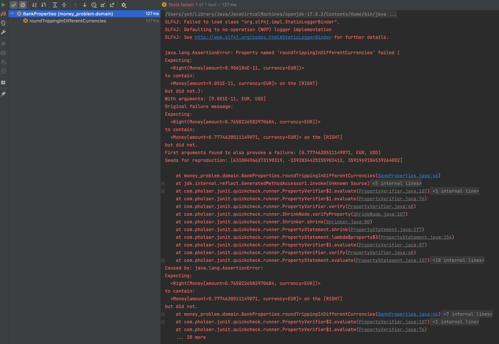
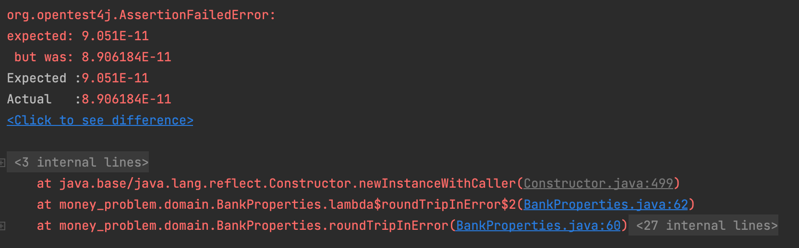

# Bank Properties 
- We have worked closely with our domain expert and at one point we spotted a problem together with the exchange rates

| From | To   | Rate    |
|------|------|---------|
| EUR  | USD  | 1.2     |
| USD  | EUR  | 0.82    |
| USD  | KRW  | 1100    |
| KRW  | EUR  | 0.0009  |
| EUR  | KRW  | 1344    |
| KRW  | EUR  | 0.00073 |

- We have 2 times a line for `KRW` to `EUR`
- We discussed with our experts, and they explain to us that they have `simply` written the wrong destination currency (To) on line 4
    - Apparently, it can often happens...
    - The table now looks like this:

| From | To  | Rate    |
|------|-----|---------|
| EUR  | USD | 1.2     |
| USD  | EUR | 0.82    |
| USD  | KRW | 1100    |
| KRW  | USD | 0.0009  |
| EUR  | KRW | 1344    |
| KRW  | EUR | 0.00073 |

- We are not fully confident in this table that will be at the center of our system
    - We discuss again with our experts on a way to enforce this table coherence/consistency
    - The conclusion is that we can easily improve it by checking what they call `Round-Tripping`
    - `from(to(x)) == x`

```gherkin
Given an original amount in currency A
When we convert it to currency B and convert it back to currency A
Then we should receive the original amount 
```

## Property-Based Testing
We will use `Property-Based Testing` to implement `Round-Tripping` properties in a first step. In `java` we can use [`junit-quickcheck`](https://pholser.github.io/junit-quickcheck/site/1.0/index.html) to do so:
```xml
<properties>
...
    <junit-quickcheck.version>1.0</junit-quickcheck.version>
</properties>
...
<dependency>
    <groupId>com.pholser</groupId>
    <artifactId>junit-quickcheck-core</artifactId>
    <version>${junit-quickcheck.version}</version>
    <scope>test</scope>
</dependency>
<dependency>
    <groupId>com.pholser</groupId>
    <artifactId>junit-quickcheck-generators</artifactId>
    <version>${junit-quickcheck.version}</version>
    <scope>test</scope>
</dependency>
``` 

### Round-Tripping in same currency
We want to create a first property like this:

```text
for all (Money money)
such that (bank.convert(money, money.currency()) equals money)) is satisfied
```

Let's create a new test class to host the properties: `BankProperties`

```java
@RunWith(JUnitQuickcheck.class)
public class BankProperties {
    private final Map<Tuple2<Currency, Currency>, Double> exchangeRates =
            of(
                    Tuple.of(EUR, USD), 1.2,
                    Tuple.of(USD, EUR), 0.82,
                    Tuple.of(USD, KRW), 1100d,
                    Tuple.of(KRW, USD), 0.0009,
                    Tuple.of(EUR, KRW), 1344d,
                    Tuple.of(KRW, EUR), 0.00073
            );

    @Property
    public void convertInSameCurrencyShouldReturnOriginalMoney(double originalAmount, Currency currency) {
        // TODO implement the property
    }
}
```

We want our property to look like this:

```java
@Property
public void convertInSameCurrencyShouldReturnOriginalMoney(double originalAmount, Currency currency) {
    var originalMoney = new Money(originalAmount, currency);
    var convertedMoney = bank.convert(originalMoney, currency);

    assertThat(convertedMoney)
            .containsOnRight(originalMoney);
}
```

To do so we need to instantiate a `Bank` with business exchange rates
- This code is pretty ugly by using `Tuple` class with `_1` and `_2`...
- It is because we have not encapsulated the exchange rates into a business entity
  - A refactoring idea emerged here

```java
private final Bank bank;

public BankProperties() {
    this.bank = createBank();
}

private Bank createBank() {
    return exchangeRates
            .foldLeft(newBank(), (bank, exchangeRate) -> bank.addExchangeRate(exchangeRate._1._1, exchangeRate._1._2, exchangeRate._2));
}

private Bank newBank() {
    var firstEntry = exchangeRates.head();
    return Bank.withExchangeRate(firstEntry._1()._1, firstEntry._1()._2, firstEntry._2);
}
```

### Round-Tripping in random currency
Let's go a little further by implementing it on random currency couples

```text
for all (double amount, Currency from, Currency to)
such that (bank.convert(bank.convert(money, to), from) equals money)) is satisfied
```
 
```java
@Property
public void roundTrippingInDifferentCurrencies(double originalAmount, Currency from, Currency to) {
    var originalMoney = new Money(originalAmount, from);

    assertThat(
            bank.convert(originalMoney, to)
                    .flatMap(convertedMoney -> bank.convert(convertedMoney, from))
    ).containsOnRight(originalMoney);
}
```

When we run it we have a surprise:

Round-Tripping as expressed by our domain experts is not working as expected with the provided values...


Our `Property` has been easily falsified.

One good practice of `PBT` is to investigate failure by writing a classic Unit Test/Example-Based Test

> Never re-run on failures
 
:large_blue_circle: We refactor our `Property` code to be able to reuse the `Round-Tripping` logic.

```java
@Property
public void roundTrippingInDifferentCurrencies(double originalAmount, Currency from, Currency to) {
    assertThat(roundTripConvert(originalAmount, from, to))
            .hasRightValueSatisfying(money ->
                    Assertions.assertThat(money.amount())
                            .isEqualTo(originalAmount)
            );
}

private Either<String, Money> roundTripConvert(double originalAmount, Currency from, Currency to) {
    return bank.convert(new Money(originalAmount, from), to)
            .flatMap(convertedMoney -> bank.convert(convertedMoney, from));
}
```

We can now describe the example found by `quickcheck`
```java
@Test
public void roundTripInError() {
    var originalAmount = 9.051E-11;
    assertThat(roundTripConvert(originalAmount, EUR, USD))
            .hasRightValueSatisfying(money ->
                    Assertions.assertThat(money.amount())
                            .isEqualTo(originalAmount)
            );
}
```

:red_circle: As expected we have an assertion error



Let's iterate on it with our domain experts
- Because of the lack of accuracy of the exchange rates we need to tolerate some loss
- We change the way we assert the `Round-Tripping` by integrating this knowledge

```java
 @Property
public void roundTrippingInDifferentCurrencies(double originalAmount, Currency from, Currency to) {
    assertThat(roundTripConvert(originalAmount, from, to))
            .hasRightValueSatisfying(money ->
                    assertThatAmountAreClosed(originalAmount, money)
            );
}

@Test
public void roundTripInError() {
    var originalAmount = 9.051E-11;
    assertThat(roundTripConvert(originalAmount, EUR, USD))
            .hasRightValueSatisfying(money -> assertThatAmountAreClosed(originalAmount, money));
}

private AbstractDoubleAssert<?> assertThatAmountAreClosed(double originalAmount, Money money) {
    return Assertions.assertThat(money.amount())
            .isCloseTo(originalAmount, Offset.offset(0.0001));
}

private Either<String, Money> roundTripConvert(double originalAmount, Currency from, Currency to) {
    return bank.convert(new Money(originalAmount, from), to)
            .flatMap(convertedMoney -> bank.convert(convertedMoney, from));
}
```
