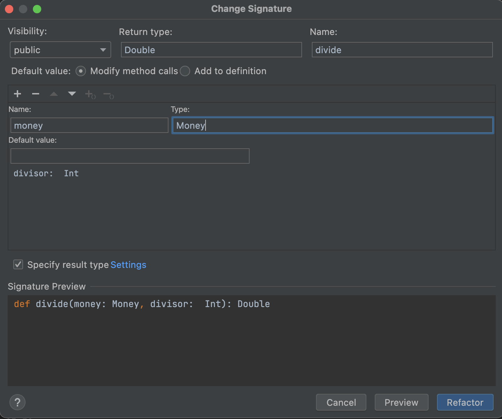
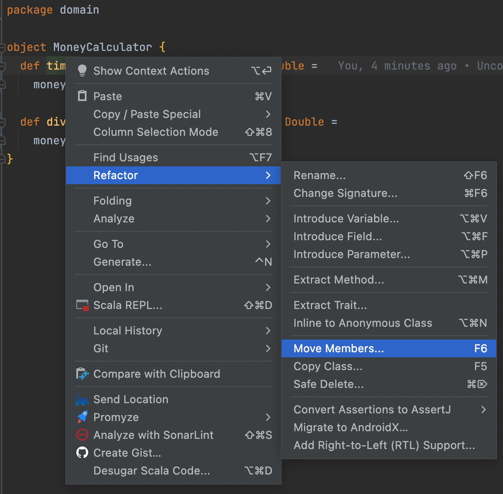
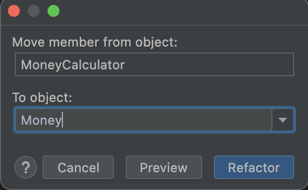
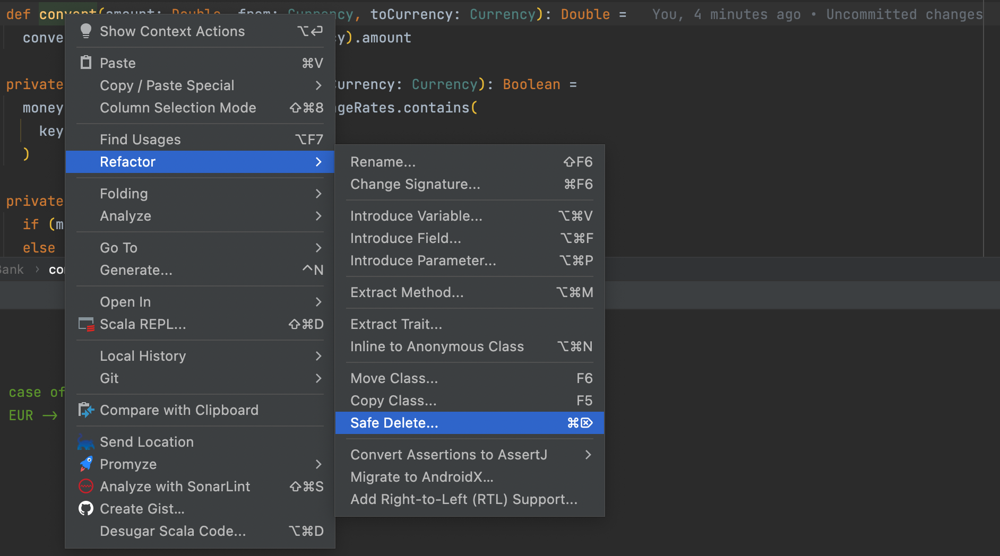

# No Primitive Types
## Introduce Money concept
A new concept emerged from the code:
A `Money` concept which is not cohesive with behavior in the `MoneyCalculator`. 

```scala
object MoneyCalculator {
  def times(amount: Double, currency: Currency, times: Int): Double =
    amount * times

  def divide(amount: Double, currency: Currency, divisor: Int): Double =
    amount / divisor
}

class Portfolio() {
  def add(amount: Double, currency: Currency): Unit =
    moneys(currency) = moneys(currency) :+ amount  
  ...
}
```

:red_circle: 
Let's see what it looks like when we group `amount` and `currency` into a `Money` type: 

- Introduce Parameter Object from `MoneyCalculator`
- We use a red test as a driver
  - We adapt the existing test on the `times` method

```scala
class MoneyCalculatorShould extends AnyFunSuite {
  test("10 EUR x 2 = 20 EUR") {
    assert(
      MoneyCalculator
        .times(Money(10, EUR), 2) === 20
    )
  }

  test("4002 KRW / 4 = 1000.5 KRW") {
    assert(
      MoneyCalculator
        .divide(4002, KRW, 4) === 1000.5
    )
  }
}
```

:green_circle: 
We generate the `Money` type from the test and adapt the `times` method from the test as well

```scala
sealed case class Money(amount: Double, currency: Currency)

object MoneyCalculator {
  def times(money: Money, times: Int): Double =
    money.amount * times

  def divide(amount: Double, currency: Currency, divisor: Int): Double =
    amount / divisor
}
```

Let's adapt the `divide` as well by using `Change Signature` refactoring


```scala
object MoneyCalculator {
  def times(money: Money, times: Int): Double =
    money.amount * times

  def divide(money: Money, divisor: Int): Double =
    money.amount / divisor
}

  test("4002 KRW / 4 = 1000.5 KRW") {
    assert(
      MoneyCalculator
        .divide(Money(4002, KRW), 4) === 1000.5
    )
  }
```

Now that we have a dedicated concept for our money operations we can move methods from `MoneyCalculator` to `Money`
- We can use `Move Members` feature from our IDE



Then configure the refactoring `move to` and `members`



Here is this step result

```scala
sealed case class Money(amount: Double, currency: Currency) {}

object Money {
  def times(money: Money, times: Int): Double =
    money.amount * times

  def divide(money: Money, divisor: Int): Double =
    money.amount / divisor
}

class MoneyCalculatorShould extends AnyFunSuite {
  test("10 EUR x 2 = 20 EUR") {
    assert(
      Money.times(Money(10, EUR), 2) === 20
    )
  }

  test("4002 KRW / 4 = 1000.5 KRW") {
    assert(
      Money.divide(Money(4002, KRW), 4) === 1000.5
    )
  }
}

object MoneyCalculator {}
```

:large_blue_circle: 
We can refactor the `Money` to return `Money` objects from methods and no more `double`
- Here we can use `===` comparison to assert the result because we used `case class` for `Money`
- It uses value equality and no reference equality

```scala
sealed case class Money(amount: Double, currency: Currency) {}

object Money {
  def times(money: Money, times: Int): Money =
    money.copy(money.amount * times)

  def divide(money: Money, divisor: Int): Money =
    money.copy(money.amount / divisor)
}

class MoneyCalculatorShould extends AnyFunSuite {
  test("10 EUR x 2 = 20 EUR") {
    assert(
      Money.times(Money(10, EUR), 2) === Money(20, EUR)
    )
  }

  test("4002 KRW / 4 = 1000.5 KRW") {
    assert(
      Money.divide(Money(4002, KRW), 4) === Money(1000.5, KRW)
    )
  }
}
```

## Clean our code
We can now make some cleanup
- Delete `MoneyCalculator`
- Rename `MoneyCalculatorShould` to `MoneyShould`
- Move the methods from the `companion object` to `Money`
  - Adapt the tests as well

```scala
sealed case class Money(amount: Double, currency: Currency) {
  def times(times: Int): Money =
    copy(amount * times)

  def divide(divisor: Int): Money =
    copy(amount / divisor)
}

class MoneyShould extends AnyFunSuite {
  test("10 EUR x 2 = 20 EUR") {
    assert(
      Money(10, EUR).times(2) === Money(20, EUR)
    )
  }

  test("4002 KRW / 4 = 1000.5 KRW") {
    assert(
      Money(4002, KRW).divide(4) === Money(1000.5, KRW)
    )
  }
}
```

## Adapt the Portfolio
:red_circle: Now that we have introduced our `Money` concept let's enrich our `Portfolio` as well
- Adapt an existing test
- Generate a new `add` method from the test taking `Money` as parameter

```scala
  test("5 USD + 10 USD = 15 USD") {
    val portfolio = new Portfolio()
    portfolio.add(Money(5, USD))
    portfolio.add(Money(10, USD))

    assert(portfolio.evaluate(bank, USD) == 15)
  }
```

Our test is now red... 

:green_circle: We have to come back in the green state by plug-in the new `add` method to the existing one

```scala
class Portfolio() {
  private val moneys: mutable.Map[Currency, List[Double]] =
    mutable.Map.empty.withDefault(_ => List.empty)

  def add(amount: Double, currency: Currency): Unit =
    moneys(currency) = moneys(currency) :+ amount

  def add(money: Money): Unit =
    moneys(money.currency) = moneys(money.currency) :+ money.amount
  ...
}
```

:large_blue_circle: We are back in a safe state with our green test. But it's not over, we have to go through the third state of TDD: Refactoring!
- Change the `add(money: Money)` to add `Money` to a private List
- Plug the existing `add` method to the new one
- Change the loop from the `evaluate` method to use the `moneys` List

```scala
class Portfolio() {
  private var moneys: List[Money] = List.empty

  def add(amount: Double, currency: Currency): Unit =
    add(Money(amount, currency))

  def add(money: Money): Unit =
    moneys = moneys :+ money

  def evaluate(bank: Bank, toCurrency: Currency): Double = {
    var convertedResult = 0d
    var missingExchangeRates: Seq[MissingExchangeRateException] = Seq.empty

    for (money <- moneys) {
      try {
        val convertedAmount =
          bank.convert(money.amount, money.currency, toCurrency)
        convertedResult += convertedAmount
      } catch {
        case missingExchangeRate: MissingExchangeRateException =>
          missingExchangeRates = missingExchangeRates :+ missingExchangeRate
      }
    }

    if (missingExchangeRates.nonEmpty)
      throw MissingExchangeRatesException(missingExchangeRates.toSeq)
    convertedResult
  }
}
```

Now that we have a new `add` method, let's use it in `PortfolioShould`.

```scala
class PortfolioShould extends AnyFunSuite with BeforeAndAfterEach {
  private var bank: Bank = _

  override def beforeEach(): Unit = {
    bank = Bank.withExchangeRate(EUR, USD, 1.2)
    bank.addExchangeRate(USD, KRW, 1100)
  }

  test("5 USD + 10 USD = 15 USD") {
    val portfolio = new Portfolio()
    portfolio.add(Money(5, USD))
    portfolio.add(Money(10, USD))

    assert(portfolio.evaluate(bank, USD) == 15)
  }

  test("5 USD + 10 EUR = 17 USD") {
    val portfolio = new Portfolio()
    portfolio.add(Money(5, USD))
    portfolio.add(Money(10, EUR))

    assert(portfolio.evaluate(bank, USD) == 17)
  }

  test("1 USD + 1100 KRW = 2200 KRW") {
    val portfolio = new Portfolio()
    portfolio.add(Money(1, USD))
    portfolio.add(Money(1100, KRW))

    assert(portfolio.evaluate(bank, KRW) == 2200)
  }

  test("5 USD + 10 EUR + 4 EUR = 21.8 USD") {
    val portfolio = new Portfolio()
    portfolio.add(Money(5, USD))
    portfolio.add(Money(10, EUR))
    portfolio.add(Money(4, EUR))

    assert(portfolio.evaluate(bank, USD) == 21.8)
  }

  test(
    "Throws a MissingExchangeRatesException in case of missing exchange rates"
  ) {
    val portfolio = new Portfolio()
    portfolio.add(Money(1, EUR))
    portfolio.add(Money(1, USD))
    portfolio.add(Money(1, KRW))

    val exception =
      intercept[MissingExchangeRatesException](portfolio.evaluate(bank, EUR))
    assert(
      exception.getMessage == "Missing exchange rate(s): [USD->EUR],[KRW->EUR]"
    )
  }
}
```

We can now remove the former `add` method from our `Portfolio`

:red_circle: We need to change the signature of the `evaluate` method as well
Its signature should be `Bank -> Currency -> Money` to ensure we don't return primitive types anymore

Adapting a first test will guide us through.

```scala
  test("5 USD + 10 USD = 15 USD") {
    val portfolio = new Portfolio()
    portfolio.add(Money(5, USD))
    portfolio.add(Money(10, USD))

    assert(portfolio.evaluate(bank, USD) == Money(15, USD))
  }

class Portfolio() {
  private var moneys: List[Money] = List.empty

  def add(money: Money): Unit =
    moneys = moneys :+ money

  def evaluate(bank: Bank, toCurrency: Currency): Money = {
    var convertedResult = 0d
    var missingExchangeRates: Seq[MissingExchangeRateException] = Seq.empty

    for (money <- moneys) {
      try {
        val convertedAmount =
          bank.convert(money.amount, money.currency, toCurrency)
        convertedResult += convertedAmount
      } catch {
        case missingExchangeRate: MissingExchangeRateException =>
          missingExchangeRates = missingExchangeRates :+ missingExchangeRate
      }
    }

    if (missingExchangeRates.nonEmpty)
      throw MissingExchangeRatesException(missingExchangeRates.toSeq)

    Money(convertedResult, toCurrency)
  }
}
```
:green_circle: Our test is now green.

:red_circle: Still, others are failing.

:green_circle: We need to adapt assertions accordingly

> During `Portfolio` refactoring to use `Money` type, we have "discovered" that we need to adapt our `Bank` as well to return `Money` from `convert`

## Adapt the Bank
:red_circle: We can apply the same strategy as on the `Portfolio`
- Adapt an existing test
- Generate code from usage and then make the test pass
  - You can force the creation of a method by naming the new convert method as `convertMoney`
  - Then `Change Name`
- Then refactor
- Apply to other tests

```scala
  test("10 EUR -> USD = 12 USD") {
    assert(bank.convert(Money(10, EUR), USD) === Money(12, USD))
  }

def convert(money: Money, toCurrency: Currency): Money = ???
```

:green_circle: Make it green.

```scala
def convert(money: Money, toCurrency: Currency): Money =
    Money(convert(money.amount, money.currency, toCurrency), toCurrency)
```

:large_blue_circle: Refactor time!

Implement the new `convert` method and plug the former method to it

```scala
  def convert(money: Money, toCurrency: Currency): Money = {
    if (!canConvert(money.currency, toCurrency)) {
      throw MissingExchangeRateException(money.currency, toCurrency)
    }
    Money(convertSafely(money.amount, money.currency, toCurrency), toCurrency)
  }

  def convert(amount: Double, from: Currency, to: Currency): Double = {
    convert(Money(amount, from), to).amount
  }
```

Adapt private methods to use `Money` as well

```scala
sealed case class Bank private (
    private val exchangeRates: mutable.Map[String, Double] = mutable.Map()
) {
  ...

  def convert(money: Money, toCurrency: Currency): Money = {
    if (!canConvert(money, toCurrency)) {
      throw MissingExchangeRateException(money.currency, toCurrency)
    }
    convertSafely(money, toCurrency)
  }

  def convert(amount: Double, from: Currency, toCurrency: Currency): Double =
    convert(Money(amount, from), toCurrency).amount

  private def canConvert(money: Money, toCurrency: Currency): Boolean =
    money.currency == toCurrency || exchangeRates.contains(
      keyFor(money.currency, toCurrency)
    )

  private def convertSafely(money: Money, toCurrency: Currency): Money =
    if (money.currency == toCurrency) money
    else
      Money(
        money.amount * exchangeRates(keyFor(money.currency, toCurrency)),
        toCurrency
      )
}
```

Adapt callers from the `convert` methods

```scala
class BankShould extends AnyFunSuite {
  private val bank = Bank.withExchangeRate(Currency.EUR, Currency.USD, 1.2)

  test("10 EUR -> USD = 12 USD") {
    assert(bank.convert(Money(10, EUR), USD) === Money(12, USD))
  }

  test("10 EUR -> EUR = 10 EUR") {
    assert(bank.convert(Money(10, EUR), EUR) === Money(10, EUR))
  }

  test(
    "Throws a MissingExchangeRateException in case of missing exchange rates"
  ) {
    val exception =
      intercept[MissingExchangeRateException](bank.convert(Money(10, EUR), KRW))
    assert(exception.getMessage == "EUR->KRW")
  }

  test("Conversion with different exchange rates EUR -> USD") {
    assert(bank.convert(Money(10, EUR), USD) === Money(12, USD))
    bank.addExchangeRate(EUR, USD, 1.3)

    assert(bank.convert(Money(10, EUR), USD) === Money(13, USD))
  }
}
```

Same process in `Portfolio`.

```scala
class Portfolio() {
  private var moneys: List[Money] = List.empty

  def add(money: Money): Unit =
    moneys = moneys :+ money

  def evaluate(bank: Bank, toCurrency: Currency): Money = {
    var convertedResult = 0d
    var missingExchangeRates: Seq[MissingExchangeRateException] = Seq.empty

    for (money <- moneys) {
      try {
        val convertedAmount = bank.convert(money, toCurrency)
        convertedResult += convertedAmount.amount
      } catch {
        case missingExchangeRate: MissingExchangeRateException =>
          missingExchangeRates = missingExchangeRates :+ missingExchangeRate
      }
    }

    if (missingExchangeRates.nonEmpty)
      throw MissingExchangeRatesException(missingExchangeRates.toSeq)

    Money(convertedResult, toCurrency)
  }
}
```

Now, we can safely delete the former `convert` method from `Bank`



## Reflect
During this iteration we have introduced a new Business concept `Money` and adapted our code accordingly to manipulate more meaningful concepts from our domain.

In the meantime, by making the refactoring we have seen duplication everywhere in our tests regarding `Money` instantiation
If the constructor of this object changes at one point it will have a huge impact on our tests and on the production code.
 
We want to avoid this situation so let's make something on it.
  
Ideally we would like something that looks like this :

```scala
10.euros().times(2)
```

In scala 2, we do not have extension methods yet (there in Scala 3)
- Let's create an implicit class fo that
- We create a `DomainExtensions` object allowing us to write our tests like this :

```scala
object DomainExtensions {
  implicit class MoneyExtensions(val amount: Double) {
    def euros(): Money = Money(amount, EUR)
    def dollars(): Money = Money(amount, USD)
    def koreanWons(): Money = Money(amount, KRW)
  }
}

class PortfolioShould extends AnyFunSuite with BeforeAndAfterEach {
  private var bank: Bank = _

  override def beforeEach(): Unit = {
    bank = Bank.withExchangeRate(EUR, USD, 1.2)
    bank.addExchangeRate(USD, KRW, 1100)
  }

  test("5 USD + 10 USD = 15 USD") {
    val portfolio = new Portfolio()
    portfolio.add(5.dollars())
    portfolio.add(10.dollars())

    assert(portfolio.evaluate(bank, USD) == 15.dollars())
  }

  test("5 USD + 10 EUR = 17 USD") {
    val portfolio = new Portfolio()
    portfolio.add(5.dollars())
    portfolio.add(10.euros())

    assert(portfolio.evaluate(bank, USD) == 17.dollars())
  }

  test("1 USD + 1100 KRW = 2200 KRW") {
    val portfolio = new Portfolio()
    portfolio.add(1.dollars())
    portfolio.add(1100.koreanWons())

    assert(portfolio.evaluate(bank, KRW) == 2200.koreanWons())
  }

  test("5 USD + 10 EUR + 4 EUR = 21.8 USD") {
    val portfolio = new Portfolio()
    portfolio.add(5.dollars())
    portfolio.add(10.euros())
    portfolio.add(4.euros())

    assert(portfolio.evaluate(bank, USD) == 21.8.dollars())
  }

  test(
    "Throws a MissingExchangeRatesException in case of missing exchange rates"
  ) {
    val portfolio = new Portfolio()
    portfolio.add(1.euros())
    portfolio.add(1.dollars())
    portfolio.add(1.koreanWons())

    val exception =
      intercept[MissingExchangeRatesException](portfolio.evaluate(bank, EUR))
    assert(
      exception.getMessage == "Missing exchange rate(s): [USD->EUR],[KRW->EUR]"
    )
  }
}
```


