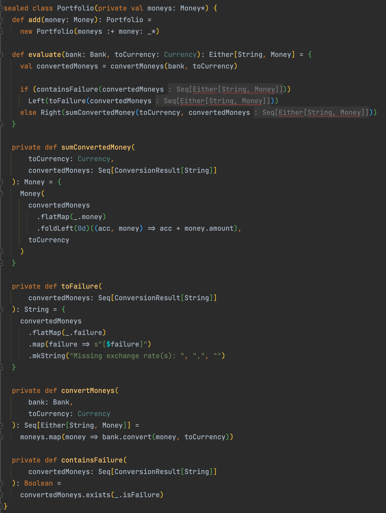

# Use an existing monad
To remove exceptions, a concept emerged from our code: `ConversionResult`.
This type looks like a monad. Instead of defining our own type let's try to use the advantages of existing ones.

In `scala`, we can use out of the monads (like `Option`)

As a reminder, the `ConversionResult` looks like this at the moment:
```scala
sealed case class ConversionResult[Failure] private (
    money: Option[Money],
    failure: Option[Failure]
) {

  def this(money: Money) = this(Some(money), None)

  def this(failure: Failure) =
    this(None, Some(failure))

  def isFailure: Boolean = failure.isDefined
}

object ConversionResult {
  def fromSuccess[Failure](money: Money): ConversionResult[Failure] =
    new ConversionResult[Failure](money)

  def fromFailure[Failure](failure: Failure): ConversionResult[Failure] =
    new ConversionResult[Failure](failure)
}
```

## Which monad?
> We are looking for one as a replacement of a type that can hold one of the 2 possible values: either a `success` or a `failure`.

Regarding this definition we choose to use the [`Either`](https://www.scala-lang.org/api/2.13.3/scala/util/Either.html) monad.

## Either monad
We will use the trait `EitherValues` from our tests to facilitate assertions on `Either`.

### Portfolio
:red_circle: You know the drill by now: as usual, we start with a red test at the `Portfolio` level.

- We rename the current `evaluate` method into `evaluateWithConversionResult`
- We adapt a test to use the future `evaluate` method with a signature like this: `Bank` -> `Currency` -> `Either<String, Money>`
  - By convention when we use `Either` the `Left` is the failure case

```scala
  test("5 USD + 10 USD = 15 USD") {
    assert(
      portfolioWith(
        5.dollars(),
        10.dollars()
      ).evaluate(bank, USD).value == 15.dollars()
    )
  }
```

Then we generate our new method from test

```scala
  def evaluate(bank: Bank, toCurrency: Currency): Either[String, Money] = ???

  def evaluateWithConversionResult(
      bank: Bank,
      toCurrency: Currency
  ): ConversionResult[String] = {
    val convertedMoneys = convertMoneys(bank, toCurrency)

    if (containsFailure(convertedMoneys))
      fromFailure(toFailure(convertedMoneys))
    else
      fromSuccess(sumConvertedMoney(toCurrency, convertedMoneys))
  }
```

:green_circle: We implement the method as the old one by using `Left()` and `Right()`

```scala
  def evaluate(bank: Bank, toCurrency: Currency): Either[String, Money] = {
    val convertedMoneys = convertMoneys(bank, toCurrency)

    if (containsFailure(convertedMoneys))
      Left(toFailure(convertedMoneys))
    else Right(sumConvertedMoney(toCurrency, convertedMoneys))
  }
```

:large_blue_circle: Refactor time!

Let's adapt the existing tests to call our new `evaluate` method

```scala
test("5 USD + 10 EUR = 17 USD") {
    assert(
      portfolioWith(
        5.dollars(),
        10.euros()
      ).evaluate(bank, USD).value == 17.dollars()
    )
  }

  test("1 USD + 1100 KRW = 2200 KRW") {
    assert(
      portfolioWith(
        1.dollars(),
        1100.koreanWons()
      ).evaluate(bank, KRW).value == 2200.koreanWons()
    )
  }

  test("5 USD + 10 EUR + 4 EUR = 21.8 USD") {
    assert(
      portfolioWith(
        5.dollars(),
        10.euros(),
        4.euros()
      ).evaluate(bank, USD).value == 21.8.dollars()
    )
  }

  test(
    "Return a failure in case of missing exchange rates"
  ) {
    assert(
      portfolioWith(
        1.euros(),
        1.dollars(),
        1.koreanWons()
      ).evaluate(bank, EUR)
        .left
        .value == "Missing exchange rate(s): [USD->EUR],[KRW->EUR]"
    )
  }
```

We can remove `dead code` the `evaluateWithConversionResult`

### Bank
Let's do the same at the `Bank` level

:red_circle: We adapt an existing test.

```scala
  test("10 EUR -> USD = 12 USD") {
    assert(bank.convert(10.euros(), USD).value === 12.dollars())
  }

  test("10 EUR -> EUR = 10 EUR") {
    assert(bank.convertWithConversionResult(10.euros(), EUR).money.value === 10.euros())
  }
```

Then we generate our new method from it.

```scala
  def convert(money: Money, toCurrency: Currency): Either[String, Money] = ???

  def convertWithConversionResult(
      money: Money,
      toCurrency: Currency
  ): ConversionResult[String] = {
    if (canConvert(money, toCurrency))
      fromSuccess(convertSafely(money, toCurrency))
    else fromFailure(s"${money.currency}->$toCurrency")
  }
```

:green_circle: We implement the method the same way as the old one by using `Left()` and `Right()`

```scala
  def convert(money: Money, toCurrency: Currency): Either[String, Money] = {
    if (canConvert(money, toCurrency))
      Right(convertSafely(money, toCurrency))
    else Left(s"${money.currency}->$toCurrency")
  }
```

:large_blue_circle: Refactor time!

Let's adapt the existing tests to call our new `convert` method.

```scala
class BankShould extends AnyFunSuite with OptionValues with EitherValues {
  private val bank = Bank.withExchangeRate(Currency.EUR, Currency.USD, 1.2)

  test("10 EUR -> USD = 12 USD") {
    assert(bank.convert(10.euros(), USD).value === 12.dollars())
  }

  test("10 EUR -> EUR = 10 EUR") {
    assert(
      bank.convert(10.euros(), EUR).value === 10
        .euros()
    )
  }

  test("Return a failure result in case of missing exchange rate") {
    assert(
      bank
        .convert(10.euros(), KRW)
        .left
        .value == "EUR->KRW"
    )
  }

  test("Conversion with different exchange rates EUR -> USD") {
    assert(
      bank.convert(10.euros(), USD).value === 12
        .dollars()
    )

    assert(
      bank
        .addExchangeRate(EUR, USD, 1.3)
        .convert(10.euros(), USD)
        .value === 13.dollars()
    )
  }
}
```

### Portfolio refactoring

Refactor the `Portfolio` to use the new `convert` method as well from the `Bank` class.
- We start by adapting the `convertMoneys` method

```scala
  private def convertMoneys(
      bank: Bank,
      toCurrency: Currency
  ): Seq[Either[String, Money]] =
    moneys.map(money => bank.convert(money, toCurrency))
```

Then, let's use our compiler errors as a refactoring driver:


After having refactored the `Portfolio` it looks like this:
```scala
sealed class Portfolio(private val moneys: Money*) {
  def add(money: Money): Portfolio =
    new Portfolio(moneys :+ money: _*)

  def evaluate(bank: Bank, toCurrency: Currency): Either[String, Money] = {
    val convertedMoneys = convertMoneys(bank, toCurrency)

    if (containsFailure(convertedMoneys))
      Left(toFailure(convertedMoneys))
    else Right(sumConvertedMoney(toCurrency, convertedMoneys))
  }

  private def convertMoneys(
      bank: Bank,
      toCurrency: Currency
  ): Seq[Either[String, Money]] =
    moneys.map(money => bank.convert(money, toCurrency))

  private def sumConvertedMoney(
      toCurrency: Currency,
      convertedMoneys: Seq[Either[String, Money]]
  ): Money = {
    Money(
      convertedMoneys
        .collect { case Right(x) => x }
        .foldLeft(0d)((acc, money) => acc + money.amount),
      toCurrency
    )
  }

  private def containsFailure(
      convertedMoneys: Seq[Either[String, Money]]
  ): Boolean = convertedMoneys.exists(_.isLeft)

  private def toFailure(
      convertedMoneys: Seq[Either[String, Money]]
  ): String = {
    convertedMoneys
      .collect { case Left(x) => x }
      .map(failure => s"[$failure]")
      .mkString("Missing exchange rate(s): ", ",", "")
  }
}
```

Let's clean our code: remove duplication and dead code
- We can safely delete the `convertWithConversionResult` method from `Bank`
- We can now delete the `ConversionResult` class

## Reflect
- What do you think about those concepts?
- What could you do with it?


