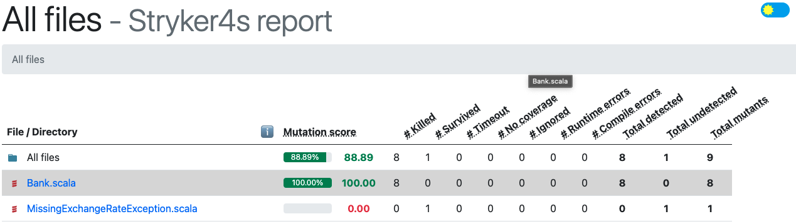
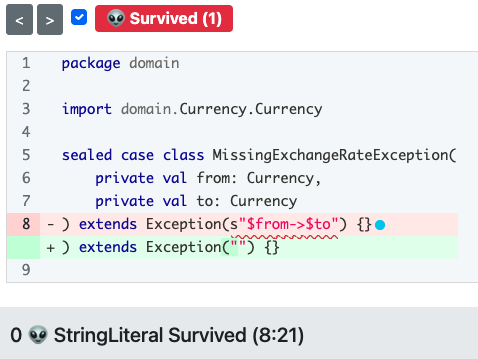
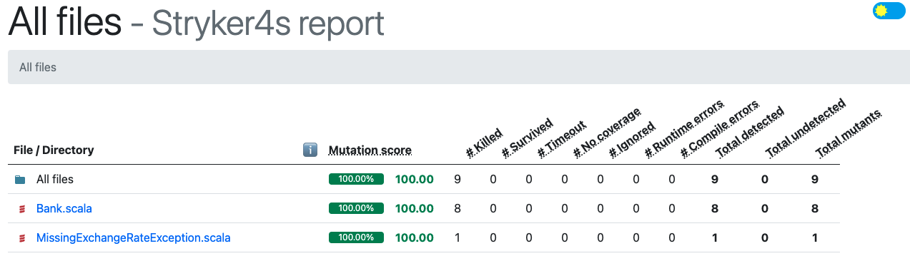

# Mutation Testing
- In scala we can use [Stryker4s](https://stryker-mutator.io/docs/stryker4s/getting-started/) as mutation testing library :
  - We need to add a `project/plugins.sbt` file
  - Add the following line in it

```sbt
addSbtPlugin("io.stryker-mutator" % "sbt-stryker4s" % stryker4sVersion)
```

- After that we can run `sbt stryker`
	- It mutates your code and run mutation coverage analysis
- Check the report inside `target/stryker4s-report`



- We can see that we have a `mutation score` of `88.89%`
	- Let's analyze which mutant survived

## MissingExchangeException
Stryker was able to create a mutant as we don't verify the exception message. The process replaced the exception message by an empty string and our test still passed.

It proves our test isn't reliable.
Testing the message does provide value as it contain business information.



Let's fix the corresponding test

```scala
test("Throws a MissingExchangeRateException in case of missing exchange rates") {
    val exception = intercept[MissingExchangeRateException](bank.convert(10, EUR, KRW))
    assert(exception.getMessage == "EUR->KRW")
}
```

When implemented, verify your test pass and run the `stryker` analysis again



## Mutants eradicated!

- Congratulations you have killed your first mutant !!!


- Why you should focus on good assertion?
	- Take a look at the [Test Desiderata](https://kentbeck.github.io/TestDesiderata/)
