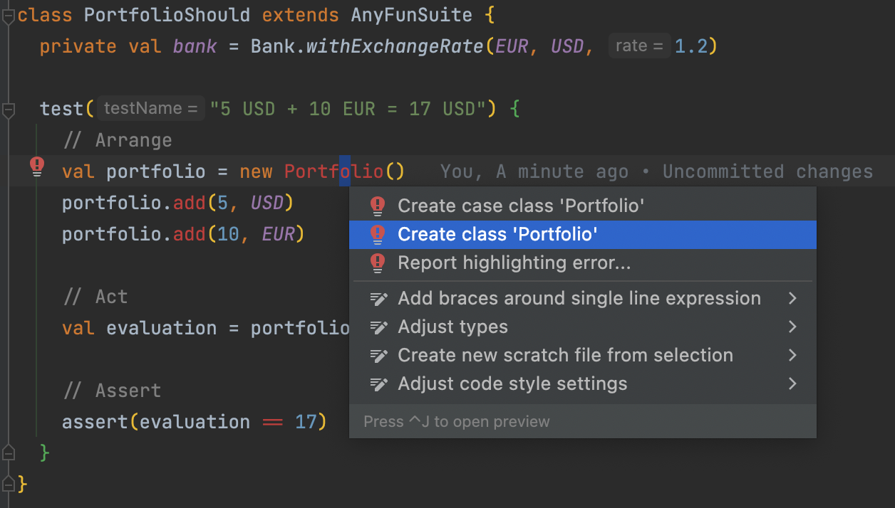
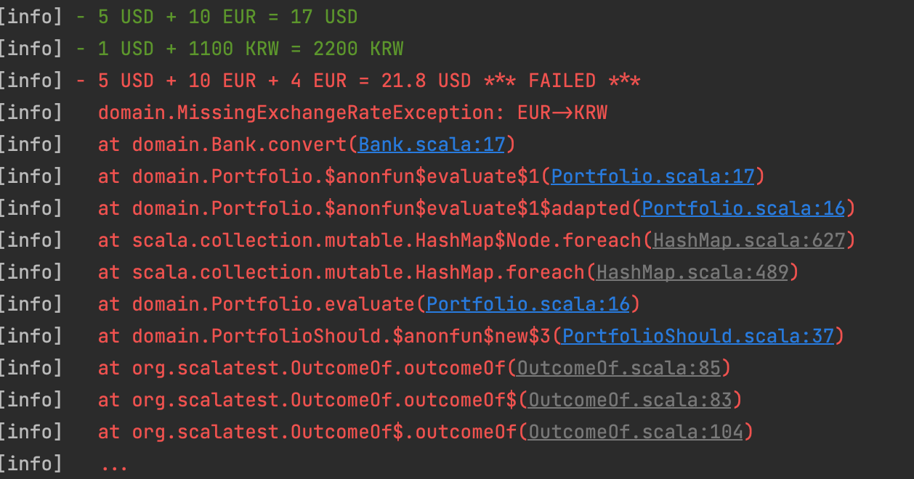
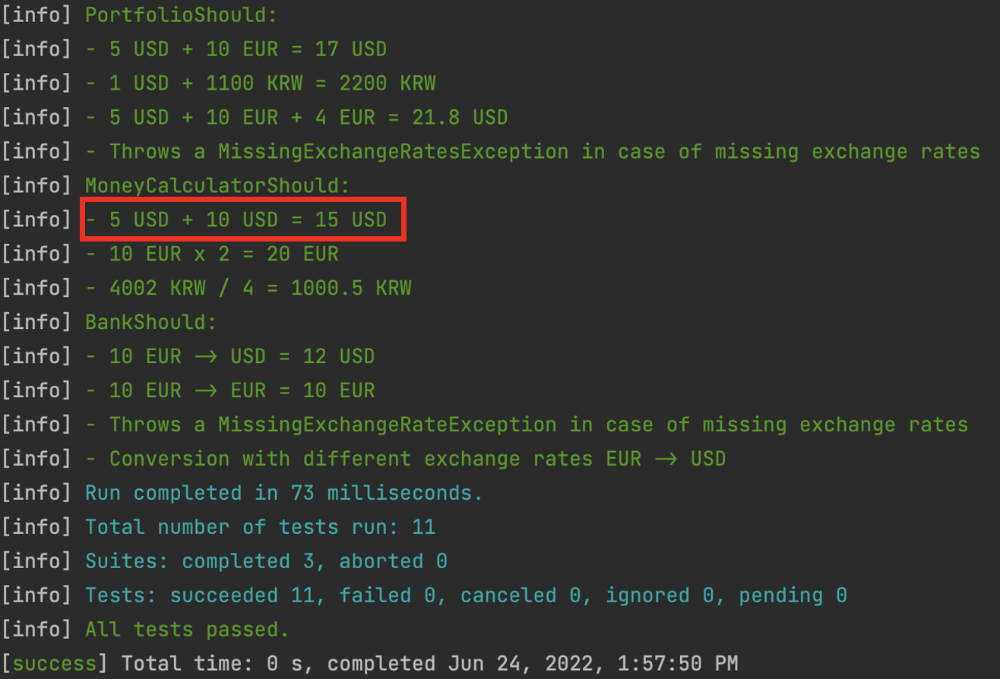

# Implement Portfolio
Implement the 2 new features :

```text
5 USD + 10 EUR = 17 USD
1 USD + 1100 KRW = 2200 KRW
```

## Write our first test

:red_circle: 
Let's write a failing test.

```scala
class PortfolioShould extends AnyFunSuite {
  test("5 USD + 10 EUR = 17 USD") {
    // Arrange
    val bank = Bank.withExchangeRate(EUR, USD, 1.2)
    val portfolio = new Portfolio()
    portfolio.add(5, USD)
    portfolio.add(10, EUR)

    // Act
    val evaluation = portfolio.evaluate(bank, USD)

    // Assert
    assert(evaluation == 17)
  }
}
```

From your IDE you should see your code like this


Congratulations you have a first failing test : You don't compile

:green_circle: 
Make it pass `as fast as possible`

We can use the power of our IDE and `generate code from usage`:



Here's what the generated code looks like:

```scala
class Portfolio() {
  def add(amount: Double, currency: Currency): Unit = ???
  def evaluate(bank: Bank, currency: Currency): Double = ???
}
```

Then we can use the strategy for that is called `Fake It 'Til You Make It` (more about it [here](https://dzone.com/articles/three-modes-of-tdd))

It's basically the fastest way to make the test pass. It is okay to write dirty code (hardcode, copy/paste, duplicate, etc.) to reach the green phase because `it will be refactored`. It's also a good way to verify you don't break any existing test.

```scala
class Portfolio() {
  def add(amount: Double, currency: Currency): Unit = {}
  def evaluate(bank: Bank, currency: Currency): Double = 17
}
```

Let's look at where we are at the moment:

```text
✅ 5 USD + 10 EUR = 17 USD
1 USD + 1100 KRW = 2200 KRW
```

## Handle currencies in KoreanWons
:red_circle:
Let's write a new failing test:

```scala
  test("1 USD + 1100 KRW = 2200 KRW") {
    val portfolio = new Portfolio()
    portfolio.add(1, USD)
    portfolio.add(1100, KRW)

    assert(portfolio.evaluate(bank, KRW) == 2200)
  }
```

The test is failing because we have faked the result of the `evaluate` method

:green_circle: 
We have to make it pass.

Here we use what we call `triangulation`:
- We start by hardcoding the result
- We provide another test that leads us closer to the final solution

```scala
class Portfolio() {
  private val moneys: mutable.Map[Currency, Double] = mutable.Map.empty

  def add(amount: Double, currency: Currency): Unit =
    moneys(currency) = amount

  def evaluate(bank: Bank, toCurrency: Currency): Double = {
    var convertedResult = 0d

    for (money <- moneys) {
      val convertedAmount = bank.convert(money._2, money._1, toCurrency)
      convertedResult += convertedAmount
    }
    convertedResult
  }
}
```

:large_blue_circle: 
Do you think any refactoring could be done ?

In the tests, we could centralize the exchange rates setup
	
```scala
class PortfolioShould extends AnyFunSuite with BeforeAndAfterEach {
  private var bank: Bank = _

  override def beforeEach(): Unit = {
    bank = Bank.withExchangeRate(EUR, USD, 1.2)
    bank.addExchangeRate(USD, KRW, 1100)
  }
  ...
}
```

Refactoring ideas are emerging from the current implementation :
- If we have the same currency twice we have a problem in the `add` method
    - We need to increase our confidence by adding a new test on it
- Missing Exchange rate -> how to improve error handling?

We're halfway there. Let's add new test cases for our portfolio :

```text
✅ 5 USD + 10 EUR = 17 USD
✅ 1 USD + 1100 KRW = 2200 KRW
5 USD + 10 EUR + 4 EUR = 21.8 USD
Improve error handling
```

## Portfolio containing amounts in same currencies
:red_circle:
As usual, the first step is always to write a failing test.

```scala
  test("5 USD + 10 EUR + 4 EUR = 21.8 USD") {
    val portfolio = new Portfolio()
    portfolio.add(5, USD)
    portfolio.add(10, EUR)
    portfolio.add(4, EUR)

    assert(portfolio.evaluate(bank, USD) == 21.8)
  }
```



:green_circle:
Make it pass by refactoring the `add` method:

```scala
class Portfolio() {
  private val moneys: mutable.Map[Currency, List[Double]] =
    mutable.Map.empty.withDefault(_ => List.empty)

  def add(amount: Double, currency: Currency): Unit =
    moneys(currency) = moneys(currency) :+ amount

  def evaluate(bank: Bank, toCurrency: Currency): Double = {
    var convertedResult = 0d

    for (money <- moneys) {
      for (amount <- money._2) {
        val convertedAmount = bank.convert(amount, money._1, toCurrency)
        convertedResult += convertedAmount
      }
    }
    convertedResult
  }
}
```

One more step to go!

```text
✅ 5 USD + 10 EUR = 17 USD
✅ 1 USD + 1100 KRW = 2200 KRW
✅ 5 USD + 10 EUR + 4 EUR = 21.8 USD
Improve error handling
```

## Improve error handling
Here we may improve error handling.

If we have multiple missing exchange rates we return the information only for the first missing one...

:red_circle:
You know the drill: let's write a new test!

```scala
  test("Throws a MissingExchangeRatesException in case of missing exchange rates") {
    val portfolio = new Portfolio()
    portfolio.add(1, EUR)
    portfolio.add(1, USD)
    portfolio.add(1, KRW)

    val exception = intercept[MissingExchangeRatesException](portfolio.evaluate(bank, EUR))
    assert(exception.getMessage == "Missing exchange rate(s): [USD->EUR],[KRW->EUR]")
  }
```

Generate the new Exception class from the test

```scala
sealed case class MissingExchangeRatesException()
    extends Exception("Missing exchange rate(s): [USD->EUR],[KRW->EUR]") {}
```

:green_circle:
Adapt our evaluation to pass the test:

```scala
  def evaluate(bank: Bank, toCurrency: Currency): Double = {
    var convertedResult = 0d
    var missingExchangeRates: Seq[MissingExchangeRateException] = Seq.empty

    for (money <- moneys) {
      for (amount <- money._2) {
        try {
          val convertedAmount = bank.convert(amount, money._1, toCurrency)
          convertedResult += convertedAmount
        } catch {
          case missingExchangeRate: MissingExchangeRateException =>
            missingExchangeRates = missingExchangeRates :+ missingExchangeRate
        }
      }
    }

    if (missingExchangeRates.nonEmpty)
      throw MissingExchangeRatesException(missingExchangeRates.toSeq)
    convertedResult
  }
```

Congratulations! All tests are now green!

:large_blue_circle:
But we don't stop when it works, we have to refactor now:

- We have some hardcoded values in the new `MissingExchangeRatesException` class

```scala
sealed case class MissingExchangeRatesException(missingExchangeRates: Seq[MissingExchangeRateException]) 
  extends Exception(missingExchangeRates
        .map(e => s"[${e.getMessage}]")
        .mkString("Missing exchange rate(s): ", ",", "")) {}
```

```text
✅ 5 USD + 10 EUR = 17 USD
✅ 1 USD + 1100 KRW = 2200 KRW
✅ 5 USD + 10 EUR + 4 EUR = 21.8 USD
✅ Improve error handling
```

Our `Portfolio` is growing step-by-step.
Let's keep it for the coming constraints 😊

## Reflect
During this iteration we have implemented a `Portfolio` that allows to add different amounts in different currencies. Let's take a look at our test cases :



With what we implemented during this iteration, it would make sense to use only the `Portfolio` to add moneys together.

So let's move this test in our `PortfolioShould` suite

```scala
  test("5 USD + 10 USD = 15 USD") {
    val portfolio = new Portfolio()
    portfolio.add(5, USD)
    portfolio.add(10, USD)

    assert(portfolio.evaluate(bank, USD) == 15)
  }
```

Now that we removed the test from MoneyCalculator, we can also remove the `add` method as it's not being used anymore.


`Always put the same attention on your test code than on your production code`
