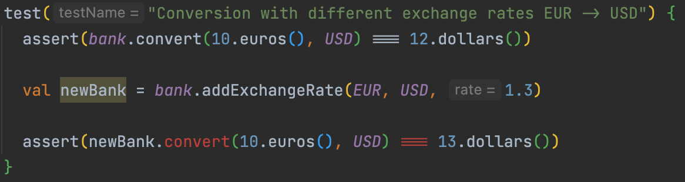
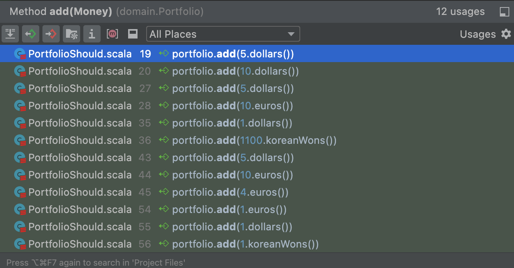
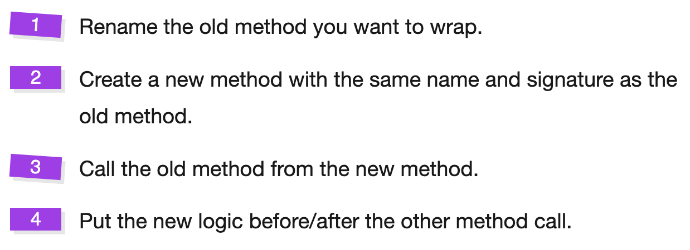

# Only Immutable Types
So, where do we have mutable types?

```scala
sealed case class Bank private (private val exchangeRates: mutable.Map[String, Double] = mutable.Map()) {
  def addExchangeRate(from: Currency, to: Currency, rate: Double): Unit =
    exchangeRates(keyFor(from, to)) = rate
  ...
}

class Portfolio() {
  private var moneys: List[Money] = List.empty

  def add(money: Money): Unit =
    moneys = moneys :+ money
  ...
}
```

## Bank
By making it immutable, we want to have a method `addExchangeRate` with a signature like this `Currency` -> `Currency` -> `Double` -> `Bank`.

:red_circle: Let's start by adapting a test to make it `red` wih a compilation error.



:green_circle: Make it `green` again.

```scala
sealed case class Bank private (private val exchangeRates: Map[String, Double] = Map.empty) {
  ...
  def addExchangeRate(from: Currency, to: Currency, rate: Double): Bank =
    Bank(exchangeRates.updated(keyFor(from, to), rate))

object Bank {
  def withExchangeRate(from: Currency, to: Currency, rate: Double): Bank =
    Bank().addExchangeRate(from, to, rate)
}
```

:large_blue_circle: Now we can refactor and simplify our test.

```scala
test("Conversion with different exchange rates EUR -> USD") {
    assert(bank.convert(10.euros(), USD) === 12.dollars())

    assert(
      bank
        .addExchangeRate(EUR, USD, 1.3)
        .convert(10.euros(), USD) === 13.dollars()
    )
  }
```

We had an impact on `Portflio` tests by doing it and need to adapt the test code as well. Now that `Bank` is immutable we need to change the private field instantiation.

```scala
  override def beforeEach(): Unit = {
    bank = Bank
      .withExchangeRate(EUR, USD, 1.2)
      .addExchangeRate(USD, KRW, 1100)
  }
```

## Portfolio
We have to adapt the `add` method too, but it is used in a lot of places.

We'll have to use a different refactoring strategy for this.



Let's use the [Wrap Technique](https://understandlegacycode.com/blog/key-points-of-working-effectively-with-legacy-code/#2-the-wrap-technique) like we did already



:large_blue_circle: Rename the existing method to `addOld`

```scala
  def addOld(money: Money): Unit =
    moneys = moneys :+ money
```

:red_circle: Adapt a test to have a red test that will call the new method


:green_circle: Generate the new `add` method from test and call the old method from the new one.
  
```scala
  def add(money: Money): Portfolio = {
    addOld(money)
    this
  }
```

:large_blue_circle: We are now able to refactor this.
- We add immutable `moneys` in constructors `varargs`
- We change the implementation of the add method as well and use `_*` to pass a `Seq` as varargs

```scala
class Portfolio(private val moneys: Money*) {
  def add(money: Money): Portfolio =
    new Portfolio(moneys :+ money: _*)

  def addOld(money: Money): Unit =
    add(money)
  ...
}
```

:green_circle: Our test is now green again.

:large_blue_circle: Let's refactor our tests to make it simple to instantiate `Portfolio`. One solution is to encapsulate `Portfolio` instantiation in a dedicated method taking Moneys as `args`.

```scala
  test("5 USD + 10 USD = 15 USD") {
    assert(
      portfolioWith(
        5.dollars(),
        10.dollars()
      ).evaluate(bank, USD) == 15.dollars()
    )
  }

private def portfolioWith(moneys: Money*): Portfolio =
    moneys.foldLeft(new Portfolio())((portfolio, money) => portfolio.add(money))
```

Let's plug remaining tests to the new `add` method

````scala
class PortfolioShould extends AnyFunSuite with BeforeAndAfterEach {
  private var bank: Bank = _

  override def beforeEach(): Unit = {
    bank = Bank
      .withExchangeRate(EUR, USD, 1.2)
      .addExchangeRate(USD, KRW, 1100)
  }

  test("5 USD + 10 USD = 15 USD") {
    assert(
      portfolioWith(
        5.dollars(),
        10.dollars()
      ).evaluate(bank, USD) == 15.dollars()
    )
  }

  test("5 USD + 10 EUR = 17 USD") {
    assert(
      portfolioWith(
        5.dollars(),
        10.euros()
      ).evaluate(bank, USD) == 17.dollars()
    )
  }

  test("1 USD + 1100 KRW = 2200 KRW") {
    assert(
      portfolioWith(
        1.dollars(),
        1100.koreanWons()
      ).evaluate(bank, KRW) == 2200.koreanWons()
    )
  }

  test("5 USD + 10 EUR + 4 EUR = 21.8 USD") {
    assert(
      portfolioWith(
        5.dollars(),
        10.euros(),
        4.euros()
      ).evaluate(bank, USD) == 21.8.dollars()
    )
  }

  test(
    "Throws a MissingExchangeRatesException in case of missing exchange rates"
  ) {
    val exception =
      intercept[MissingExchangeRatesException](
        portfolioWith(
          1.euros(),
          1.dollars(),
          1.koreanWons()
        ).evaluate(bank, EUR) == 21.8.dollars()
      )
    assert(
      exception.getMessage == "Missing exchange rate(s): [USD->EUR],[KRW->EUR]"
    )
  }

  private def portfolioWith(moneys: Money*): Portfolio =
    moneys.foldLeft(new Portfolio())((portfolio, money) => portfolio.add(money))
}
````

We can safely delete the `addOld` method.

By now, you've noticed how easy it can be to :large_blue_circle: refactor when you have a test suite protecting you.

