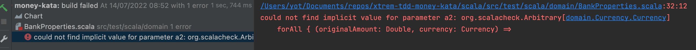
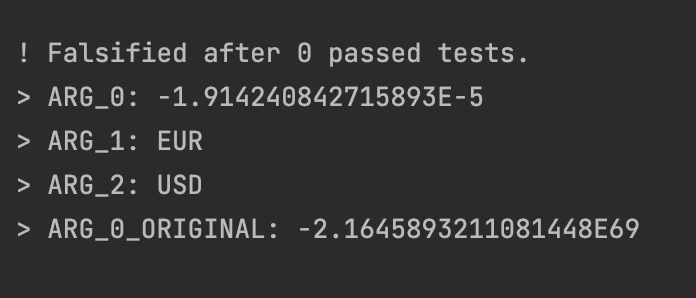
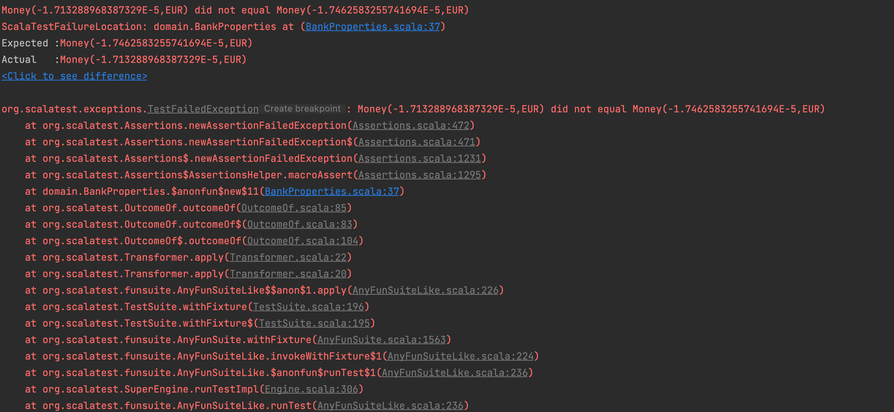
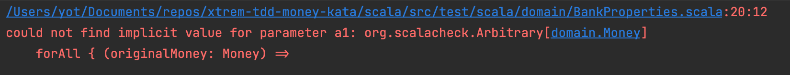

# Bank Properties 
- We have worked closely with our domain experts and at one point we spotted a problem together with the exchange rates

| From | To   | Rate    |
|------|------|---------|
| EUR  | USD  | 1.2     |
| USD  | EUR  | 0.82    |
| USD  | KRW  | 1100    |
| KRW  | EUR  | 0.0009  |
| EUR  | KRW  | 1344    |
| KRW  | EUR  | 0.00073 |

- We have 2 times a line for `KRW` to `EUR`
- We discussed with our experts, and they explain to us that they have `simply` written the wrong destination currency (To) on line 4
    - Apparently, it can often happens...
    - The table now looks like this:

| From | To  | Rate    |
|------|-----|---------|
| EUR  | USD | 1.2     |
| USD  | EUR | 0.82    |
| USD  | KRW | 1100    |
| KRW  | USD | 0.0009  |
| EUR  | KRW | 1344    |
| KRW  | EUR | 0.00073 |

- We are not fully confident in this table that will be at the center of our system
    - We discuss again with our experts on a way to enforce this table coherence/consistency
    - The conclusion is that we can easily improve it by checking what they call `Round-Tripping`
    - `from(to(x)) == x`

```gherkin
Given an original amount in currency A
When we convert it to currency B and convert it back to currency A
Then we should receive the original amount 
```

## Property-Based Testing
We will use `Property-Based Testing` to implement `Round-Tripping` properties in a first step. 
It could help us better understand the business and discover edge cases.

In `scala` we can use [`scalacheck`](https://scalacheck.org/) to do so:

```scala
libraryDependencies += "org.scalatestplus" %% "scalacheck-1-15" % "3.2.11.0" % "test"
``` 

### Round-Tripping in same currency
We want to create a first property like this:

```text
for all (Money money)
such that (bank.convert(money, money.currency()) equals money)) is satisfied
```

:red_circle: Let's create a new test class to host the properties: `BankProperties`

```scala
class BankProperties extends AnyFunSuite with Checkers {
  private val exchangeRates: Map[(Currency, Currency), Double] = Map(
    (EUR, USD) -> 1.2,
    (USD, EUR) -> 0.82,
    (USD, KRW) -> 1100d,
    (KRW, USD) -> 0.0009,
    (EUR, KRW) -> 1344d,
    (KRW, EUR) -> 0.00073
  )

  test("convert in same currency should return original Money") {
    ???
  }
}
```

We want our property to look like this:

```scala
  private val bank: Bank = ???

  test("convert in same currency should return original Money") {
    check(forAll { (originalAmount: Double, currency: Currency) =>
      {
        val originalMoney = Money(originalAmount, currency)
        val convertedMoney = bank.convert(originalMoney, currency)

        convertedMoney.value == originalMoney
      }
    })
  }
```

To do so we need to instantiate a `Bank` with business exchange rates, let's do it

```scala
  private val bank: Bank = createBank()

  private def newBank(): Bank = {
    val firstEntry = exchangeRates.head
    Bank.withExchangeRate(firstEntry._1._1, firstEntry._1._2, firstEntry._2)
  }

  private def createBank(): Bank =
    exchangeRates
      .drop(1)
      .foldLeft(newBank()) {
        case (bank, ((from, to), rate)) => bank.addExchangeRate(from, to, rate)
      }
```

:green_circle: We have to provide an `Arbitrary` for `Currency` as well



```scala
  implicit def currencyGenerator: Arbitrary[Currency] =
    Arbitrary {
      Gen.oneOf(Currency.values.toSeq)
    }
```

:large_blue_circle: Let's refactor our class to make it more readable
- We can put "details" inside a `companion object`
- So we can directly empathize the `properties` when opening the class whithout any noise

```scala
import domain.BankProperties.{bank, currencyGenerator}
import domain.Currency._
import org.scalacheck.Prop.forAll
import org.scalacheck.{Arbitrary, Gen}
import org.scalatest.EitherValues
import org.scalatest.funsuite.AnyFunSuite
import org.scalatestplus.scalacheck.Checkers

class BankProperties extends AnyFunSuite with Checkers with EitherValues {
  test("convert in same currency should return original Money") {
    check(forAll { (originalAmount: Double, currency: Currency) =>
      {
        val originalMoney = Money(originalAmount, currency)
        bank.convert(originalMoney, currency).value == originalMoney
      }
    })
  }
}

object BankProperties {
  private val exchangeRates: Map[(Currency, Currency), Double] = Map(
    (EUR, USD) -> 1.2,
    (USD, EUR) -> 0.82,
    (USD, KRW) -> 1100d,
    (KRW, USD) -> 0.0009,
    (EUR, KRW) -> 1344d,
    (KRW, EUR) -> 0.00073
  )

  private val bank: Bank = createBank()

  private def newBank(): Bank = {
    val firstEntry = exchangeRates.head
    Bank.withExchangeRate(firstEntry._1._1, firstEntry._1._2, firstEntry._2)
  }

  private def createBank(): Bank =
    exchangeRates
      .drop(1)
      .foldLeft(newBank()) {
        case (bank, ((from, to), rate)) => bank.addExchangeRate(from, to, rate)
      }

  implicit def currencyGenerator: Arbitrary[Currency] =
    Arbitrary {
      Gen.oneOf(Currency.values.toSeq)
    }
}
```

Congratulations on this first `Property` 👌

### Round-Tripping in random currency
Let's go a little further by implementing it on random currency couples

```text
for all (amount: Double, from: Currency, to: Currency)
such that (bank.convert(bank.convert(money, to), from) equals money)) is satisfied
```
 
```scala
  test("round tripping in different currencies") {
    check(forAll { (originalAmount: Double, from: Currency, to: Currency) =>
      {
        val originalMoney = Money(originalAmount, from)

        bank
          .convert(originalMoney, to)
          .flatMap(convertedMoney => bank.convert(convertedMoney, from))
          .value == originalMoney
      }
    })
  }
```

When we run it we have a surprise:

:red_circle: Round-Tripping as expressed by our domain experts is not working as expected with the provided values...


Our `Property` has been easily falsified.

One good practice of `PBT` is to investigate failure by writing a classic Unit Test/Example-Based Test

> Never re-run on failures
 
:large_blue_circle: We refactor our `Property` code to be able to reuse the `Round-Tripping` logic.

```scala
test("round tripping in different currencies") {
    check(forAll { (originalAmount: Double, from: Currency, to: Currency) =>
      {
        roundTripConvert(originalAmount, from, to).value == Money(
          originalAmount,
          from
        )
      }
    })
  }

  private def roundTripConvert(
      originalAmount: Double,
      from: Currency,
      to: Currency
  ): Either[String, Money] = {
    bank
      .convert(Money(originalAmount, from), to)
      .flatMap(convertedMoney => bank.convert(convertedMoney, from))
  }
```

We can now describe the example found by `scalacheck`
```scala
  test("round trip in error") {
    val originalAmount = -1.762116836700869e-5
    val roundTripMoney = roundTripConvert(originalAmount, KRW, EUR)

    assert(roundTripMoney.value == Money(originalAmount, KRW))
  }
```

:red_circle: As expected we have an assertion error



Let's iterate on it with our domain experts
- Because of the lack of accuracy of the exchange rates we need to tolerate some loss

> For them, it is OK to have 1% loss for a round-tripping

:red_circle: We change the way we assert the `Round-Tripping` by integrating this knowledge

```scala
  test("round trip in error") {
    val originalAmount = -1.762116836700869e-5
    val roundTripAmount = roundTripConvert(originalAmount, KRW, EUR).value

    assert(
      abs(roundTripAmount.amount - originalAmount)
        <= toleranceFor(originalAmount)
    )
  }
```

Our example is still red...
We can not tolerate more loss...

> After a discussion, our domain experts recognize that exchange rates are not accurate enough and up-to-date...

They provide us an updated table for our tests:

| From | To  | Rate           |
|------|-----|----------------|
| EUR  | USD | 1.0567         |
| USD  | EUR | 0.9466         |
| USD  | KRW | 1302.0811      |
| KRW  | USD | 0.00076801737  |
| EUR  | KRW | 1368.51779     |
| KRW  | EUR | 0.00073        |

```scala
  private val exchangeRates: Map[(Currency, Currency), Double] = Map(
    (EUR, USD) -> 1.0567,
    (USD, EUR) -> 0.9466,
    (USD, KRW) -> 1302.0811,
    (KRW, USD) -> 0.00076801737,
    (EUR, KRW) -> 1368.51779,
    (KRW, EUR) -> 0.00073
  )
```

:green_circle: With those new exchange rates and the tolerance the `Example` is now green

Let's use it in our `Property` as well

```scala
class BankProperties extends AnyFunSuite with Checkers with EitherValues {
  ...

  test("round tripping in different currencies") {
    check(forAll { (originalAmount: Double, from: Currency, to: Currency) =>
      {
        amountsAreClosed(
          originalAmount,
          roundTripConvert(originalAmount, from, to).value.amount
        )
      }
    })
  }

  test("round trip in error") {
    val originalAmount = -1.762116836700869e-5
    val roundTripAmount = roundTripConvert(originalAmount, KRW, EUR).value

    assert(amountsAreClosed(originalAmount, roundTripAmount))
  }
}

object BankProperties {
  ...
  private def amountsAreClosed(
      originalAmount: Double,
      roundTripAmount: Double
  ): Boolean =
    abs(roundTripAmount - originalAmount) <= toleranceFor(originalAmount)

  private def toleranceFor(originalAmount: Double): Double =
    abs(0.01 * originalAmount)
}
```

:green_circle: With those new exchange rates the `Property` can not be falsified anymore


:large_blue_circle: What can be improved?

In our 2 properties, we use a random `Double` but it would be better to handle `Money` directly

```scala
  test("convert in same currency should return original Money") {
    check(forAll { (originalAmount: Double, currency: Currency) =>
      {
        val originalMoney = Money(originalAmount, currency)
        bank.convert(originalMoney, currency).value == originalMoney
      }
    })
  }

  test("round tripping in different currencies") {
    check(forAll { (originalAmount: Double, from: Currency, to: Currency) =>
      {
        amountsAreClosed(
          originalAmount,
          roundTripConvert(originalAmount, from, to).value.amount
        )
      }
    })
  }
```

:large_blue_circle: We would like to have our properties expressed like this:
```scala
  test("convert in same currency should return original Money") {
    check(forAll { (originalMoney: Money) =>
      bank
        .convert(originalMoney, originalMoney.currency)
        .value == originalMoney
    })
  }
```

:red_circle: If we run it, an issue has been raised like previously for the `Currency`.
We need to define how `scalacheck` can generate our `Money` objects.
 


By writing this generator we wondered what are the boundaries of our `Money`: minimum and maximum amount. 
> According to our domain experts, our system should handle positive and negative numbers to a limit of 1 Billion no matter the currency. 

```scala
  private val maxAmount = 1_000_000_000

  implicit def moneyGenerator: Arbitrary[Money] =
    Arbitrary {
      for {
        amount <- Gen.choose(-maxAmount, maxAmount)
        currency <- Arbitrary.arbitrary[Currency]
      } yield Money(amount, currency)
    }
```

:green_circle: Our `Property` is green again with the definition of this implicit Money generator.

:large_blue_circle: Let's refactor our other `Property` to use this generator as well
```scala
class BankProperties extends AnyFunSuite with Checkers with EitherValues {
  test("convert in same currency should return original Money") {
    check(forAll { (originalMoney: Money) =>
      bank
        .convert(originalMoney, originalMoney.currency)
        .value == originalMoney
    })
  }

  test("round tripping in different currencies") {
    check(forAll { (originalMoney: Money, to: Currency) =>
      {
        amountsAreClosed(
          originalMoney,
          roundTripConvert(originalMoney, to).value
        )
      }
    })
  }
}

object BankProperties {
  ...
  private def roundTripConvert(
      originalMoney: Money,
      to: Currency
  ): Either[String, Money] =
    bank
      .convert(originalMoney, to)
      .flatMap(convertedMoney =>
        bank.convert(convertedMoney, originalMoney.currency)
      )

  private def amountsAreClosed(
      originalMoney: Money,
      roundTripMoney: Money
  ): Boolean =
    abs(roundTripMoney.amount - originalMoney.amount) <=
      toleranceFor(originalMoney)
  ...
}
```

## Reflect
During this iteration with `Property-Based Testing`, we asked ourselves a lot of questions regarding the Domain.
We have discovered a lot of rules:
- Amount accepted for Money representation
- Validity of exchange rates must be checked through Round-Tripping or not?
  - We have a clear description of the tolerance to apply to it at least

We have discovered missing invariants in our domain... we definitely need to work on it.

Before that, we need to work on business comprehension / alignment with our business experts.

> What could be a better way to handle exchange rates in our system?

Let's do that in our next iteration.
 
